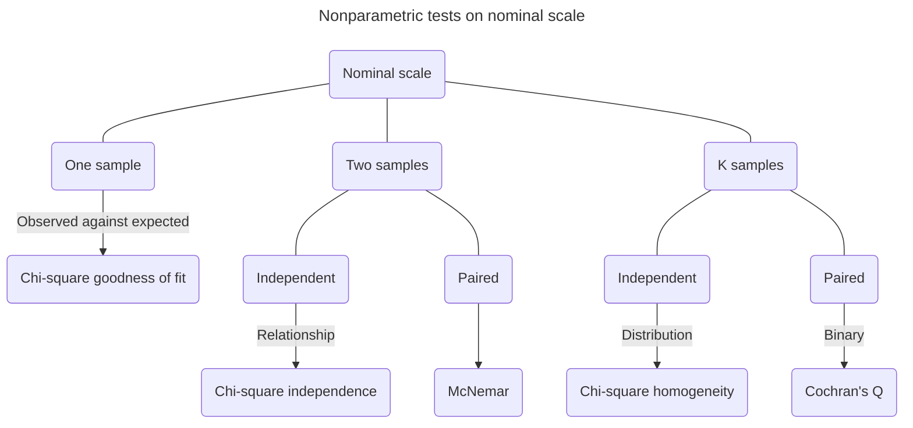
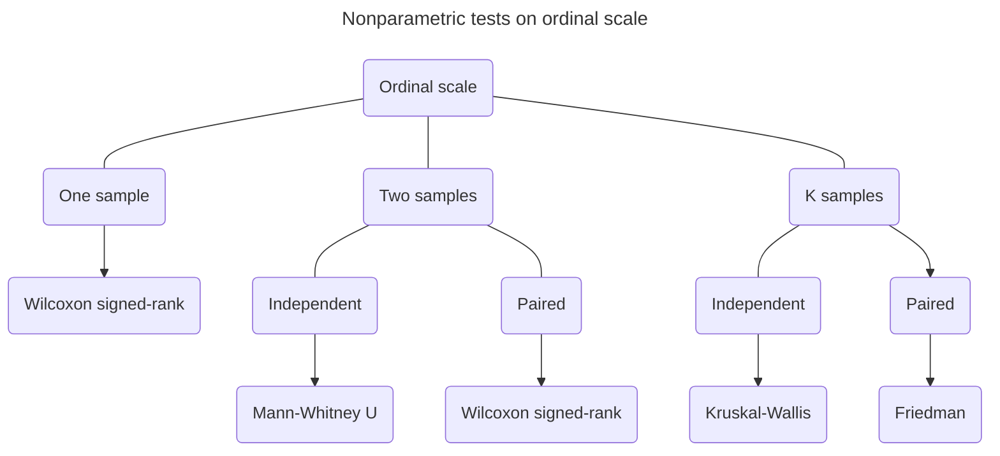

`Unlock the world of maths and statistics with Python for data science. This document is complied from various resources for academic purposes`[^1]

[^1]: Nield, T. 2021. *Essential Math for Data Science: Take Control of Your Data with Fundamental Calculus, Linear Algebra, Probability and Statistics*. O'Reilly: Cambridge, England.

# Basic maths and calculus

**Variables** are named placeholders for numbers that aren't specified or known. In Python, we use theta $θ$ to denote angles and beta $β$ for a parameter in a linear regression.

```python
x = int(input('Please input a number'))
product = 3 * x
print(product)
```

**Parameters** are numerical values that summarise certain characteristics of a population. They are fixed and usually unknown values that define the underlying distribution of data. For example, in a normal distribution, the mean and standard deviation are parameters that describe the central tendency and spread of the data, respectively. Parameters are often estimated using sample data, and the estimates are referred to as statistics. This estimation process allows us to make inferences about the population based on the sample data.

**Functions** are expressions that show how variables relate to one another. Basically, you put in an input variable, the function works on them, and you get an output variable. Functions help us understand how variables are related such as predicting how many fires we might have at a certain temperature, which we typically plot on a **Cartesian plane**. Another convention is to explicitly designate the dependent variable $y$ as a function of $x$, denoted as $f(x)$. Therefore, instead of stating a function as $y=2x+1$, we can also represent it as $f(x)=2x+1$, a **continuous function** without breaks in its line.

```python
# Declare a linear function

def f(x):
    return 2 * x + 1

x_values = [0, 1, 2, 3]
for x in x_values:
    y = f(x)
    print(y)
```

```python
# Plot a linear function with SymPy

from sympy import *

x = symbols('x')
f = 2 * x + 1
plot(f)
```

```python
# Plot a quadratic function with SymPy

from sympy import * 

x = symbols('x')
f = x**2 + 1
plot(f)
```

When a function is continuous but curvy known as a **parabola**, rather than linear and straight, we call it a **curvilinear function**.

Functions can use more than one input variable such as $f(x,y)=2x+3y$. To represent this graphically, we plot it in **three dimensions**, forming a plane of values instead of a line. This approach helps us visualise how the function changes across different combinations of the two independent variables $x$ and $y$ with one dependent variable.

```python
# 3D function

from sympy import * 
from sympy.plotting import plot3d 

x, y = symbols('x, y')
f = 2 * x + 3 * y 
plot3d(f)
```

A **summation** is expressed as a sigma $Σ$ and adds elements together. For example, iterate the numbers 1 through 3, multiply each by 2 and sum them. Note that $i$ is a placeholder variable representing each consecutive index value we are iterating in the loop, which we multiply by 2 and then sum all together.

$$
\sum_{i=1}^3 2i=(2)1+(2)2+(2)3=12
$$

```python
summation = sum(2 * i for i in range(1, 4))
print(summation)

#Output
12
```

The `range()` function in Python is end exclusive, meaning if you invoke range(1, 4), it will iterate the numbers 1, 2, and 3, which excludes the 4 as an upper boundary.

It is also common to see `n` represent the number of items in a collection, where we iterate a collection of numbers of size `n`, multiply each one by 10, and sum them.

$$
\sum_{i=1}^n 10x_{i}
$$

```python
x = [1, 4, 6, 2] 
n = len(x) 
summation = sum(10 * x[i] for i in range(0, n))
print(summation)

# Output
130
```

A a summation operation in SymPy is performed using the `sum()` operator. We then use the `subs()` function to specify n as 5, which will then iterate and sum all $i$ elements from $1$ through $n$. Finally, use the `doit()` function to execute the expression.

```python
from sympy import *

i, n = symbols('i, n') 

# Iterate each element i from 1 to n, then multiply and sum
summation = Sum(2 * i,(i, 1 , n)) 

# Specify n as 5, then iterate the numbers 1 through 5
up_to_5 = summation.subs(n, 5)
print(up_to_5.doit())

# Output
30
```

## Exponent

**Exponents** involve multiplying a number by itself a certain number of times e.g. $2^3=2 \times 2 \times 2=8$, that is, $2$ as the base and $3$ as the exponent.

When we multiply exponents together with the same base, we simply add the exponents which is known as the **product rule** e.g. $x^2x^3=x^{2+3}=x^5$ and $\frac{x^2}{x^5}=x^{2-5}=x^{-3}$.

```python
from sympy import *

x = symbols('x') 
expr = x**2 / x**5 
print(expr)

# Output
x**(-3)
```

**Fractional exponents** are an alternative way to represent **roots**. For example, exponent $\frac{1}{2}$ in $4^{\frac{1}{2}}=\sqrt{4}=2$ represents the squared root operation and $\frac{1}{3}$ in $8^{\frac{1}{3}}=\sqrt[3]{8}=2$ a cubed root.

**Power rule** is an exponent of an exponent will multiply the other exponent together e.g. $(8^3)^2=8^{3*2}=8^6$ and $(8^{\frac{1}{3}})^2=2^2=4$.

Irrational numbers like $\pi$ has an infinite number of decimal places can serve as exponents if we take the first 11 digits. We can approximate it as a rational number e.g. $8^\pi \approx 8^{\frac{31415926535}{10000000000}}\approx 687.2913$.

## Logarithm

A **logarithm** is a math function that finds a power for a specific number and base. From measuring earthquakes to managing volume on your stereo, the logarithm is found everywhere. It is also a key part of logistic regression. For example, $2$ raised to the power of $3$ equals to $8$.

$$
log{_a}b=x \Leftrightarrow a^x=b
$$

$$
log{_{base}}argument=exponent \Leftrightarrow base^{exponent}=argument
$$

$$
log{_2}8=3 \Leftrightarrow 2^3=8
$$

Note that an argument can be either an input or an output provided to a function.

```python
from math import log

# Find what power of 2 equals 8
x = log(8, 2)
print(x)

# Output
3.0
```

| Operator | Exponent property | Logarithm property |
|----------|-------------------|--------------------|
| Multiplication | $x^m \times x^n=x^{m+n}$ | $log(a \times b)=log(a)+log(b)$ |
| Division | $\frac{x^m}{x^n}=x^{m-n}$ | $log(\frac{a}{b})=log(a)-log(b)$ |
| Exponentiation | $(x^m)^n=x^{mn}$ | $log(a^n)=n \times log(a)$ |
| Zero exponent | $x^0=1$ | $log(1)=0$ |
| Inverse | $x^{-1}=\frac{1}{x}$ | $log(x^{-1})=log(\frac{1}{x})=-log(x)$

: Logarithmic properties

## Euler's number and natural logarithm


In data science, the default base for the logarithm, rather than `10` is **Euler's number** `e`, which is a mathematical constant approximately equal to $2.71828$. Its exponential function is a derivative to itself, which is convenient for exponential and logarithmic functions.

$$
e := \lim_{n \to \infty} \left(1 + \frac{1}{n} \right)^n
$$

For example, you lend £100 to someone with 20% interest annually for two years. Note that interest is typically compounded monthly.

$$
A=P \left(1+\frac{r}{n} \right)^{nt}
$$

$$
Balance=starting\ value \left( 1+\frac{interest\ rate}{number\ of\ months} \right)^{number\ of\ months\ \times \ number\ of\ years}
$$

$$
100 \left(1+\frac{0.2}{12} \right)^{12 \times 2}=148.69146179463576
$$

```python
from math import exp

p = 100
r = 0.2
n = 12
t = 2

a = p * (1 + (r / n))**(n * t)
print(a)

# Output
148.69146179463576
```

If daily for two years:

$$
100 \left(1+\frac{0.2}{365} \right)^{365 \times 2}=149.16612786515807
$$

We get smaller and smaller fractions of a cent the more frequently we compound. If we keep making these periods infinitely smaller to the point of compounding continuously, we need Euler's number
$e \approx 2.71828$.

$$
A=P(e^{rt})
$$

$$
100(e^{0.2 \times 2})=149.18246976412703
$$

```python
from math import exp

p = 100
r = 0.2
t = 2

a = p * exp (r * t)
print(a)

# Output
149.18246976412703
```

Technically, $e$ is the resulting value of the expression $(1+\frac{1}{n})^n$ as $n$ gets bigger and approaches infinity. As you make $n$ larger, there is a diminishing return, and it converges approximately on the value of $e$, which is $2.71828$.

$$
\left(1+\frac{1}{100} \right)^{100}=2.70481382942
$$

$$
\left(1+\frac{1}{10000} \right)^{10000}=2.71814592682
$$

$$
\left(1+\frac{1}{10000000} \right)^{10000000}=2.71828169413
$$

When $e$ is used as our base for a logarithm, we call it a **natural logarithm** e.g. $log{_e}10 \Leftrightarrow ln(10)$. Note that the natural logarithm is a default function in Python.

```python
from math import log

# Find what power of e equals 10
x = log(10)
print(x)

# Output
2.302585092994046
```

## Limit


A **limit** describes the behaviour of a function as its input **approaches** a value **but never reaches** it.

$$
f(x)=\frac{1}{x}
$$

The limit of the function $f(x)$ as the input variable $x$ approaches the value $c$, it equals to $L$.

$$
\displaystyle{\lim_{x \to c}}f(x)=L
$$

That is, as $x$ approaches infinity, the function $\frac{1}{x}$ approaches $0$ but never reaches it.

$$
\displaystyle{\lim_{x \to \infty}}\frac{1}{x}=0
$$

```python
from sympy import *

x = symbols('x')
f = 1 / x
result = limit(f, x, oo)
print(result)

# Output
0
```

The constant $e$ commonly appears in limits, especially when dealing with exponential functions. As $x$ approaches infinity, the expression $(1+\frac{1}{n})^n$ converges to $e$.

$$
\displaystyle{\lim_{x \to \infty}} \left(1+\frac{1}{n} \right)^n=e=2.71828182845905
$$

```python
from sympy import *

x = symbols('n')
f = (1 + ( 1 / n))**n
result = limit(f, n, oo)
print(result)

# Output
2.71828182845905
```

> [!NOTE]
> [SymPy](https://docs.sympy.org/latest/tutorials/intro-tutorial/intro.html 'What is symbolic computation?') is a robust computer algebra system for Python, which deals with the computation of mathematical objects symbolically rather than approximately. Mathematical expressions with unevaluated variables are left in symbolic form.

## Derivative


A **derivative** tells the **slope** of a function, and it is useful to measure the **rate of change** at any point in a function, which is often used in machine learning with **gradient descent** to find the minimum of a function by iteratively moving in the direction of steepest descent.

For example, how steep is the curve at $x=3$ in the function $f(x)=x^2$? We can measure steepness at any point in the curve with a visualised **tangent line** that just touches the curve at a given point.

$$
f'(x)=\frac{d}{dx}x^n=nx^{n-1}
$$

$$
f'(3)=2 \times 3^{2-1}=6
$$

```python
# Calculate the derivative of the function

from sympy import *

x = symbols('x')
f = x**2
dx_f = diff(f)
print(dx_f)

# Output
2*x
```

```python
# When x = 3

from sympy import *
x = symbols('x')
f = x**2
slope = diff(f)

def f(x):
    return x**2
    
def dx_f(x):
    return 2*x # The derivative we calculated above

slope = dx_f(3)
print(slope)

# Output
6
```

**Partial derivatives** are derivatives on functions that have multiple input variables, that is, slopes with respect to multiple variables in several directions. e.g. $f(x,y)=2x^3+3y^3$. The variables $x$ and $y$ each get their own derivatives $\frac{d}{dx}$ and $\frac{d}{dy}$.

$$
f'(x)=nx^{n-1}
$$

$$
\frac{d}{dx}2x^3+3y^3=3 \times 2x^{3-1}=6x^2
$$

$$
\frac{d}{dx}2x^3+3y^3=3 \times 3y^{3-1}=9y^2
$$

When $(x,y)$ is $(1,2)$, the slope to $x$ is $6(1)^2=6$ and $y$ is $9(2)^2=36$.

```python
from sympy import *
from sympy.plotting import plot3d

x,y = symbols('x y') 
f = 2*x**3 + 3*y**3

# Calculate the partial derivatives for x and y
dx_f = diff(f, x)
dy_f = diff(f, y)
print(dx_f) # prints 6*x**2 
print(dy_f) # prints 9*y**2
plot3d(f) # plot the function
```

The **chain rule** in calculus is used to differentiate composite functions expressed as $\frac{dz}{dx}=\frac{dx}{dy} \times \frac{dy}{dx}$ e.g. when we build a neural network.

$$
\begin{cases}
y=x^2+1\\
z=y^3-2
\end{cases}
$$

$$
\Rightarrow z=(x^2+1)^3-2=6x(x^2+1)^2
$$

```python
from sympy import * 

z = (x**2 + 1)**3 - 2 
dz_dx = diff(z, x)
print(dz_dx)

# Output
6*x*(x**2 + 1)**2
```

## Integral


The opposite of a derivative is an **integral**, which finds the area under the curve for a given range. For example, **Riemann sum** provides a certain method of approximation of an integral by a finite sum. Let's find the area under the line between $0$ and $1$ in the function $f(x)=2x$. The area is a triable, where you multiply its base by its height and then divide the result by $2$.

$$
A=\frac{1}{2}\ bh=\frac{1}{2}\ 1 \times 2=1
$$

Now, find the area under the line between $0$ and $1$ in the function $f(x)=x^2+1$. The curviness here does not give us a clean geometric formula to find the area, but we can pack 5 rectangles of equal length under the curve.

```python
def approximate_integral(a, b, n, f):
    delta_x = (b - a) / n
    total_sum = 0
    
    for i in range(1, n + 1):
        midpoint = 0.5 * (2 * a + delta_x * (2 * i - 1))
        total_sum += f(midpoint)
    return total_sum * delta_x
    
def my_function(x):
    return x**2 + 1

area = approximate_integral(a = 0, b = 1, n = 5, f = my_function)
print(area) 

# Output
1.33
```

```python
# Use SymPy to perform integration

from sympy import *

f = x**2 + 1

# Calculate the integral of the function with respect to x for the area between x = 0 and 1
area = integrate(f, (x, 0, 1))
print(area)

# Output
4/3
```

```python
# Use limit to calculate integral

x, i, n = symbols('x, i, n')
f = x**2 + 1
lower, upper = 0, 1

# Calculate width and each rectangle height at index i
delta_x = ((upper - lower) / n)
x_i = (lower + delta_x * i)
fx_i = f.subs(x, x_i)

# Iterate all n rectangles and sum their areas
n_rectangles = Sum(delta_x * fx_i, (i, 1, n)).doit()

# Calculate the area by approaching the number of rectangles n to infinity
area = limit(n_rectangles, n, oo)
print(area)

# Output
4/3
```

# Probability


**Probability** is about quantifying predictions of events yet to happen, whereas **likelihood** is measuring the frequency of events that already occurred. In statistics and machine learning, we often use likelihood as **the past** in the form of data to predict probability as **the future**.

A probability of an event must be strictly between 0% and 100%. Logically, this means the probability of an event **not** happening is calculated by subtracting the probability of the event from $1$.

**Classical probability** uses theory to apply a likelihood to possible events. On the other hand, **empirical probability** uses repeated trials to use actual observed frequencies to estimate likelihood. For example, what is the probability of randomly picking Monday in a week?

$$
Classical\ probability=\frac{Number\ of\ events\ to\ occur}{Number\ of\ possible\ outcomes}
$$

$$
Empirical\ probability=\frac{Number\ of\ events\ occurred}{Number\ of\ observations}
$$

$$
P(A)=\frac{N(A)}{N(B)}=\frac{1}{7} \approx 0.14285714285714285
$$

The opposite or complement of an event $A$ is the event not $A$, often denoted as ${\neg}A$, ${\sim}A$ or $A'$.

$$
P(A')=1-P(A)=1-\frac{1}{7}=\frac{6}{7} \approx 0.85714285714
$$

Alternatively, probability can be expressed as **odds**. For example, what are the odds in favour of randomly picking Monday in a week.

$$
t=\frac{p}{1-p}
$$

$$
\Rightarrow \frac{\dfrac{1}{7}}{1-\dfrac{1}{7}}=\frac{\dfrac{1}{7}}{\dfrac{6}{7}}=\frac{1}{6}
$$

The odds against the event with probability are six times as likely that a random day is not a Monday.

$$
t=\frac{1-p}{p}
$$

$$
\Rightarrow \frac{1-\dfrac{1}{7}}{\dfrac{1}{7}}=\frac{\dfrac{6}{7}}{\dfrac{1}{7}}=\frac{6}{1}
$$

## Joint probability

Find the probability of flipping a head on a coin and rolling a six on a dice that happen together.

$$
P(A \cap B)=P(A) \times P(B)
$$

$$
\Rightarrow \frac{1}{2} \times \frac{1}{6}=\frac{1}{12} \approx 0.08333333333
$$

We can use the multiplication as a shortcut to find the joint probability instead of generating all possible combinations and counting the ones of interest to us. This method is known as the **product rule**.

## Union probability

Find the probability of flipping a head on a coin or rolling a six on a dice that least one of the events happens and not mutually exclusive.

$$
P(A \cup B)=P(A)+P(B)−P(A \cap B)
$$

$$
\Rightarrow  \frac{1}{2}+\frac{1}{6}- \left( \frac{1}{2} \times \frac{1}{6} \right)=\frac{8}{12}-\frac{1}{12}=\frac{7}{12} \approx 0.58333333333
$$

## Conditional probability

A conditional probability is the likelihood of an event occurring given that another event has already happened, which allows you to evaluate how prior information affects probabilities.

Typically, the problem statement for conditional probability questions assumes that the initial event occurred or indicates that an observer witnesses it. The goal is to calculate the chances of the second event under the condition that the first event occurred.

$$
P(A|B)=\frac{P(A \cap B)}{P(B)}
$$

$$
Probability\ of\ A\ given\ B=\frac{Probability\ of\ A\ intersects\ B}{Probability\ of\ B}
$$

$$
P(umbrella|rain)=\frac{P(umbrella \cap rain)}{P(rain)}
$$

$$
\Rightarrow \frac{0.5}{0.6} \approx 0.8333333333333334 \approx 83\%
$$

## Bayes' theorem

1. Posterior probability: P(belief|evidence)
2. Likelihood: P(evidence|belief)
3. Prior probability: P(belief)
4. Marginal probability: P(evidence)

$$
P(A|B)=\frac{P(B|A) \times P(A)}{P(B)}
$$

$$
Posterior\ probability=\frac{Likelihood\ \times \ Prior\ probability}{Marginal\ probability}
$$

$$
P(belief|evidence)=\frac{P(evidence|belief) \times P(belief)}{P(evidence)}
$$

$$
P(rain|cloudy)=\frac{P(cloudy|rain) \times P(rain)}{P(cloudy)}
$$

$$
\Rightarrow \frac{0.95 \times 0.05}{0.65} \approx 0.07307692307692308 \approx 7\%
$$

Note that the order of events matters in Bayes' theorem. That is, the probability of it being cloudy given that it's raining but uses the probability of it raining given that it's cloudy in the equation, which leads to incorrect results. Theoretically, clouds may go away after it rains. Therefore, the following equation is considered incorrect. Unless, we'd like to claim otherwise.

$$
P(cloudy|rain)=\frac{P(rain|cloudy) \times P(cloudy)}{P(rain)}
$$

```python
p_cloudy = 0.65 
p_rain = 0.05 
p_cloudy_given_rain = 0.95 
p_rain_given_cloudy = p_cloudy_given_rain * p_rain / p_cloudy
print(p_rain_given_cloudy)

# Output
0.07307692307692308
```

## Binomial distribution

')

Find 11 probabilities for binomial distribution from 0 to 10 success.

```python
from scipy.stats import binom

n = 10
p = 0.9
for k in range(n + 1):
    probability = binom.pmf(k, n, p)
    print('{0} - {1}'.format(k, probability))

# Output
0 - 9.999999999999981e-11
1 - 8.999999999999986e-09
2 - 3.644999999999997e-07
3 - 8.747999999999995e-06
4 - 0.00013778099999999982
5 - 0.0014880347999999988
6 - 0.011160261000000001
7 - 0.05739562799999998
8 - 0.1937102445
9 - 0.387420489
10 - 0.3486784401000001
```

$$
9.999999999999981e{-}11=0.00000000009999999999999981=0.000000009999999999999981\%
$$

$$
0.3486784401000001 \approx 35\%
$$

## Beta distribution


The **beta distribution** allows us to see the likelihood of different underlying probabilities for an event to occur given $\alpha$ **successes** and $\beta$ **failures**.

Find the the likelihood of that probability being $90\%$ or less given $8$ successes and $2$ failures.

```python
from scipy.stats import beta 

a=8 
b=2 
p = beta.cdf(0.9, a, b)
print(p)

# Output
0.7748409780000002
```

**Bernoulli trial** (or binomial trial) is a random experiment with exactly two possible outcomes, **success** and **failure**, in which the probability of success is the same every time the experiment is conducted.

## Geometric distribution

The geometric distribution is often referred to as the discrete version of the exponential distribution.

What is the probability of rolling a 4 on a regular 6-sided die on the 5th roll?

Probability mass function:

$$
P(X=n)=(1-p)^{n-1}*p
$$

$$
\Rightarrow P(5)=(1-\frac{1}{6})^{5-1}*\frac{1}{6}=0.08036
$$

Expected value (mean):

$$
E(X)=\frac{1}{p}
$$

$$
\Rightarrow E(X)=\frac{1}{\frac{1}{6}}=6
$$

```python
# Import packages
from scipy.stats import geom
import matplotlib.pyplot as plt

# Probability and Number of Trials
n = [1, 2, 3, 4, 5, 6, 7, 8, 9, 10]
p = 1 / 6

# Generate the PMF
dist = geom.pmf(X, p)

# Plot the distribution
plt.figure(figsize = (12, 7))
plt.scatter(n, dist, linewidth = 2, color = 'black')
plt.xticks(fontsize = 18)
plt.yticks(fontsize = 18)
plt.ylabel('Probability', fontsize = 20)
plt.xlabel('Number of Rolls', fontsize = 20)
plt.vlines(n, 0, dist, colors = 'black', linewidth = 2, alpha = 0.7)
plt.savefig('plot.png')
plt.show()
```

# Descriptive and inferential statistics  

## Descriptive statistics

> Garbage in, garbage out!

Refer to [statistics with Python](https://docs.python.org/3/library/statistics.html 'Mathematical statistics functions') for more information on mathematical statistics functions.

Statistics encompasses a range of mathematical techniques aimed at **collecting**, **organising**, **summarising**, **analysing**  and **interpreting data**, to **discover findings** that are useful or **predict what causes those findings to happen**. Statistics is the heart of so many **data-driven** innovations.

**Data** is like snapshots of a story, similar to photographs. But it doesn't capture everything about reality or the countless factors behind the story. Data can also be biased, incomplete, or lacking important details. Ideally, we'd want endless data covering every aspect of reality, but that's not possible. Even the most powerful supercomputers can't gather all the world's data.

To achieve our goals, we must focus our objectives. While a few well-chosen photos can reveal if someone is good at golf, understanding their entire life story from photos alone is nearly impossible. Similarly, in data projects, we need to gather relevant and complete data by keeping our objectives clear and focused. Broad goals can lead to misleading results or incomplete data. This practice, known as **data mining**, though useful, requires careful execution.

**Descriptive statistics** summarises and describe the main features of a dataset. On the other hand, **inferential statistics** makes predictions or inferences about a population based on a sample of data.

**Population** represents the entirety of individuals under scrutiny in a given study. A **sample** is a subset of the population that is ideally random and unbiased, which we use to infer attributes about the population. We often have to study samples because polling the entire population is not always possible. When populations are **theoretical**, scientists resort to **simulations** to generate data.

It's crucial to have a **random** sample to avoid **bias**, which distorts our conclusions by favouring one group over others. Many **confounding variables** can affect the outcome of a study, making it difficult to determine the true relationship between the variables of interest. Refer to [glossary of biases](https://github.com/x-square/behavioural-science/blob/main/23-10-biases-glossary.md 'Glossary of biases') for more information on unfair preference towards one group.

$\mu$ [mu] refers to **population mean**, and $\bar{x}$ [x bar] represents **sample mean** .

$$
\bar{x} = \frac{1}{n} \left(\sum_{i=1}^{n}x_i \right)
$$

$$
\Rightarrow m=\frac{sum\ of\ terms}{number\ of\ terms}
$$

```python
# Mean number of pets each person owns
import numpy as np

sample = [1, 3, 2, 5, 7, 0, 2, 3]
mean_value = np.mean(sample)
print(mean_value)

# Output
2.875
```

**Weighted mean** is a type of average where each value is multiplied by a predetermined weight reflecting its relative importance when calculating the average.

$$
W=\frac{\sum_{i=1}^{n}w_{i}*x_{i}}{\sum_{i=1}^{n}w_{i}}=\frac{(x_{1}*w_{1})+\ldots+(x_{n}*w_{n})}{w_{1}+ \ldots w_{n}}
$$

```python
# Three exams of 0.2 weight each and final exam of 0.4 weight
scores = [90, 80, 63, 87]
weights = [0.2, 0.2, 0.2, 0.4]
weighted_mean = sum(s * w for s, w in zip(scores, weights)) / sum(weights)
print(weighted_mean)

# Output
81.4
```

**Median** can be a helpful alternative to the mean when data is **skewed by outliers** or values that are **extremely large and small** compared to the rest of the values.

If $n$ is odd:

$$
Median=\frac{n+1}{2}
$$

If $n$ is even:

$$
Median=\frac{\frac{n}{2}+ \left(\frac{n}{2}+1 \right)}{2}
$$

```python
# Middle-most value of pets each person owns
import numpy as np

sample = [0, 1, 5, 7, 9, 10, 14]
median_value = np.median(sample)
print(median_value)

# Output
7
```

**Quartiles** divide the dataset into four equal parts. The first quartile `Q1` represents the $25th$ percentile, the second quartile `Q2` represents $50th$ percentile, which is the same as the median, and the third quartile `Q3` represents the $75th$ percentile.

**Mode** is the most frequently occurring set of values. It primarily becomes useful when your data is repetitive, and you want to find which values occur the most frequently e.g. **categorical data**. **Bimodal** describes a distribution with two distinct peaks, suggesting the data has two most frequent values.

```python
import statistics

sample = [1, 3, 2, 5, 7, 0, 2, 3]
mode_value = statistics.mode(sample)
print(mode_value)

# Output
3
```

**Variance** measures the average squared deviation of data points from the mean, indicating the **spread of the data**. When we **square** the differences before adding them together, it has a few benefits. Firstly, it **removes negative values** because squaring a negative number makes it positive. Secondly, it **emphasises larger differences**, making them more noticeable. Finally, from a mathematical perspective, working with squared values is simpler because it **simplifies mathematical operations**, especially when dealing with derivatives.

Population variance:

$$
\sigma^2=\frac{1}{n}\sum_{i=1}^{n}(x_{i}-\mu)^{2}=\frac{(x_{1}-mean)^2+\ldots(x_{n}-mean)^2}{n}
$$

```python
import numpy as np

data = [0, 1, 5, 7, 9, 10, 14]
pop_var_value = np.var(data)
print(pop_var_value)

# Output
21.387755102040813
```

Sample variance:

$$
s^2=\frac{1}{n-1}\sum_{i=1}^{n}(x_{i}-\bar{x})^{2}=\frac{(x_{1}-mean)^2+\ldots(x_{n}-mean)^2}{n-1}
$$

```python
import numpy as np

data = [0, 1, 5, 7, 9, 10, 14]
sample_var_value = np.var(data, ddof=1)
print(sample_var_value)

# Output
24.95238095238095
```

The number of variance is larger than any of our observations because we did a lot squaring and summing, putting it on an entirely different metric. The opposite of a square is a square root, so let's take the **square root** of the variance which gives us the **standard deviation**, which makes it a bit more intuitive and meaningful.

By counting values **short of 1** item in our divisor, we increase the variance and therefore capture **greater uncertainty** in our **sample's degrees of freedom**, which represent the number of values in a calculation that are **free to vary** without violating any constraints. For example, the formula to calculate standard deviation is `n - 1`, which is also true in a one-sample *t*-test. It is `(r - 1) x (c - 1)`[^2] in a chi-squared test of independence and `n - 2` in linear regression.

[^2]: `r` stands for row and `c` for column.

Population standard deviation:

$$
\sigma=\sqrt{\frac{1}{n}\sum_{i=1}^{n}(x_{i}-\mu)^{2}}=\sqrt{\frac{(x_{1}-mean)^2+\ldots(x_{n}-mean)^2}{n}}
$$

```python
import numpy as np

data = [0, 1, 5, 7, 9, 10, 14]
pop_std_value = np.std(data)
print(pop_std_value)

# Output
4.624689730353898
```

Sample standard deviation:

$$
s=\sqrt{\frac{1}{n-1}\sum_{i=1}^{n}(x_{i}-\bar{x})^{2}}=\sqrt{\frac{(x_{1}-mean)^2+\ldots(x_{n}-mean)^2}{n-1}}
$$

```python
import numpy as np

data = [0, 1, 5, 7, 9, 10, 14]
sample_std_value = np.std(data, ddof=1)
print(sample_std_value)

# Output
4.99523582550223
```

**Normal distribution** aka Gaussian distribution is a **symmetrical bell-shaped** curve centred around the mean, with most of its **data clustered near the mean**. **Its spread is determined by the standard deviation.** As you move away from the mean, the tails on both sides of the curve **gradually decrease in height** but never touch zero. 

$$
f(x)={\frac{1}{\sigma{\sqrt{2\pi }}}}e^{-{\frac{1}{2}}\left({\frac{x-\mu}{\sigma}}\right)^{2}}
$$

Histograms often depict normal distributions. **Bins** on the **x-axis** represent **continuous intervals**, and each bar's **height** denotes the **frequency** within that interval. In general, the choice of bins can affect the interpretation of the data, including the **shape** and **level of continuity** of the distribution.

**Probability density function** (PDF) describes the likelihood of a continuous random variable falling within certain values. The vertical axis is not the probability but rather the likelihood for the data. To find the probability we need to look at a given range, and then find the area under the curve for that range.


**Probability mass function** (PMF) describes the probability distribution of a discrete random variable, indicating the likelihood of each possible outcome occurring, see [probability mass function binomial distribution](#binomial-distribution).

**Cumulative distribution function** (CDF) of a random variable $X$ tells us the chance that $X$ is less than or equal to a given value $x$.


Continuous random variable:

$$
F(x)=\int _{-\infty}^{x}f(t)\,dt
$$

Discrete random variable:

$$
F(x)=P(X\leq x)=\sum _{t\leq x}x\leq f(t)
$$

**Percent point function** (PPF) aka inverse cumulative distribution function or quantile function describes the relationship between the probability of an event and the value of a random variable.


**Z-score** aka **standard score** is a way to measure the position of a data point in relation to the mean of a dataset, expressed in terms of standard deviations from the mean.

$$
z=\frac{x-\mu}{\sigma}=\frac{value-mean}{standard\ deviation}
$$

Find if $x_a=150,000$ or $x_b=815,000$ is more expensive relative to the average house in its neighbourhood? Note that $\mu$ refers to the mean price of the house of the neighbourhood, and $\sigma$ stands for standard deviation.

$\mu _a=140,000$\
$\mu _b=800,000$\
$\sigma _a=3,000$\
$\sigma _b=10,000$

$$
\begin{cases}
z_a=\frac{15,000-14,000}{3000} \approx 3.3333333333333335\\
z_b=\frac{815,000-800,000}{10,000}=1.5
\end{cases}
$$

$$
\therefore z_a > z_b
$$

**Coefficient of variation** measures the relative variability of a dataset by expressing the standard deviation as a percentage of the mean, which allows for comparison of variability between datasets with different units or scales of measurement. It helps to assess the stability and consistency of data sets, with lower coefficient of variation values indicating less relative variability and higher values indicating greater variability.

$$
cv=\frac{\sigma}{\mu}
$$

In the example, although neighbourhood A is cheaper than B, it has more spread and therefore more price diversity than B. In other words, **B is more consistent than A**.

$$
\begin{cases}
z_a=\frac{3000-14,000}{3000}=0.0214\\
z_b=\frac{10,000-800,000}{10,000}=0.0125
\end{cases}
$$

## Inferential statistics

**Central limit theorem** states that the distribution of sample means approaches a normal distribution as the sample size increases, regardless of the shape of the population distribution. This theorem is fundamental in statistics as it allows us to make inferences about population parameters based on sample statistics, even when the population distribution is unknown or not normally distributed.

**Uniform distribution** is a probability distribution where all outcomes have equal probability of occurring. Every outcome has the same likelihood of happening, making it a simple and predictable distribution.

**Confidence interval** is a range of values that is likely to contain the true unknown parameter of a population, with a certain level of confidence. It provides a measure of the uncertainty or precision associated with estimating population parameters from sample data.

Based on the analysis of 50 golden retrievers, with an average weight of 64.41 kg and a sample standard deviation of 2.05 kg, we can state with 95% confidence that the true average weight of all golden retrievers falls within the range of 63.645 kg to 65.171 kg.

Here's a simplified breakdown of the process:

- We begin by selecting a confidence level, such as aiming for 95% confidence that our sample mean reflects the population mean.
- Next, we determine the critical z-score corresponding to the 95% confidence level, which is approximately $\pm 1.96$.
- We then calculate the margin of error, which turns out to be approximately $\pm 0.57$.
- Therefore, with 95% confidence, we conclude that the mean weight lies within 64.41 $\pm$ 0.57, equating to a range of 63.84 kg to 64.98 kg.

$$
Confidence\ interval = Sample\ mean \pm Margin\ of\ error
$$

$$
\Rightarrow Sample\ mean \pm (Z\ score \times Standard\ error)
$$

$$
\Rightarrow \bar{x} \pm z \frac{s}{\sqrt{n}}
$$

```python
# Confidence interval for n > 30
import numpy as np
import scipy.stats as stats

# Define sample size, mean, standard deviation, and confidence level
n = 50
mean = 64.41
std = 2.05
confidence_level = 0.95

# Calculate z-score based on confidence level
z_score = stats.norm.ppf(1 - (1 - confidence_level) / 2)

# Calculate margin of error
margin_of_error = z_score * std / np.sqrt(n)

# Calculate confidence interval
lower_bound = mean - margin_of_error
upper_bound = mean + margin_of_error

# Print the calculations
print(f"z-score for 95% confidence level: {z_score:.2f}")
print(f"Margin of error: {margin_of_error:.2f}")
print(f"Confidence interval: {mean} ± {margin_of_error:.2f}")
print(f"    Lower bound: {lower_bound:.2f}")
print(f"    Upper bound: {upper_bound:.2f}")

# Output
z-score for 95% confidence level: 1.96
Margin of error: 0.57
Confidence interval: 64.41 ± 0.57
    Lower bound: 63.84
    Upper bound: 64.98
```

```python
# Get critical value range for 95% confidence with a z-statistic
from scipy.stats import norm

lower = norm.ppf(.025)
upper = norm.ppf(.975)
print(lower, upper)

# Output
-1.9599639845400545 1.959963984540054
```

For smaller samples:

$$
CI = \bar{x} \pm t \frac{s}{\sqrt{n}}
$$

```python
# Confidence interval for n < 30
import numpy as np
import scipy.stats as stats

# Define sample size, mean, standard deviation, and confidence level
n = 25
mean = 64.41
std = 2.05
confidence_level = 0.95

# Calculate degrees of freedom
df = n - 1

# Calculate t-score based on confidence level and degrees of freedom
t_score = stats.t.ppf(1 - (1 - confidence_level) / 2, df)

# Calculate margin of error
margin_of_error = t_score * std / np.sqrt(n)

# Calculate confidence interval
lower_bound = mean - margin_of_error
upper_bound = mean + margin_of_error

# Print the calculations
print(f"t-score for 95% confidence level: {t_score:.2f}")
print(f"Margin of error: {margin_of_error:.2f}")
print(f"Confidence interval: {mean} ± {margin_of_error:.2f}")
print(f"    Lower bound: {lower_bound:.2f}")
print(f"    Upper bound: {upper_bound:.2f}")

# Output
t-score for 95% confidence level: 2.06
Margin of error: 0.85
Confidence interval: 64.41 ± 0.85
    Lower bound: 63.56
    Upper bound: 65.26
```

```python
# Get critical value range for 95% confidence with a t-statistic
from scipy.stats import t

n = 25
lower = t.ppf(.025, df=n-1)
upper = t.ppf(.975, df=n-1)
print(lower, upper)

# Output
-2.063898561628021 2.0638985616280205
```

The **p-value** is a measure in statistics that indicates the probability of obtaining results as extreme as the ones observed, assuming that the null hypothesis is true. A smaller p-value e.g. $<.05$ suggests stronger evidence against the null hypothesis, indicating that the observed results are unlikely to occur by random chance.

In hypothesis testing, the **null hypothesis** `H0` is a statement that there is no significant difference or effect, often serving as the default assumption to be tested against. The **alternative hypothesis** `H1`, on the other hand, suggests there is a significant difference or effect present in the population.

**Type I error** or **false positive** occurs when you mistakenly reject a true null hypothesis. It's like crying wolf when there is none. On the other hand, **Type II error** or **false negative** happens when you fail to reject a false null hypothesis. It's akin to missing a real wolf because you didn't notice it.

Type I errors can result in **unnecessary actions** e.g. over a million patients are prescribed the medication despite risks of severe side effects and inadequate research on the outcomes. While still problematic, Type II errors may lead to **missed opportunities** e.g. the drug intervention is considered ineffective when it can actually improve symptoms of the disease.

| **Decision about H0** | **H0 is true** | **H0 is false** |
|-----------------------|----------------|-----------------|
| **Fail to reject** | True negative <br> Correct inference <br> Probability = 1 − α | False negative <br> Type II error <br> Probability = β  |
| **Reject** | False positive <br> Type I error <br> Probability = α | True positive <br> correct inference <br> Probability = 1 - β |

: Type I and type II errors


**Independent variables** are the factors that researchers **manipulate** in an experiment. They are the variables that are changed deliberately to observe their effect on the dependent variable. **Dependent variables**, on the other hand, are the **outcomes** that researchers **measure**. They depend on the independent variable. Their changes are assumed to be caused by manipulations of the independent variable. **Controlled variables** are the factors that are kept **constant** during an experiment to ensure that they do not influence the results. By controlling these variables, researchers can isolate the effects of the independent variable on the dependent variable.

In a **one-tailed** test, you're only interested in one direction of difference or effect. For example, you might be testing whether a new drug improves performance because you are only interested in whether it's better, not worse. This type of test is more powerful in detecting effects in a specific direction but can miss effects in the opposite direction.

Typically, we frame null and alternative hypotheses in a one-tailed test using **inequalities**. When expecting the sample mean[^3] of the **experiment group** $\bar{x}_e$ to show improvement or a positive effect compared to the **control group** $\bar{x}_c$, we express this as experiment $>$ control. Otherwise, we can do the other way round to see if the experiment is worse than control as experiment $<$ control.

[^3]: Sample mean $\bar{x}$ is commonly used because it is accessible and cost-effective. We use the population mean $\mu$ when we have data for the entire population rather than just a sample of it.

$$
\begin{cases}
H0: \bar{x}_e > \bar{x}_c\\
H1: \bar{x}_e < \bar{x}_c
\end{cases}
$$

```python
# Cold has 18 day mean recovery and 1.5 std dev
from scipy.stats import norm

mean = 18
std_dev = 1.5

# What x-value has 5% of area behind it?
x = norm.ppf(0.05, mean, std_dev)
print(x)

# Output
15.53271955957279
```

```python
from scipy.stats import norm

mean = 18
std_dev = 1.5

# The threshold for the p-value of 0.05 is 15 days
p_value_1 = norm.cdf(16, mean, std_dev)
print(p_value_1)

p_value_2 = norm.cdf(15, mean, std_dev)
print(p_value_2)

# Output
0.09121121972586788
0.022750131948179195
```

In contrast, a **two-tailed** test looks for differences or effects in both directions. It's useful when you're interested in any difference, regardless of whether it's positive or negative. For example, you might be testing whether a new teaching method changes student scores, without any assumption of whether it'll be better or worse. Two-tailed tests are more conservative and capture effects in both directions, but they may require larger sample sizes to detect effects compared to one-tailed tests.

To do a two-tailed test, we frame null and alternative hypotheses in an **equal** and **not equal** structure.

$$
\begin{cases}
H0: \bar{x}_e = \bar{x}_c\\
H1: \bar{x}_e \neq \bar{x}_c
\end{cases}
$$

```python
# Cold has 18 day mean recovery and 1.5 std dev
from scipy.stats import norm

mean = 18
std_dev = 1.5

# What x-value has 2.5% of area behind it?
x1 = norm.ppf(.025, mean, std_dev)
print(x1)

# What x-value has 97.5% of area behind it
x2 = norm.ppf(.975, mean, std_dev)
print(x2)

# Output
15.060054023189918
20.93994597681008
```

```python
from scipy.stats import norm

mean = 18
std_dev = 1.5

# The threshold for the p-value of 0.05 is 15 days on the lower bound or 21 on the upper bound
p1 = norm.cdf(16, mean, std_dev)
p2 = 1 - norm.cdf(20, mean, std_dev)
p_value1 = p1 + p2
print(p_value1)

p3 = norm.cdf(15, mean, std_dev)
p4 = 1 - norm.cdf(21, mean, std_dev)
p_value2 = p3 + p4
print(p_value2)

# Output
0.18242243945173575
0.0455002638963584
```

There is a problem getting more awareness in the scientific research community called **p-hacking**, where scientists shop for statistically significant p-values of 0.05 or less.

**Texas Sharpshooter Fallacy** is a cognitive bias where someone cherry-picks data or focuses on specific patterns within a dataset while ignoring the broader context or random variations. The name comes from the analogy of a marksman who shoots at a barn and then paints a target around the area where the most bullet holes cluster, making it appear as though they had aimed precisely at that spot.

Data mining often falls prey to big data fallacy, where it finds patterns in random events. With vast data and quick algorithms, it's easy to spot things that seem meaningful but are actually just **coincidental**. We learnt to form hypotheses before collecting data, but data mining does the opposite. Ironically, starting with a hypothesis often leads to more **objectivity**.

## Statistical tests






# Linear algebra

## Matrix multiplication

$$
c_{ij}\sum_{k=1}^{n}a_{ik}*ba_{jk}=a_{i1}*a_{j1}\ldots+a_{in}*a_{jn}
$$


If A is a `4` $\times$ 2 matrix and B a 2 $\times$ `3` matrix, the matrix product C is defined to be a `4` $\times$ `3` matrix.

$$
c11=a11 \times b11+a12 \times b21\\
c12=a11 \times b12+a12 \times b22\\
c13=a11 \times b13+a12 \times b23
$$

$$
c21=a21 \times b11+a22 \times b21\\
c22=a21 \times b12+a22 \times b22\\
c23=a21 \times b13+a22 \times b23
$$

$$
c31=a31 \times b11+a32 \times b21\\
c32=a31 \times b12+a32 \times b22\\
c33=a31 \times b13+a32 \times b23
$$

$$
c41=a41 \times b11+a42 \times b21\\
c42=a41 \times b12+a42 \times b22\\
c43=a41 \times b13+a42 \times b23
$$

`Any questions, please reach out`

Chiawei Wang PhD\
Data Scientist\
<chw.wng@outlook.com>
