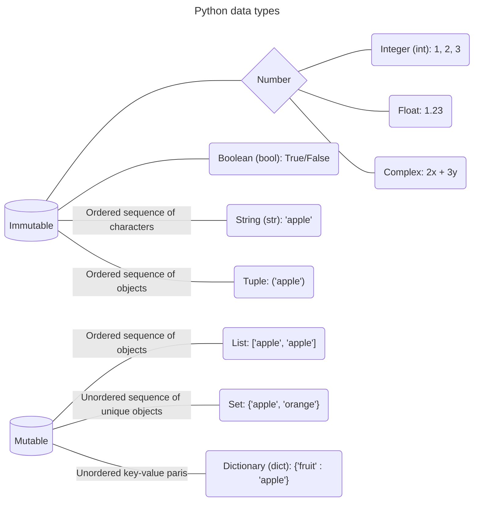

`This document compiles information from Google Advanced Data Analytics for academic purposes.`[^1]

[^1]: This part of notes is compiled from [Google Advanced Data Analytics](https://www.coursera.org/professional-certificates/google-advanced-data-analytics 'Google professional certificate'). This program includes over 200 hours of instruction and hundreds of practice-based assessments, which will help you simulate real-world advanced data analytics scenarios that are critical for success in the workplace. The content is highly interactive and exclusively developed by Google employees with decades of experience in advanced data analytics and data science. Through a mix of videos, assessments, and hands-on labs, you'll get introduced to advanced data analytics tools and platforms and key technical skills required for an advanced role.

Course descriptions:

1. **Foundations of data science**
   - Learn how data professionals operate in the workplace and how different roles in the field of data science contribute to an organization's vision of the future. Then, explore data science roles, communication skills, and data ethics.
2. **Get started with Python**
   - Discover how the programming language Python can power your data analysis. Learn core Python concepts, such as data types, functions, conditional statements, loops, and data structures.
3. **Go beyond the numbers: Translate data into insights**
   - Learn the fundamentals of data cleaning and visualizations and how to reveal the important stories that live within data.
4. **The power of statistics**
   - Explore descriptive and inferential statistics, basic probability and probability distributions, sampling, confidence intervals, and hypothesis testing.
5. **Regression analysis: Simplify complex data relationships**
   - Learn to model variable relationships, focusing on linear and logistic regression.
6. **The nuts and bolts of machine learning**
   - Learn supervised and unsupervised machine learning techniques and how to apply them to organizational data.
7. **Google advanced data analytics capstone**
   - Complete a hands-on project designed to demonstrate the skills and competencies you acquire in the program.

# Foundations of data science

> [!TIP]
> **What is Data Science?**[^2]
> 
> Data science intersects **statistics**, **computer science** and **domain knowledge** like business. Each of these disciplines presents its own complexity, and when fused, they pose even greater challenges.
> 
> Data scientists forge **insights** from **extensive unstructured data** by harnessing the power of **statistical learning** through **algorithms**, ultimately driving **business objectives**.
> 
> The application of data science extends beyond a single industry or academic discipline, finding value in healthcare, economy and criminal justice to name a few.

[^2]: Mukherjee, S. 2019. How Data Science is taking over mobile marketing. CleverTap. <https://clevertap.com/blog/data-science>


Computer Scientist Jim Gray, a Turing Award winner, envisions Data Science as a fourth paradigm of science, that is, **theoretical**, **empirical**, **computational** and **data-driven**.[^3]

[^3]: Hey, T; Tansley, S; Tolle, K & Gray, J. 2009. The fourth paradigm: Data-intensive scientific discovery. Microsoft Research. <https://www.microsoft.com/en-us/research/publication/fourth-paradigm-data-intensive-scientific-discovery>

## Profiles of data professionals

Data analysts in **technical** roles transform raw data into something useful for decision-making. **Strategic** data analytics professionals focus on maximizing information to guide the businesses they are working for.

### Data scientist and data analyst

Data scientist and data analyst are roles that work directly with data. These professionals gather, clean, analyze, and share insights from data with stakeholders. An increasing number of industries turn to data analysis to create insights that inform various tasks like guide decision-making, identify user preferences, or determine how to use resources more effectively. With more industries looking for data professionals, there is a great chance that you will find one that matches your interests.

#### Key attributes

- What they do: Uncover trends, patterns, and insights from data
- How they do it: Employ advanced modeling and statistical analytics techniques

### Data management and infrastructure 

Data professionals that work in data management and infrastructural roles are primarily responsible for the systems that distribute data and maintain its integrity. They work alongside data analytics professionals and help support their work. Their main responsibility is to ensure the functionality of data systems and the compliance with local, state, and federal regulations involving data security and ethics. 

#### Key attributes

- What they do: Manage data sources and the overall data infrastructure
- How they do it: Work with the tools and databases used to manage data within a business

### Business intelligence

Data analytics and business intelligence share a lot of commonalities. Both fields have professionals that use data to create insights that inform decision-making. A major difference is that business intelligence is more focused on creating processes and information channels that transform relevant data. Business intelligence professionals create tables, reports, and dashboards that empower stakeholders, giving them access to the data they need to inform the entire decision-making process on a continual basis. These roles often serve as a complement to core data analytics/data science professionals.

#### Key attributes

- What they do: Perform predictive analysis that enables organizations to determine likely future trends
- How they do it: Create tables, reports and dashboards that empower their organization

## Where data makes a difference for the future

There are so many different industries taking advantage of data analytics in so many different ways. Here is just a sample of some of these industries and how they use data:

| **Industry** | **Overview** | **How data is used** |
|--------------|--------------|----------------------|
| App-driven business (sharing economy service) | Facilitates users acquiring, providing, or sharing access to goods and services, often through online or app-based communities | <li> Maintaining functioning mobile applications <li> Delivering customized content based on user history including discounts <li> Using machine learning models to send notifications at key times or even locations |
| Automotive | Includes industries associated with the production, wholesaling, retailing, and maintenance of motor vehicles | <li> Gaining greater control over their supply chains <li> Improving production line performance, and designing new and more efficient vehicles <li> Enhancing vehicle safety and new features |
| Cybersecurity | Protects networks, devices, and data from unauthorized access or criminal use and the practice of maintaining confidentiality, integrity, and availability of information | <li> Locating weak points within networks and systems using predictive analytics <li> Defending against security attacks <li> Detecting data breaches through logic, models, and data tools <li> Improving the ability to identify attacks and respond to them with Artificial Intelligence (AI) |
| Digital marketing | Assists in advertising and promotional efforts of companies using the internet and online technologies | <li> Translating customer interaction into actionable business data <li> Predicting user behaviors to personalize content and offers <li> Identifying patterns and trends that guide innovations <li> Determining the return on investment (ROI) of marketing efforts |
| Energy | Includes companies that explore, produce, refine, market, store, and transport both renewable and non-renewable energy resources | <li> Analyzing real-time data from power systems and monitoring devices <li> Optimizing technologies, monitoring power grids, and predicting failures <li> Preventing accidents and malfunctions |
| Gaming | Hosts an estimated 2.7 billion gamers worldwide, facilitating the interaction of players across the globe | <li> Designing world-building and character creation systems <li> Monitoring character engagement and how the environment reacts to player input <li> Optimizing game-play by identifying potential new features or upgrades <li> Regulating in-game purchases and fraud detection systems <li> Personalizing marketing campaigns |
| Streaming media and entertainment | Provides access to live and recorded content on-demand, delivered via the internet to computers, smart devices, and mobile devices | <li> Analyzing and monitoring user interactions to better understand customer sentiment <li> Matching users with advertisers with real-time analytics <li> Guiding future content decisions <li> Personalizing marketing campaigns |
| Telecommunications| Primarily involves operating and providing access to facilities for the transmission of voice, data, text, sound, and video | <li> Assisting the deployment, optimization, and predictive maintenance of telecommunications networks <li> Optimizing pricing models <li> Targeting advertisement and incentive campaigns, as well as detecting fraudulent activity <li> Analyzing customer data to customize subscriber plans |
| Travel and tourism | Encompasses a variety of services from transportation, accommodations, attractions, booking, and much more | <li> Marketing to individuals based on their previous travel or searched destinations <li> Directing machine learning systems that can adjust a traveler's itinerary based on set factors including weather and availability <li> Generating recommendations based on personal preferences and location-based discounts <li> Managing reservations and processing transactions |

: How data is used in different industries

### Data trends for the future

The future of data is booming! Big data's getting bigger, fueling data-driven decisions through both simple trend analysis and complex forecasting. Companies are also hoarding raw data in accessible repositories, creating massive opportunities for data analysts to organize and extract valuable insights. Buckle up, data enthusiasts, the future's full of exciting potential!

### Innovative technologies

Data access innovations are bringing industries new ways to connect data. This means exciting data solutions and tools are always on the horizon!

Artificial intelligence will keep impacting businesses, streamlining many areas. Accurate sales forecasting helps companies improve stock, reduce delivery times, and automate processes.

Artificial intelligence will also team up with machine learning, business intelligence, and automation to deliver more personalized services.

As the number of internet-connected devices grows, edge computing will bring applications and data sources closer physically. This boosts real-time analytics and automation.

More data analytics tasks will be automated in edge environments. Remember, Artificial intelligence and machine learning systems are only as equitable as their creators. You'll learn more about ensuring equity in data analytics in the future.

## Ideal qualities for data analytics professionals

Employers in a variety of industries are eager to hire data professionals who possess more than just technical expertise. You can highlight your non-technical abilities for potential employers in several ways. Discover ways to successfully and effectively communicate your passions. By demonstrating a commitment to professional growth and sharing examples of your ability to solve problems, you can set yourself apart from other candidates.

> [!TIP]
> **Being coachable**
> 
> Coachable individuals are capable of receiving feedback and using that information to make improvements. At the center of being coachable is a positive attitude, and the ability to self-reflect and take steps to grow. People who are coachable usually have a growth mindset, which is a belief that hard work and determination can make them better. As a result, they view feedback from colleagues and supervisors as an opportunity to improve their skill set.

- A passion for data analysis
    - Include in your portfolio your passion for data analysis. Provide examples of passion projects, volunteer work, or analysis outside of employment to relay your commitment to data analysis. If you are conducting data analysis in your free time, it says a lot about your passion.
- Lifelong learning
    - Stay current by reading data-related blogs and attending workshops. Visit business networking websites to connect and learn from subject matter experts.
- Strong interpersonal skills
    -  Include interpersonal skills on your list of qualifications on your resume. Revisit the material within this program including the material on communication. Find opportunities to add examples of teamwork, empathy, leadership, mediating, and active listening.
- Communication
    - Be sure that all correspondences you exchange are professional and free of grammatical and spelling errors. Include any examples of written communication in your portfolio–these may include but are not limited to reflection pieces, executive summaries, or  project proposals. Don't forget to include writing examples or online blog entries that describe how you have communicated in past situations.
- Problem solver
    - Adjust your past working responsibilities into tasks that you were able to achieve. This can be accomplished by stressing the end results of your actions. Detail how your action or task had a direct impact on the organization. If there is a measured or empirical amount of change associated with your actions, be sure to include that. Example: `Analyzed data from over 3,000 users to optimize systems, which led to a 32% increase in customer satisfaction.`

## Volunteer data skills to make a positive impact

> *To allow all kids, despite physical limitations, the ability to experience the same hallmark childhood memories as their peers. Helping kids, be kids.*
> 
> Christopher's Promise mission statement (2022)

Data analytics has a lot to offer a nonprofit organization. Gaining deeper insight into the organization's efforts can help them to operate in a more effective and efficient way. Analyzing data can improve various nonprofit functions, such as allocation of resources, recruiting and retaining supporters, fundraising, and conducting research. Data analysis also can help reveal patterns and power dynamics that can be used to inform decision-making. In addition to identifying individuals and communities in need of assistance, predictive modeling can also be used to identify potential recipients of a nonprofit's services.

Data analytics professionals can help nonprofit organizations in a variety of ways:

- Fundraising
    - Using data analytics, you can predict with high accuracy which prospects are most likely to donate. In order to maximize return on marketing and outreach expenses, nonprofit organizations can use data analysis to prioritize outreach and reduce overall marketing expenditures.
- Marketing
    - There is valuable information in a nonprofit's data that can benefit marketing efforts. Data analysis can help determine a nonprofit's target audience and gather insights such as donation methods, contribution history, and other demographics. As a result, the nonprofit can help guide communication with potential donors and determine the effectiveness of campaigns.
- Monitoring activities
    - Data analysis can help nonprofits monitor resources, expenses, and daily operational needs. A nonprofit will often need assistance in keeping track of donated materials. For example, a database of donations to a food bank could help the organization determine specific food items being collected and inventory the expiration dates of food items for shelving, cycling, and distribution. Using a system of real-time inventory in conjunction with predictive data analytics could anticipate shortages and identify those donors who have helped provide these items in the past.
    - Using data analysis, this organization guides restorative efforts in underserved communities. DataKind brings together volunteer experts from academia and industry to design innovative solutions to tough social challenges. They help social organizations apply their data to predictive analytics, machine learning algorithms, and AI in a way that both increases impact and is sensitive to ethical considerations.
- Hackathons
    - A hackathon is an event where programmers and other data professionals come together and collaborate on a particular project. The goal is to create a solution to an existing problem.
    - Hackathon events are commonly built around a central theme or question, such as tracking industrial emissions, promoting healthy food options, or how we can improve mental health for cancer patients.

## Critical data security and privacy principles

As a data analytics professional, you have a responsibility to handle data ethically. Data ethics refers to well-founded standards of right and wrong that dictate how data is collected, shared, and used. Throughout your career you will work with a lot of data. This sometimes includes PII, or personally identifiable information, which can be used by itself or with other data to track down a person's identity. One element of treating data ethically is ensuring that the privacy and security of that data is maintained throughout its lifetime.

### Privacy matters

Data privacy means preserving a data subject's information and activity any time a data transaction occurs. This is also called information privacy or data protection. Data privacy is concerned with the access, use, and collection of personal data. For the people whose data is being collected, this means they have the right to:

- Protection from unauthorized access to their private data
- Freedom from inappropriate use of their data
- The right to inspect, update, or correct their data
- Ability to give consent to data collection
- Legal right to access the data

In order to maintain these rights, businesses and organizations have to put privacy measures in place to protect individuals' data. This is also a matter of trust. The public's ability to trust companies with personal data is important. It's what makes people want to use a company's product, share their information, and more. 

### Protecting privacy with data anonymization

Organizations use a lot of different measures to protect the privacy of their data subjects, like incorporating access permissions to ensure that only the people who are supposed to access that information can do so. Another key strategy to maintaining privacy is data anonymization. 

Data anonymization is the process of protecting people's private or sensitive data by eliminating PII. Typically, data anonymization involves blanking, hashing, or masking personal information, often by using fixed-length codes to represent data columns, or hiding data with altered values.

Data anonymization is used in just about every industry. As a data analytics professional, you probably won't personally be performing anonymization, but it's useful to understand what kinds of data are often anonymized before you start working with it. This data might include:

- Telephone numbers
- Names
- License plates and license numbers
- Social security numbers
- IP addresses
- Medical records
- Email addresses
- Photographs
- Account numbers

Imagine a world where we all had access to each other's addresses, account numbers, and other identifiable information. That would invade a lot of people's privacy and make the world less safe. Data anonymization is one of the ways we can help keep data private and secure!

### The practices and principles of good data stewardship

As you have been learning, all data professionals are responsible for ensuring the quality, integrity, accessibility, and security of data. Data stewardship is the practice of ensuring that data is accessible, usable, and safe. Making data stewardship a normal part of your work habits will benefit everyone who relies on your analysis, both inside and outside of your organization. In the following, you will learn some tips about data stewardship and receive some best practices that can assist in guiding your career in data analytics.

- Respect privacy
- Be cautious of unintentional harm
- Avoid creating or reinforcing bias
- Consider inclusivity
- Uphold high standards of scientific excellence

## Build the perfect data team

### Data professional profiles within large organizations

- Data Scientist
- Data Analyst
- Data Engineer
- Analytic Team Manager
- Business Intelligence Engineer

### Five principles for data team building

1. Adaptability
   - Data platforms, networks and storage options need to allow flexibility. Each data professional will have their preferences as to the tools and their approaches to analysis. Remote and on-site employees need to have access and the ability to work with all data and use the tools of communication they feel are the most productive.
   - Keep your desire for learning. Expand your knowledge through online data science communities and educational opportunities.
2. Activation
   - Access to data analysis results require someone with the background and experience of a data analyst. Even small-scale data operations require skills that go beyond the scope of other professionals within an organization.
   - Maintain positive professional relationships through effective communication. Your ability to share insights is just as important to an organization as your analyzing skills.
3. Standardization
   - An organization needs to set criteria for the standardization of data practices and procedures. Standardization helps to promote best practices, and communication and transferability of information between teams. When users can share optimized code and other assets it saves development time and streamlines projects. An organization that builds a culture of collaboration embeds best practices into work behaviors.
   - Become a problem solver. Obstacles within a project can turn into opportunities for innovation, which can transform an organization.
4. Accountability
   - Data analysis is a complex and dynamic process that requires a high level of accountability. To promote responsibility, organizations need a ‘paper trail' that allows examination of their entire process.
   - Data analytics professionals are more than repositories of information. It benefits everyone involved in a project if you are able to communicate your knowledge and observations. Identify what would be most valuable to others and provide the information.
5. Business impact
   - Often, the inability to estimate the impact on the business can block data analysis projects. Organizations are not considering all available data analytical solutions during the planning stage.
   - Focus on communicating clearly with stakeholders. Maintain a commitment to consistency between what you have promised and what you will deliver.

## RACI matrix

RACI matrix is a tool that many organizations use to structure their projects. It also helps to outline, communicate, and understand the responsibilities of data analytics professionals and other cross-functional team members.

| **Task** | **Business Intelligence Engineer** | **Data Scientist** | **Analytic Team Manager** | **Data Engineer** | **Chief Data Officer** |
|---|---|---|---|---|---|
| **Access to data** | R | C | R | R | A |
| **Create models to analyze data** | C | R | C | I | A |
| **Drive insights and recommendations based on data** | C | R | C | I | A |
| **Ensure data compliance** | C | I | C | R | A |

: Assign responsibility

- Responsible
    - Those who do the work to complete the task 
- Accountable
    - Those who delegate work and are the last one to review the task or deliverable before it's deemed complete
- Consulted
    - Those who provide input based on either how it will impact their future project work or their domain of expertise on the deliverable itself
- Informed
    - Those who need to be kept in the loop on project progress, rather than roped into details of every deliverable

## Current and future tools

As a data professional, you will continue learning new skills and applying your current skills in new ways throughout your career. Recognizing how skills can be transferable allows you to adapt to different organizations' needs and evolving technologies. And as you progress through this, you add tools to your data science toolbox that will help you now and in the future!

### Tools today

| **Tool** | **Definition** | **Examples** | **Transferable skills** |
|----------|----------------|--------------|-------------------------|
| Spreadsheets | A digital worksheet where data can be manipulated and used for calculations | <li> Google Sheets <li> Microsoft Excel |  <li> Data entry <li> Mathematical calculations <li> Manage datasets <li> Task automation <li> Data manipulation <li> Data analysis |
| Databases | A collection of data stored in a computer system | <li> Google Cloud <li> CloudSQL <li> Oracle <li> Microsoft SQL Server | <li> Database design <li> Data storage management <li> Data integrity |
| Programming languages | A system of words and symbols used to write instructions that computers follow | <li> SQL <li> R <li> Python <li> Java <li> C++ | <li> Communicate with computer systems <li> Write and input commands <li> Manage datasets <li> Data manipulation <li> Data analysis |
| Data visualization | The graphical representation of data | <li> Tableau <li> Matplotlib <li> Seaborn <li> Google Charts <li> InfoGram <li> ChartBlocks | <li> Communicate data insights  <li> Design compelling visuals <li> Identify key metrics|
| Dashboards | A tool that monitors live, incoming data | <li> Tableau <li> LookerStudio <li> Microsoft PowerBI | <li> Communicate data insights <li> Monitor real-time data <li> Develop data visualizations <li> Design filters and custom calculations |

: Common tools data professionals use everyday

More specifically used tools for data analytics and machine learning with Python:

- NumPy and pandas for data processing and manipulation
- Matplotlib.pyplot, seaborn, and Tableau for visualizations
- Statsmodels for statistical tests and regression modeling
- Scikit-learn for building machine learning models

### Tools tomorrow and beyond

The world of data science is always growing and evolving—tools you might not have even known about a few years ago can quickly become necessary for professionals working in the field. As you consider the skills you are developing now, it can be useful to consider all the ways you might also use them in the future. 

#### Artificial intelligence

Artificial intelligence, or AI, refers to computer systems that are able to perform tasks that normally require human intelligence. One of the great benefits of using AI for data science is that it can help provide real-time insights to stakeholders. For example, a business with an e-commerce website might use AI to monitor and deliver insights about how customers use their website in real-time, allowing the team to make quick improvements. 

#### Machine learning

Machine learning is the use and development of algorithms and statistical models to teach computer systems to analyze and discover patterns in data. Data analysts can train algorithms to analyze large amounts of data that would otherwise take a long time to process. For example, a financial analyst might use machine learning to find patterns in the data that help identify fraud. 

One of the most exciting developments in these future technologies is the way they can be used together to automate tasks and provide insights faster than ever.

## How data professionals use AI

### The uses of AI for data work

Data professionals can use AI to improve their data analysis, perform essential tasks, and streamline their workflow. For example, data professionals can use AI to:

- Create predictive models to help accurately forecast future events or outcomes. 
- Automate time-consuming tasks such as data cleaning, coding, and report writing. 
- Analyze extremely large datasets. 
- Improve the quality of data by identifying and correcting errors. 
- Generate insights from data that would not be obvious to humans. 
- Provide guidance on tasks such as choosing the right algorithms and interpreting results. 
- Facilitate collaboration among team members. 

Data professionals can leverage AI to enhance the quality and efficiency of their data projects, generate valuable insights, and help stakeholders make better business decisions. 

### Conversational AI tools: Bard and ChatGPT

Many data professionals now use conversational AI tools to help them analyze their data and boost their productivity. Two of the most frequently used tools are Bard and ChatGPT.  Bard was created by Google AI. ChatGPT, also known as Chat Generative Pre-trained Transformer, was developed by OpenAI. 

Bard and ChatGPT are both large language models (LLMs) that are trained on massive datasets of text and code. An LLM is a type of AI algorithm that uses deep learning techniques to identify patterns in text and map how different words and phrases relate to each other. This allows LLMs to predict what word should come next. LLMs can generate human-like text in response to a wide range of prompts and questions. 

Tools like Bard and ChatGPT can help data professionals in a variety of ways. A data professional might ask Bard or ChatGPT to: 

- Clean a dataset by removing missing values, outliers, and duplicate data.
- Create interactive data visualizations such as dashboards and heatmaps. 
- Recommend a specific algorithm for a particular task based on the data professional's input.
- Create a shared document to facilitate a brainstorming session among a team of data professionals.

### Use cases for AI

Data professionals can use AI to help automate tasks, make predictions, generate insights, and communicate findings. They can leverage AI to be more productive in their work and more impactful in their organizations. Overall, AI is a powerful tool for data professionals but it is not without limitations. For this reason, human oversight and intervention is critical when working with AI and related tools.

#### Finance

- Analyze financial transactions to help prevent fraud and protect customers' money.
- Analyze large datasets of financial data to help identify potential risks and make more informed decisions about investments.
- Analyze historical market data and current market conditions to help generate sound investment recommendations. 

#### Retail

- Recommend products to customers based on their past purchase history and browsing behavior. 
- Track customers' interactions with the retail website to help personalize the shopping experience. 
- Analyze sales data and forecast future demand to help optimize the amount of product inventory and reduce costs. 

#### Manufacturing  

- Automate tasks such as welding, painting, and assembly to help improve efficiency.
- Analyze data from sensors and cameras to help identify defects in products before they are shipped to customers. 
- Analyze data from production lines to help identify ways to produce more products at a lower cost.

#### AI and human data professionals

Data professionals use AI as a tool to help them understand data, make better decisions, and improve efficiency. Like all tools, AI has limitations. Human data professionals possess skills, abilities, and qualities that AI currently lacks.

- **Intuition**
    - AI models are trained on data, and they can only make decisions based on the patterns they observe in the data. Humans can use their intuition and personal experience to make decisions that are not explicitly programmed into the AI model.
- **Deal with ambiguity**
    - AI models are good at solving problems that are well-defined and have clear parameters. However, humans can identify and understand complex problems that are not well-defined and have ambiguous parameters by considering key details offered in the context of the project.
- **Interpersonal communication**
    - AI models can generate reports and presentations, but they cannot communicate with stakeholders in the nuanced way that humans can. Humans can explain the results of their analysis to fit the needs of specific stakeholders, and use their emotional intelligence to address concerns.
- **Creativity**
    - AI models are good at following instructions, but they are not imaginative like humans. Humans can be creative in their approach to data analysis, and imagine new and innovative solutions to complex problems.
- **Critical thinking**
    - Humans can think critically about their data and identify potential biases and ethical issues. AI models are usually trained on real-world data that contains biases and are therefore likely to reflect those biases in model outputs.
- **Leadership**
    - Humans can be leaders, and they can motivate and inspire others. AI may have difficulty understanding the nuances of human emotion, motivation, and communication. This limits AI's ability to effectively run an organization.
- **Factuality**
    - Generative AI models are trained to output text based on patterns in language. Sometimes the model output may be very well-composed and as a result, seem reliable, but may not be factual. As noted above, it's important to always verify model output.

## Make the most out of mentorships

Mentors are professionals who share knowledge, skills, and experiences to help you grow and develop. They can offer guidance at different points in your career. Mentors can be advisors, sounding boards, honest critics, resources, and more. You can even have multiple mentors to gain more diverse perspectives! 

There are a few things to consider along the way:

- Decide what you are searching for in a mentor
- Consider common interests
- Respect their time

## Showcase your skills: How to prepare for the interview

The interview is an opportunity to share how you can add value to an organization. Recognizing your growing skill set and how you might communicate those skills to potential employers is a great way to showcase not just your technical know-how, but your ability to communicate effectively too. This reading is a great resource to keep in mind as you build your skills and your professional narrative in preparation for your job search. 

### Interview question types

#### Behavioral questions

These questions ask you to describe how you have handled specific situations in the past, and your personal characteristics. They are designed to assess your skills, experience, and problem-solving abilities, as well as your fit for the company culture.

#### Technical questions

These questions ask you to demonstrate the knowledge and skills presented in your resume or portfolio. In job interviews for technical positions, an employer may ask for a demonstration of specific tasks, prior projects, or even a take-home assessment. Often these technical demonstrations are presented as a separate assignment that you will complete outside of the interview itself. These questions are designed to assess your technical skills and expertise.

#### Situational questions

These questions ask you how you would handle hypothetical situations. Similar to behavioral questions, employers typically use situational questions to develop a preliminary understanding of how your skills fit the role. Situational questions are designed to assess your judgment, critical thinking skills, and ability to apply knowledge to new situations.

#### Subject questions

These questions ask you about your knowledge of a specific subject or area, usually pertaining to the field or industry that you're applying for. These questions are designed to determine how well you understand the relationship between the role you're applying for and the broader context of the company. Employers may also use these questions to assess your understanding of how the company works in contrast to direct competitors in the marketplace. 

### Applying course skills

As you progress through this certificate program, you will learn industry skills that interviewers will be interested in asking about. Throughout your learning journey, it will be useful to identify and keep in mind key skills you will need to be able to discuss. The following is a list of questions that you might be asked in an interview for data professional positions. You will find questions in this list that are representative of the four interview question type categories explained in the previous section. Finishing your certificate will mean you're prepared to answer all of these questions!

#### Course 1 Foundations of data Science

- As a new member of a data analytics team, what steps could you take to be fully informed about a current project? Who would you like to meet with?
- How would you plan an analytics project?
- What steps would you take to translate a business question to an analytical solution?
- Why is actively managing data an important part of a data analytics team's responsibilities? 
- What are some considerations you might need to be mindful of when reporting results?

#### Course 2 Get Started with Python

- Describe the steps you would take to clean and transform an unstructured data set. 
- What specific things might you review for as part of your cleaning process?
- What are some of the outliers, anomalies, or unusual things you might consider in the data cleaning process that might impact analyses or the ability to create insights?

#### Course 3 Go Beyond the Numbers: Translate Data into Insights

- How would you explain the difference between qualitative and quantitative data sources?
- Describe the difference between structured and unstructured data. 
- Why is it important to do exploratory data analysis (EDA)?
- How would you perform EDA on a given dataset?
- How do you create or alter a visualization based on different audiences? 
- How do you avoid bias and ensure accessibility in a data visualization?
- How does data visualization inform your EDA?

#### Course 4 The Power of Statistics

- How would you explain an A/B test to stakeholders who may not be familiar with analytics?
- If you had access to company performance data, what statistical tests might be useful to help understand performance?
- What considerations would you think about when presenting results to make sure they have an impact or have achieved the desired results?
- What are some effective ways to communicate statistical concepts/methods to a non-technical audience?
- In your own words, explain the factors that go into an experimental design for designs such as A/B tests.

#### Course 5 Regression Analysis: Simplify Complex Data Relationships

- Describe the steps you would take to run a regression-based analysis.
- List and describe the critical assumptions of linear regression.
- What is the primary difference between R2 and adjusted R2?
- How do you interpret a Q-Q plot in a linear regression model?
- What is the bias-variance tradeoff? How does it relate to building a multiple linear regression model? Consider variable selection and adjusted R2.

#### Course 6 The Nuts and Bolts of Machine Learning

- What kinds of business problems would be best addressed by supervised learning models?
- What requirements are needed to create effective supervised learning models?
- What does machine learning mean to you?
- How would you explain what machine learning algorithms do to a teammate who is new to the concept?
- How does gradient boosting work?

## PACE stages

As a general rule, data professionals rely on workflow structures to guide them through the duration of data projects. Within a large-scale project, there can be a number of tasks that require a certain order of operations. Identifying complexities and finding consistent ways to work together can make projects more efficient and enable more productive communication. Identifying these and other types of potential blockers early can help you plan and prepare resources in advance before they can negatively affect a project.

Data professionals at Google developed PACE as a flexible model. Through PACE, you will identify areas of action and contexts for when they will need to be considered. All in all, PACE offers professionals a customizable scaffold that can support their efforts while working through every stage of a data project.

> [!NOTE]
> **Data science projects typically take anywhere from 1 to 6 months**
>
> Plan A
> 
> - Data planning takes 20% of the project schedule or 2 weeks
> - Data analysing takes 60% or 6 weeks
> - Data constructing takes 10% or 1 week
> - Data executing takes 10% or 1 week
>
> Plan B
> 
> - Data planning takes 20% of the project schedule or 2 weeks
> - Data analysing takes 20% or 2 weeks
> - Data constructing takes 30% or 3 weeks
> - Data executing takes 30% or 3 weeks


Let's take a closer look at each stage of the PACE model.

### Plan

At the beginning of a project, it is important to establish a solid foundation for success. Here you will define the scope of your project. This is when you will begin by identifying the informational needs of the organization. During the planning stage, you will have the widest viewpoint of a project. By assessing all of the factors and processes involved, you are mapping a path to completion, using your creativity to conceptualize a course of action. Here you will also take special note of tasks that may require an innovative approach within your workflow.

The planning stage is where you conceptualize the scope of the project and develop the steps that will guide you through the process of completing a project. Here are a few examples of the types of planning stage tasks:

- Research business data
- Define the project scope
- Develop a workflow
- Assess project and or stakeholder needs

### Analyze

In the analyzing stage, you will interact with the data for the first time. Here you will acquire all of the data you will need for the project. Some datasets could come from primary sources within your organization. Others may need to be collected from secondary sources outside your company. You may even find that you need governmental or open source data. The analyzing stage is also where you will engage in exploratory data analysis or EDA. This involves cleaning, reorganizing and analyzing all of the necessary data for the project.

The analyzing stage is where you will collect, prepare, and analyze all of the data for your project. Here are a few examples of the types of analyzing stage tasks:

- Format database
- Scrub data
- Convert data into usable formats

### Construct

Just as the name suggests, the construction stage is all about building. In this stage of PACE, you will be building, interpreting, and revising models. Some projects will require machine learning algorithms to uncover correlations within your data. You will use these correlations to uncover information from the data that would otherwise go unused. These relationships can help your organization make informed decisions about the future.

In the construction stage, you will build models that will allow you access to hidden relationships locked within data. Here are a few examples of the types of construction stage tasks:

- Select modeling approach
- Build models
- Build machine learning algorithms

### Execute

In the execution stage, you will put your analysis and construction into action. Here you will deliver your findings to the internal (inside of your organization) and external (outside of your organization) stakeholders. Quite often, this will involve stakeholders from the business-side of the companies you are working with. Presenting your findings is only a part of the execution stage. Stakeholders will provide feedback, ask questions, and make recommendations that you will collect and incorporate.

In the execution stage you will present the finding of your analysis, receive feedback, and make revisions as necessary. Here are a few examples of the types of execution stage tasks:

- Share results
- Present findings to other stakeholders
- Address feedback

## Best communication practices for data professionals

Effective communication is important for data professionals. Regardless of where you are in the framework of a project, communication can inform and empower your stakeholders. Identify the needs of your audience and invite feedback. Remember that your role is to connect the data, technology, and the stakeholders. When sharing the results of your data analysis, make your presentations clear, focused, accessible, and take into account any assumptions or limitations presented by the data. Demonstrate your value by being available and ready to share insights in a simple way that promotes general understanding.

### Seven tips for effective communication

1. Speak the language of your audience
   - Identify the needs of your audience. It's important to know the objectives of the person you are communicating with. Focusing on their needs allows you to gain insight and assess how technical the conversation should be.
       - Why has this person contacted you?
       - What does your stakeholder want from this interaction?
       - What's important to them, their team, or their organization?
   - Determine what they know, what they need to know, and what might go beyond their level of involvement in a project.
       - Break down technical concepts into simpler terms. 
       - Use shorter sentences so main ideas are easier to understand and remember.
       - Use direct language and minimize embellishments or unnecessary detail.
       - Pay attention to diverse backgrounds and respect the lived experiences of others.
   - Avoid jargon, acronyms, and technical **buzzwords** that could lead to confusion.
2. Invite questions and welcome feedback
   - Everyone can use feedback, whether it is positive reinforcement or areas for improvement. When you are focused on the details of a task, it's possible to overlook something. Another person's feedback offers you a great way to gather insights for your personal growth and professional excellence. By accepting the challenge that feedback and questions present, you will strengthen your own skills and help the overall project.
       - Merge your passion for finding solutions with the goals of the project.
       - Continue to strive for greater understanding of the results.
       - Elicit feedback and questions to improve communication about your projects.
       - Consider opportunities to reflect on your communication skills.
   - Analyze feedback. Is it valid? Does the person have a complete understanding of the goals of the project or data analytical process? If not, set up an additional meeting to help clarify.
3. Be the connection to the data
   - You are your team's direct connection to the insights your data offers. Your goal is to help other stakeholders understand the process and how it addresses their needs. When everyone understands the process, communication can be highly effective.
       - Focus on the objectives to help others better understand your data process.
       - Tell the story of the data with a compelling and cohesive narrative.
       - Respond to questions in a timely manner.
       - Demonstrate your value to the team. 
       - Find opportunities to address stakeholder questions.
   - Continue to proactively identify ways the data and tools you have access to can address the objectives of your team and drive new insights. 
4. Let your visualizations help tell the story
   - Visualizations are one of the best ways to communicate ideas, especially when dealing with big data. Visual references help bring to life the details inside your data. Graphs, charts, and infographics can promote general understanding. Later you will explore Tableau, a visualization tool that you can use to create compelling visuals from data.
       - Be sure that your visuals tell the story within the data.
       - Design visualizations for inclusivity.
       - Use labels and text to clarify, not clutter.
       - Use fonts that are easy to read.
       - Use high contrast, shading, and other customizations to communicate your messages clearly.
       - Offer handouts, slides, and other material in accessible formats.
    - Keep visualizations simple. When deciding what to include in a presentation, less is more.
5. Build positive professional relationships
   -  When you consider the responsibilities and objectives of others, your communication will reflect that consideration. This builds credibility and influence in your workplace and allows you to continue growing throughout your career. 
       - Focus on what matters to your audience.
       - Invite feedback and discussion.
       - Be a trusted subject matter expert who communicates clearly and inclusively.
       - Cultivate positive interactions to strengthen working relationships and improve morale.
   - When a stakeholder contacts you, be accessible and engaged in your communication.
6. Identify assumptions about the data
   - The backgrounds, experiences, beliefs, and worldviews of people can influence the information contained within data. In your role as a data analytics professional, you will want to consider ways that these various factors can introduce bias.
   - If they are not recognized, assumptions can have a powerful effect on outcomes. Without information, there is often a tendency to fill in the gaps in understanding with assumptions. The most effective methods to reduce the impact of assumptions are practicing active listening and effectively asking questions.
       - Is there something I am taking for granted?
       - Am I assuming something here that I shouldn't?
       - Can I determine if the assumption is correct?
   - Data professionals need to identify their own assumptions as well as any assumptions their audience might have. Make sure you consider any bias you might have, too!
7. Identify limitations in the data 
   - As a data professional, you will also encounter limitations within data that can impede your analysis. These limitations will need to be addressed before you can proceed.
       - Is the data complete? Are there missing values or sections?
       - Are the datasets formatted correctly?
       - Is this a sufficient sample size to conduct analysis of an entire population or group?
       - What are the biases present in the data set?
       - Does this data contain personally identifiable information? What steps will I take to protect this information?
   - In addition to identifying and communicating about data limitations before analysis, you will also need to     

### Share findings

One of the most important communications you will have with stakeholders will be sharing your findings, often through presentations. This will mean translating the results, concepts, and terms of your analysis for wider audiences. When sharing the results of your analysis with stakeholders, there are some best practices that you should apply:

- Craft results to the needs of your stakeholders. Communicate why this data will help them achieve their goals.
- Determine the visualizations and or dashboards that are the most effective. What data will you need to show and how do you want stakeholders to interact with it?
- Think about the design carefully. A simple yet visually appealing approach to visualizations is always the best.
- Use a hierarchy of data in your visualizations or dashboards. Information that is most important should be easily accessible, but you should provide a path for more details.
- What should I keep in mind when I share results?
    - What information is the most important to my audience?
    - What is the most efficient way to share with the tools available and the time I'm allotted?
    - What can I do to make the key points effectively?

### Presentations

Presenting information clearly and effectively is key to a data scientist's workflow. Communication skills that pertain to presentations include but are not limited to: the structure of your presentation, slide design, the tone of your voice and the body language you convey, and more. It's also important to consider accessibility as you are creating any assets. Check with your organization about accessibility guidelines.

- Structure your presentation. Be sure there is a logical structure: a beginning, middle, and end.
- Presentation slides are not scripts. Don't read or put complete paragraphs on presentation slides.
- Make sure your data can be understood visually and consider potential accessibility challenges for your audience.
- Focus most on the points your data illustrates.
- Share one—and only one—major point from each chart.
- Label chart components clearly.
- Visually highlight **Aha!** zones.
- Write a slide title that reinforces the data's point.

## Communicate with stakeholders in different roles

### Exemplar email #1 to the new data professional

- An overview of the data team's workflow. This information gives the new data professional insight into how the data team shares their results and invites feedback from internal stakeholders.
- The accuracy goal for the visitation prediction model. Knowing the project objective is important for a data professional working to develop an effective ML model.
- Invite the recipient to ask follow-up questions. Questions are an opportunity to improve communication and learn more about the project.

Dear Akbar,

My name is Cynthia, one of the data professionals with the National Park Service and a
member of the data team responsible for the visitation prediction project.

Welcome to the team! I look forward to working with you. As a data professional, you will need
to know about the data team's workflow.

At the start of a new project, the entire team contributes to a strategy document that includes
the project's scope and objective, data sources, and key milestones. Next, the team cleans,
organizes, and explores the data. Then, we build and test machine learning models. Finally,
we share the results with stakeholders and receive feedback. The accuracy goal for the
visitation prediction model is 90%.

If you have further questions about the project, please feel free to reach out anytime.

Cynthia Delgado\
Data Scientist\
National Parks Service Data Team

### Exemplar email #2 to the new public relations writer

- Relevant information for creating non-technical articles that promote the NPS' mission and work. This information includes the purpose and benefits of the visitation prediction project, and the problem the project is addressing. 
- Direct, non-technical language that does not include unnecessary detail.
- Invite the recipient to ask follow-up questions. Questions are an opportunity to improve communication and learn more about the project.

Dear Victoria,

My name is Cynthia, one of the data professionals with the National Park Service and a
member of the data team responsible for the visitation prediction project.

Welcome to the team! I look forward to working with you. I've been asked to provide you with
an overview of the visitation prediction project.

The recent increase in visitation is a major concern for the NPS. In 2022, the NPS received
about 312 million recreation visits, an increase of 15 million visits from 2021. 26 percent of
total visits occurred in the top 8 most visited parks. Unexpected increases in visitation can
stress the natural environments and wildlife within the parks, and reduce the overall quality of
visitor experience.

NPS leadership has asked the data team to build a model that will accurately predict future
visitation at the most visited parks. A powerful model can help park managers better
understand trends in future visitation, take proactive measures to protect the parks' natural
and cultural resources, and improve visitor experience.

If you have further questions about the project, please feel free to reach out anytime.

Cynthia Delgado\
Data Scientist\
National Parks Service Data Team

## Elements of successful communication

As you have been learning, communication is the driving force behind PACE because data professionals need to be able to communicate effectively with stakeholders while working through different stages of a project. You have already learned some important tips for effective communication. But, there are a few more elements for successful communication you should consider.

### Understanding why

Having a clear vision of why you are communicating is the first thing you need to consider. Your **why** depends on the context set by the business or organization you work for as well as the goals orienting the project. When crafting any form of communication, use your why to guide main ideas so that your audience can identify how to act or respond with purpose.

- Goals of the project you are communicating about
- What you hope to gain from this communication
- What you're asking your audience to do
- What you need your audience to understand

Understanding the why behind your communication will help you organize your thoughts and develop clearer, more direct communication. 

### Set the stage

When you are developing effective communication, you have to consider more than just the why. You also need to think about where the communication is taking place. Setting will have a direct impact on how your message is delivered and how you shape it. As you prepare to communicate, consider the most appropriate way to communicate for the setting you plan to be in.

- Ask a coworker for advice about a recent obstacle over lunch
- Send an email updating all the stakeholders about an important project
- Share progress with your team in a weekly meeting
- Present the results of your analysis to a boardroom of executives

Each of these settings will require you to consider how you're communicating, what each of those audiences need, and what you need from them in return. As you develop your communication skills, don't forget that the setting can be just as important as the actual communication.  

### All about time

Time is a currency in the professional world. It's very important to be efficient. This includes making sure your communication is understandable so that stakeholders can quickly comprehend your message. To ensure your message is clear and concise, remember to always:

- Use direct language 
- Minimize wordiness
- Avoid unnecessary details
- Always strive for clarity  
- Use proper grammar and punctuation
- Keep vocabulary simple and avoid technical language
- Break complex ideas into shorter sentences to make concepts easier to understand and remember

Not only will these suggestions help make your communication efficient and easier to understand, they will also save you time having to re-explain important concepts. And more than that, your colleagues will be grateful that you respected their time. 

### Active Listening

As you begin your career as a data professional, you will spend a lot of time in meetings and in conversation. Many stakeholders are from different departments both inside and outside of your organization. The information shared during these interactions is valuable. Often, it's where you gather insight into how the business operates, its goals, key milestones, and parameters within projects. 

- Invite understanding of others
- Develop empathy for others and their responsibilities 
- Build a connection with colleagues
- Promote trust

When you are practicing active listening, you make the effort to understand the speaker's point of view. This helps you understand what other people are trying to communicate and sets you up to ask better, more insightful questions.

### Asking Questions

Data professionals aren't automatically developing solutions. For data analysis to be effective, data professionals need to ask the right questions. In fact, the entire data analytical process depends on it. 

Asking questions is a powerful communication tool. Asking the right questions can lead to institutional learning and a fruitful exchange of ideas. Many times, questions invite innovation and initiate efforts that can help improve projects and overall workflow.

- Ask questions that haven't been answered already
- Ask questions that reveal the bigger picture
- Ask questions that gather information or further the knowledge of the team
- Ask questions that can help clarify misunderstandings

Effective questions are more likely to get you the answers you need to do your best work– which is good for the whole team.

## Communicate objectives with a project proposal

A project proposal can provide the structure and communication needed for tracking tasks. In addition, project proposals are beneficial for teams when facing challenges that require a high degree of flexibility. As projects progress, the expectations, resources, or even team members can change. This will require adjustments within a project that can impact the overall workflow and delivery date.

Each project proposal contains important information that a team will need to consider before work begins. Below is a brief explanation of some common sections you will find in project proposals. Note that the format of project proposals will vary, so not every section described here will be included in every project proposal.

- **Project title** is usually placed near the top of a document. Effective titles are brief and purposeful. Depending on the context and circumstances surrounding a project, the title can change over time.
- **Project objective** is a one to three sentence explanation of what the project is trying to achieve.
- **Milestones** are groupings of tasks within a project, breaking the work needed into smaller, manageable goals. Milestones assist in the delegation and scheduling of work that needs to be completed within projects. The milestones in the provided example are representative of future end-of-course projects.
- **Tasks** detail the work that needs to be completed within a milestone. The tasks in the provided example parallel some of the work you will complete in upcoming end-of-course projects.
- **Outcomes** are the completed actions or results that allow a project to continue.
- **Deliverables** are items that can be shared amongst team members or with stakeholders. These are the end products of work undertaken for a project.
- **Stakeholders** either individuals or groups are directly involved and have a vested interest in the success of a project. Input from stakeholders can serve as a basis for making decisions throughout a project.
- **Estimated time** is provided at the beginning of a project to indicate the time needed to complete milestones. As a project develops, these estimates will often need to be updated to account for adjustments to timelines or changes in team members.

### Sample project proposal

The sample project proposal, linked below, deals with a fictional visitation prediction project undertaken by the U.S. National Park Service (NPS). Use this document as a reference as you review each of the following sections.

This project proposal's audience is the NPS data team. The purpose is to gather a comprehensive list of project tasks and divide them into smaller actionable groupings or milestones. Project proposals assist project managers in setting up task tracking, scheduling, and allocating resources. Furthermore, they serve as a reference for the team and as a valuable tool when new members are added to the project.


## Connect PACE with executive summaries

Executive summaries are documents that summarize the most important points about a project, giving decision makers a brief overview of the most relevant information. They can also be used to help new team members quickly become acquainted with a project. The format is designed to respect the responsibilities of decision makers and or executives who may not have time to read and understand an entire report.

Executive summaries are used across numerous industries and organizations. There are many ways to present information within an executive summary, including software options built specifically for that purpose. In this program, you will primarily consider a one-page format within a presentation slide. Although the design and layout of executive summaries can vary, there are key elements that are common among them.

Executive summaries are used across a wide variety of businesses and typically include the following elements:

- **Project theme** is incorporated into the executive summary title to create an immediate connection with the target audience.
- **Problem statement** focuses on the need or concern being targeted or addressed by the project. Note that the problem can also be referred to as the hypothesis that you're trying to prove through data analysis.
- **Solution statement** summarizes a project's main goal. In this section, actions are described that address the concerns outlined in the problem statement.
- **Details or key insights** are to provide any additional background information that may assist the target audience in understanding the project's objectives. Determining what details to include depends on the intended audience.
- **Next steps or recommendations** are information that supports the actions the team plans to take. This can also include recommendations for decision makers based on the insights gained over the course of the project. In this section, a data professional may also include general project reflections. When you are adding to this section, include at least one point for recommendations and one for the suggested next steps.

### Sample executive summary

The following linked sample executive summary deals with a fictional visitation prediction project undertaken by the U.S. National Park Service (NPS). The intended audience of this summary is a group of decision makers from NPS leadership. The purpose of this summary is to share the insights gained through data analysis of recreational park visits. Each section delivers a short statement without embellishment. This allows decision makers to quickly grasp the most relevant points about a project. Reference this document as you review each of the following sections.


## End-of-course portfolio project introduction


### Importance of communication in the data career space

End-of-course projects emphasize technical and professional workplace skills, as well as the importance of communication in data analytics. The success of your workflow management, data analysis, data visualizations, statistics, regression analysis, and building machine learning models relies on your ability to communicate with cross-functional team members. So, each project is designed to help you develop critical communication skills that you'll need to use on the job in order to effectively: 

- Ask questions
- Share project needs
- Communicate with stakeholders
- Give and receive feedback
- Stay in contact with team members on the project

## Explore your course 1 workplace scenarios

1. Automatidata, featuring a fictional data consulting firm 
2. TikTok, created in partnership with the short-form video hosting company
3. Waze, created in partnership with the realtime driving directions app  


# Get started with Python

## Python versus other programming languages

| **Features by software** | **Python** | **R** | **Java** | **C++** |
|--------------------------|------------|-------|----------|---------|
| **Speed** | Slower | Depends on configuration and add-ons | Faster | Very fast |
|**Approachability** | Easy to learn | Complex | Easy to learn | Complex |
| **Variable** | Dynamic | Dynamic | Static | Declarative |
| **Data science focus** | Machine learning and automated analysis | Exploratory data analysis and building extensive statistical libraries | Used across projects with open-source assets | Not as widely used but very powerful implementations |
| **Programming paradigm** | Object-oriented | Functional language | Object-oriented | Multi-paradigm (imperative & object-oriented) |

: Programming language comparisons

## More about object-oriented programming

Previously, we identified object-oriented programming as a programming paradigm that is based around objects, which can contain both data and code that manipulates that data. You may recall that a class is an object's data type that bundles data and functionality together, and you've encountered some examples of this class-specific functionality in the form of methods and attributes.

Classes comprise the core objects of Python, which is why Python is known as an object-oriented language. Class objects are powerful because they contain unique tools designed specifically for that class packaged within them. Methods are functions that belong to a class; they perform actions or operations, and they use parentheses. Attributes are values or characteristics associated with a class or class instance; they do not use parentheses. And, while there are many classes, attributes, and methods pre-built into Python, there is a high level of customization offered in the object-oriented programming paradigm.

### Attributes and methods

Python classes are powerful and convenient because they come with built-in features that simplify common data analysis tasks. These features are known as attributes and methods:

- **Attribute**: A value associated with an object or class which is referenced by name using dot notation.
- **Method**: A function that belongs to a class and typically performs an action or operation. 

A simpler way of thinking about the distinction between attributes and methods is to remember that attributes are **characteristics** of the object, while methods are **actions** or **operations**.

### If the class were Spaceship

Then attributes might be:

`name`, `kind`, `speed`, `tractor_beam`

These attributes could be accessed by typing:

`Spaceship.name`, `Spaceship.kind`, `Spaceship.speed`, `Spaceship.tractor_beam`

Notice that these characteristics are accessed using only a dot. 

Methods of the Spaceship class might be:

`warp()`, `tractor()` 

These methods could be used by typing:

`Spaceship.warp()`, `Spaceship.tractor()`

Notice that methods are followed by parentheses, and it's possible for them to take arguments. For example, `Spaceship.warp(7)` could change the speed of the ship to warp seven.

### Defining classes with unique attributes and methods

Python lets you define your own classes, each with their own special attributes and methods. This helps all different kinds of programmers to build reusable code that makes their work more efficient. You can even build the Spaceship class mentioned previously. The example, here, demonstrates how to do this.

```python
class Spaceship:
   # Class attribute
   tractor_beam = 'off'

   # Instance attributes
   def __init__(self, name, kind):
       self.name = name
       self.kind = kind
       self.speed = None

  # Instance methods
   def warp(self, warp):
       self.speed = warp
       print(f'Warp {warp}, engage!')

   def tractor(self):
       if self.tractor_beam == 'off':
           self.tractor_beam = 'on'
           print('Tractor beam on.')
       else:
           self.tractor_beam = 'off'
           print('Tractor beam off')
```

A class is like a blueprint for all things that share characteristics and behaviors. In this case, the class is Spaceship. There can be all different kinds of spaceships. They can have different names and different purposes. Whenever you create an object of a given class, you're creating an instance of that class. This is also known as instantiating the class. In the code above, every time you instantiate an object of the Spaceship class it will start with its tractor beam set to off. The tractor beam is a class attribute. All instances of the Spaceship class have one. There are also instance attributes. These are attributes that you can assign when you instantiate the object. 

```python
# Create an instance of the Spaceship class (i.e. 'instantiate')
ship = Spaceship('Mockingbird','rescue frigate')

# Check ship's name
print(ship.name)

# Check what kind of ship it is
print(ship.kind)

# Check tractor beam status
print(ship.tractor_beam)

# Output
Mockingbird
rescue frigate
off
```

The next block of code uses the warp() method to set the warp speed to seven. Then it checks the current speed of the ship using the speed attribute.

```python
# Set warp speed
ship.warp(7)

# Check speed
ship.speed

# Output
Warp 7, engage!
7
```

This final block of code uses the tractor() method to toggle the tractor beam. Then it checks the current status of the tractor beam using the tractor_beam attribute.

```python
# Toggle tractor beam
ship.tractor()

# Check tractor beam status
print(ship.tractor_beam)

# Output
Tractor beam on.
on
```

## Explore Python syntax

### The Language of Python

Python syntax includes words that represent objects and commands, as well as punctuation that gives the words structure, hierarchy, and context. Together, the words and punctuation communicate ideas and processes. This is known as semantics. Semantics is the meaning conveyed by the syntax. The best way to learn syntax and semantics is through exposure. Practice coding and become familiar and comfortable with reading other people's code. In addition, there are some general conventions that practitioners use to help maintain stylistic uniformity within the language. 

Coding languages are similar to spoken languages in that they have a way to classify words according to their function. For example, English sentences are composed of nouns, verbs, and prepositions to name a few.

- **Variables** represent data stored as strings, tuples, dictionaries, lists, and objects.
    - `student_name`
- **Keywords** are special words that are reserved for specific purposes and that can only be used for those purposes.
    - `and`
    - `or`
    - `not`
    - `if`
    - `elif`
    - `else`
    - `for`
    - `in` 
    - `while`
    - `continue`
    - `break`
    - `print`
    - `return`
    - `def`
    - `class`
    - `from`
    - `import`
    - `as`
    - `with`
    - `is`
    - `True`
    - `False`
    - `None`
- **Operators** are symbols that perform operations on objects and values.
    - `+` Addition
    - `-` Subtraction
    - `*` Multiplication
    - `/` Division
    - `**` Exponentiation e.g `2 ** 3 - 8`
    - `%` Modulo returns the remainder after a division e.g. `10 % 3 = 1`
    - `//` Floor division divides the first operand by the second operand and rounds the result down to the nearest integer e.g. `5 // 2 = 2`
    - `>` Greater than returns a Boolean of whether the left operand is greater than the right operand
    - `<` Less than returns a Boolean of whether the left operand is less than the right operand
    - `==` Equality returns a Boolean of whether the left operand is equal to the right operand
- **Expressions** are a combination of numbers, symbols, and variables to compute and return a result upon evaluation.
    - `[1, 2, 3] + [2, 4, 6]`
- **Functions** are a group of related statements to perform a task and return a value.

```python
def to_celsius(x):
   '''Convert Fahrenheit to Celsius'''
   return (x-32) * 5/9

to_celsius(75)

# Output
23.88888888888889
```
- **Conditional statements** are sections of code that direct program execution based on specified conditions.

```python
num = -4 # It's necessary to put this line before the condition when there is no 'def'.

if num > 0:
   print('Number is positive.')
elif num == 0:
   print('Number is zero.')
else:
   print('Number is negative.')

# Output
Number is negative.
```

- Python generates **syntax errors** for incorrectly used keywords and syntax.

```python
print(This will throw an error because I didn't make it a string.)

# Output
Error on line 1:
    print(This will throw an error because I didn't make it a string.)
                  ^
SyntaxError: invalid syntax
```



[Mermaid diagramming and charting tool](https://mermaid.js.org 'Mermaid diagramming and charting tool') is JavaScript based that renders Markdown inspired text definitions to create and modify diagrams dynamically.

### Naming rules and conventions

When assigning names to objects, programmers adhere to a set of rules and conventions which help to standardize code and make it more accessible to everyone. Here are some naming rules and conventions that you should know:

- Names cannot contain spaces.
- Names may be a mixture of upper and lower case characters.
- Names can't start with a number but may contain numbers after the first character.
- Variable names and function names should be written in `snake_case`, which means that all letters are lowercase and words are separated using an underscore. 
- Descriptive names are better than cryptic abbreviations because they help other programmers and you read and interpret your code. For example, `student_name` is better than `sn`. It may feel excessive when you write it, but when you return to your code you'll find it much easier to understand.

[PEP 8 Style Guide for Python](https://peps.python.org/pep-0008) is a more exhaustive resource for style-related matters.[^4] Because Python is open source, PEP offers a framework to guide developers and build consensus around ideas. It's a useful and trusted resource. 

[^4]: PEP stands for Python Enhancement Proposal, a document that shares information with the Python community. It outlines either a new feature for Python or describes changes to its processes or environment.

#### Resources for more information

- [Python standard library](https://docs.python.org/3/library 'Reference library')
- [Built-in types](https://docs.python.org/3/library/stdtypes.html 'Built-in data types')
- [Built-in functions](https://docs.python.org/3/library/functions.html#built-in-functions 'Built-in functions')
- [Operators](https://python-reference.readthedocs.io/en/latest/docs/operators/index.html 'Python operators')

## Reference guide: Functions

Functions are bodies of reusable code for performing specific processes or tasks, which only runs when they are called. You can pass data into a function. They help you do more work with less code. Function examples include:

- A specific calculation or measurement, such as converting Fahrenheit to Celsius
- An inventory utility to iterate quantities and calculate the total cost of goods in stock
- Building a DataFrame from a series or dictionary data
- An application utility such as a spell checker

In this reading, you will learn how to **define**, **build**, and **call functions**. 

### Function syntax

The keyword `def` introduces a definition function. It must be followed by the function name and the parenthesized list of formal parameters. The statements that form the body of the function start at the next line, and must be indented.

```python
def my_function(arguments):
    '''
    Summarize the function's behavior and explain its arguments with parameters and return values.
    '''
    code block
    return value
```

- Begin with the `def` keyword followed by the name of `function`, then put its `arguments` in parentheses, ending with a colon.
    - Python convention is to use `snake_case` (lowercase words separated by underscores) for function names.
- For important functions or functions whose purposes or operations are not very obvious, include a `docstring`. Write the docstring between three opening and closing quotation marks. 
    - The docstring should be in the form of a command (e.g. `add` two numbers as opposed to `adds` two numbers).
    - The docstring should summarize the function's behavior and explain its `arguments with parameters` and return values.
    - The docstring should be indented four spaces from the definition statement.
- Write the body of the function.
    - All code should be indented at least four spaces from the definition statement, but there can be many levels of indentation depending on the complexity of the code. 
- Finally, use a `return` statement to return a value or a `print` statement to print something to the console and complete the function. This line should also be indented four spaces.

### Return versus print statements

Sometimes the difference between `return` statement and `print` statement isn't clear to new learners of Python. It's important to understand what each action is and when to use it.

`Return` statement gives you a result that you can use for something else. It doesn't have to be something that prints when the function is run. `Print` statements printw something to the console and nothing more.

Think of it like this: a `return` statement is like your brother going to the market and bringing you back a bag of potatoes. A `print` statement is like your brother going to the market, coming home, and telling you what kind of potatoes were for sale. With the `return` statement, you have some potatoes to cook. With the `print` statement, you just know what potatoes are available, but you don't have any potatoes.

### Functions versus methods

Functions and methods are very similar, but there are a few key differences. Methods are a specific type of function. They are functions that belong to a class. This means that you can use them or call them by using dot notation.

#### Method example

The split method is a function that belongs to the string class. It splits strings on their white spaces.

```python
my_string = 'The eagles filled the sky.'
my_string.split()

# Output
['The', 'eagles', 'filled', 'the', 'sky.']
```
### Function example

Standalone functions do not belong to a particular class and can often be used on multiple classes.

```python
 sum([6, 3])

# Output
9
```

#### Resources for more information

- [Python standard library](https://docs.python.org/3/library 'Reference library') *vide supra* [*see above*]
- [Built-in types](https://docs.python.org/3/library/stdtypes.html 'Built-in data types') *vide supra* [*see above*]
- [Built-in functions](https://docs.python.org/3/library/functions.html#built-in-functions 'Built-in functions') *vide supra* [*see above*]
- [Operators](https://python-reference.readthedocs.io/en/latest/docs/operators/index.html 'Python operators') *vide supra* [*see above*]
- [Syntax symbol uses](https://wiki.python.org/moin/PythonGlossary?action=AttachFile&do=view&target=PySymbols.html 'Syntax symbol uses')
- [Docstring conventions](https://peps.python.org/pep-0257 'PEP 257 Docstring conventions')

## Reference guide: Python operators

### Comparators

You can use comparison operators to compare values. When a comparison is made, Python returns a Boolean result: `True` or `False`.

- `>` greater than
- `>=` greater than or equal to
- `<` less than
- `<=` less than or equal to
- `!=` not qqual to
- `==` equal to

> [!TIP]
> The single equals sign `=` is reserved for assignment statements. If you use a single equal sign to make a comparison, the computer will return a **SyntaxError**.
>
> If you try to compare data types that aren't compatible, like checking if a string is greater than an integer, Python will throw a **TypeError**.

### Logical operators

Python has three logical operators that can be combined with comparators to create more complex statements.

- `and` evaluates `True` only if both statements are `True`
- `or` evaluates to `True` if one or both of the statements are `True`
- `not` reverses the evaluation
    - If *p* `True` then *q* `False`, if *p* `False` then *q* `True`

```python
x = 3
my_list = [3, 4, 6, 10]

print(x <3 and x != 0)
print(x >= len(my_list) or x == min(my_list))
print(x not in my_list)

# Output
False
True
False
```

### Arithmetic operators

*vide supra* [*see above*]

- `+` Addition
- `-` Subtraction
- `*` Multiplication
- `/` Division
- `**` Exponentiation 
- `%` Modulo
- `//` Floor division

## Conditional (or selection) statements

> [!NOTE]
> Statements are program elements used in the **control flow** that control how and in what order objects are manipulated, including conditional, iterative and jump statements to name a few.

### If statements

Conditional statements are an essential part of programming. They allow you to control the flow of information based on certain conditions. In Python, `if`, `elif`, and `else` statements are used to implement conditional statements. Using conditional statements to branch program execution is a core part of coding for most data professionals, so it's important to understand how they work.

```python
if condition1:
   # block of code to execute if the condition evaluates to True

elif condition2:
   # block of code to execute if condition1 evaluates to False
   # and condition2 evaluates to True

else:
   # block of code to execute if BOTH condition1 and condition2
   # evaluate to False
```

`condition1` and `condition2` are expressions that evaluate to either `True` or `False`. If the condition in the if statement is true, then the block of code that follows is executed. Otherwise, it is skipped.

`elif` statement stands for `else if`, and it is used to specify an alternative condition to check if the first condition is `False`. You can have any number of `elif` statements in your code. If the preceding condition is `False` and the `elif` condition is `True`, then the block of code that follows the `elif` statement is executed.

The `else` statement is used to specify what code to execute if both the if statement and any subsequent `elif` statements are false.

```python
def hint_username(username):
    if len(username) < 6:
        print('Invalid username! Must be at least 6 characters!')
    elif 5 < len(username) < 11:
        print('Please enter Room A!')
    elif 10 < len(username) < 16:
        print('Please enter Room B!')
    else:
        print('Invalid username! Must be at most 15 characters!')

hint_username('Pomelo')

# Output
'Please enter Room A!
```

> [!TIP]
> - `elif` and `else` statements are optional. You can have an `if` statement by itself.
> - You can have multiple `elif` statements.
> - You can only have one `else` statement, and only at the end of your logic block.
> - The conditions must be an expression that evaluates to a Boolean value `True` or `False`.
> - **Indentation matters!** The code associated with each conditional statement must be indented below it. The typical convention for data professionals is to indent four spaces. Indentation mistakes are one of the most common causes of unexpected code behavior.

###  Match (or switch) statements

`match` statement takes an expression and compares its value to successive patterns given as one or more case blocks.

`case guard` is an additional condition that must be satisfied together with a matched pattern. Note that a case guard must be a Boolean expression.

```python
def http_error(status):
    match status:
        case 400:
            return 'Bad request'
        case 404:
            return 'Not found'
        case 418:
            return "I'm a teapot"
        case _:
            return 'Something is wrong with the internet'

print(http_error(500))

# Output
Something is wrong with the internet
```

## Iterative statment: While loop

`While loop` is useful because they allow you to perform an action or evaluation repeatedly until a given condition or requirement is met, and then they stop. This is an important process in computer programming, not just in Python, but in most other languages too.

### While loop syntax

`while loop` is a control structure that allows you to repeatedly execute a block of code for as long as a certain condition is true. 

```python
while condition:
   # Code block to execute
```
Condition is a Boolean expression that is evaluated at the beginning of each iteration of the loop. If the condition is true, the code block executes. After the code block executes, the condition is evaluated again. This process continues until the condition is false, at which point the loop terminates and the program continues with the next statement after the loop. 

```python
x = 1
while x < 100:
   print(x)
   x = x * 2

# Output
1
2
4
8
16
32
64
```

In this example, `x` equals one when the loop begins. Because `x` is less than 100, the program prints the value of `x`, then multiplies `x` by two. Then the condition is checked again, and because it is still `True`, the code inside the loop executes again. This process continues until x becomes 128, at which point the condition becomes `False` and the loop terminates.

### Infinite loop

Be careful with `while loop` because if you make a mistake with your logic or syntax, it could result in an infinite loop that never terminates. In the previous example, if `x = x * 2` were accidentally not indented to be in the body of the while loop, the loop would reach the print statement and cycle back to check the conditional statement, which of course would still be true because the value of `x` would never change from one.

If you get stuck in an infinite loop, don't worry. You can break out of it by interrupting the kernel. There are several ways to do this.

> [!CAUTION]
> **Break out of an infinite loop by interrupting the kernel in Visual Studio Code**
> 
> - For Jupyter Notebook, turn to Command Palette (⇧⌘P) and execute `Jupyter: Restart Kernal`.
> - For Python file, turn to terminal and execute `⌃C` (Control-C).

## Iterative statement: For loop

`for loops` is like `while loop`, but instead of looping continuously until a condition is met, for loops iterate over each element of an iterable sequence, allowing you to perform an action or evaluation with each iteration. This is an important process in computer programming, not just in Python, but in most other languages too.

`for loop` allows you to execute a block of code the same number of times as there are elements in an iterable sequence. The `range()` function is useful for creating a defined iterable sequence. And nested loops are loops within loops that give you even greater power and control over how your code may execute.

### For loop syntax

`for loop` is a control structure that allows you to execute a block of code the same number of times as there are elements in an iterable sequence.

```python
for item in iterable_sequence:
   # Code block to be executed for each value in iterable_sequence
```
`iterable_sequence` variable can be any iterable data type, and item is a variable whose name is arbitrary. You decide it. However, there are some conventions that you'll encounter when naming this variable. For example, if you're iterating over characters in a string, you'll frequently encounter the variable `char`. If you're iterating over a list of numbers, you'll find `n`. It's helpful to give this variable a `name` so readers of your code understand what kind of information is being looped over. So, for a variable called `names` that contains a list of people's names, you might write: `for name in names`.

```python
n = 5
y = [1, 2, 3]

for num in y:
   print(num)

print(num)

# Output
1
2
3
3
```

Notice that `n` exists as a variable before the for loop begins. The for loop's first iteration reassigns [overwirtes] its value with that of the first element in the sequence. This reassignment occurs with each iteration of the loop. When the loop terminates, the variable persists, and it contains the value it had after the final iteration of the loop.

### The range() function

`for loop` allows you to create a loop that performs exactly the number of iterations needed for the data structure you're looping over. In other words, whether your iterable sequence contains two, 1,000, or a million elements, you can use the same syntax and don't have to specify the number of iterations you want. However, sometimes you need to perform a task a set number of times, but you don't already have an iterable object to loop over. Or, sometimes you need to generate a known, regular sequence of numbers. This is where the `range()` function is useful.

 `range()` function is a function that takes three arguments: `start, stop, step`. Its output is an object belonging to the range class. If you only include one argument, it will be interpreted as the stop value. The start and step values by default will be zero and one, respectively. If you include two arguments, they will be interpreted as the start and stop values with step being one by default. Note that the stop value is not included in the range that is returned.

```python
# One argument: Stop

for i in range(3):
   print(i)

# Output
0
1
2
```

```python
# Two arguments: Start, stop

for num in range(2, 5):
   print(num)

# Output
2
3
4
```

```python
# Three arguments: Start, stop, step

for num_plus_3 in range(2, 11,3):
   print(num_plus_3)

# Output
2
5
8
```

### Nested loops

Sometimes you'll need to extract information from nested structures, for example, from a list of lists. One way of doing this is by using nested loops. A `nested loop` is a loop inside of another loop. You can have an infinite number of nested loops, but it becomes more confusing to read and understand the more nested loops you add.

```python
students = [['Igor', 'Sokolov'], ['Riko', 'Miyazaki'], ['Tuva', 'Johansen']]

for student in students:
   for name in student:
       print(name)
   print()

# Output
Igor
Sokolov

Riko
Miyazaki

Tuva
Johansen
```

In this example, the students variable contains a list of three lists. Each inner list contains two elements: a given name and a surname. The first `for loop` iterates over the inner lists. The second `nested for loop` iterates over each name in each inner list and prints the name. After each iteration of the outer loop, the program uses an empty print statement to print a new line. 

Note that after printing each student's name, a second `print()` statement is used to add an empty line, creating a separation between each student's names in the output.

```python
students = [['Igor', 'Sokolov'], ['Riko', 'Miyazaki'], ['Tuva', 'Johansen']]

for student in students:
    print(f'{student[0]} {student[1]}')

# Output
Igor Sokolov
Riko Miyazaki
Tuva Johansen
```

Note that `f-string` (formatted string) is a feature in Python that allows you to embed expressions inside string literals, using curly braces `{}`. These expressions are evaluated at runtime and formatted using the `format()` protocol. F-strings were introduced in Python 3.6 and provide a concise and readable way to create formatted strings.

> [!TIP]
> The difference between `for loop` and `while loop` is that `for loop` is used when the number of iterations is known, whereas execution is done in a `while loop` until the statement in the program is proved wrong.
>
> Use `for loops` when there is a sequence of elements that you want to iterate over, whereas use `while loops` when you want to repeat an action until a **boolean** condition changes, that is **True** or **False**.


## Jump (or transfer) statements

### Break statement

It is possible to end either a `while loop` or a `for loop` even if the conditional statement is still true. To do this, use a `break` statement.

```python
x = 1
i = 0
while x < 100:
   if i == 5:
       break
   print(i, x)
   x = x * 2
   i += 1

# Output
0 1
1 2
2 4
3 8
4 16
```

In this example, there is a variable `i` that acts as a counter. For each iteration of the loop, the program:

- Checks if `x` is less than **100**.
- If it is, then the program checks if i equals five.
- If it does, the loop terminates because of the `break` statement. Otherwise, it prints the values of both `i` and `x`, doubles the value of `x`, and increments the value of `i` by one.
- Repeats until `x ≥ 100` or `i = 5`. In this case, the loop breaks when `i` becomes **5**. 

### Continue statement

It's also possible to skip an iteration of either a `while loop` or a `for loop` without executing the rest of the code inside the loop for the current iteration. To do this, use a `continue` statement. 

```python
i = 0
while i < 10:
    if i % 3 != 0:
        print(i)
        i += 1
        continue
    i += 1

# Output
1
2
4
5
7
8
```

This example is a loop that prints all the numbers from zero through 9 that are not divisible by three. For each iteration of the loop, the program:

- Checks if `i` is less than **10**.
- If it is, then the program uses the modulo operator to check if `i` is evenly divisible by three.
- If it is not, then the program prints `i`, increments the value of `i` by one, and then **cycles back to the beginning** to check that `i` is less than 10. This happens because of the `continue` statement. The final `i += 1` does not execute, thus avoiding a double incrementation of `i`.
- But if step 2 evaluates `i` as evenly divisible by three, nothing in the if block executes so there's no print statement and `i` is incremented by one.
- Repeats until `i` becomes **10**. 

### Pass statement

 `pass` statement serves as a placeholder when you need a statement syntactically but don't want to execute any specific code within that part of either a `while loop` or a `for loop`. 


```python
count = 0
while count < 5:
    if count == 2:
        pass  # Do nothing when count is 2
    else:
        print(count)
    count += 1

# Output
0
1
3
4
```

## String indexing and slicing

Strings are an important class of data because they represent text.

Indexing and slicing are powerful tools in Python that allow you to access specific elements or parts of a sequence. Both indexing and slicing use square brackets. Remember that in a slice the starting index is inclusive and the stopping index is exclusive, and that negative indices count from the end of the sequence. With these tools, you can manipulate strings and other iterable sequences to perform a wide variety of operations

### Indexing

**Indexing** refers to accessing a single element of a sequence by its position. In Python, the first element of any sequence has an **index of zero**. This means Python uses **zero-based indexing**. Numerous other programming languages also use zero-based indexing, but not all of them do. Some languages use **one-based indexing**, such as R, Julia, and SAS. 

```python
my_string = 'Mississippi half-step' # String
print(my_string[0])

my_list = [1, 'unladen', 'swallow'] # List
print(my_list[1])
print(my_list[-1])

# Output
M
unladen
swallow
```

In these examples, there are two sequence variables: a string and a list. Indexing is used to access the character at index zero of the string, which is its first character, `M`. The list is selected at index one, which contains the word `unladen`. The list is also selected at its final position. **Negative indexing.** starts from `-1` for the last, `-2` for the second-to-last and so on.

### Slicing

Slicing refers to accessing a range of elements from a sequence. Use square brackets containing two indices separated by a colon.

```python
new_string = 'pining for the fjords'
print(new_string[:3]) # Same as print(new_string[0:3])
print(new_string[3:]) # Same as print(new_string[3:21])
print(len(new_string))

# Output
pin
ing for the fjords
21
```

When the starting index is omitted, it's implied to be zero. When the ending index is omitted, its implied value is the length of the sequence.

Note that slicing in Python is **exclusive on the upper bound**. In this example, you index at 21 to include the last item, which is the 21st character. Intuitively, you might think to index at 22 to cover the 21st character. However, this practice is incorrect because the slicing here is determined by `0 + 21 = 22` for the zero-based indexing rule.

## String formatting and regular expressions

As you've learned, strings are a crucial class of data because they represent textual information. Data professionals encounter strings all the time, so it's important to become familiar with different ways of manipulating and working with them.

String formatting is the process of inserting specific substrings into designated places within a larger string. Often, the inserted substrings get processed and formatted a certain way. There are multiple ways of using string formatting to help you process strings. These include the **format() method**, **literal string interpolations** (or **f-strings**) and **regular expressions**, also known as regex. The methods you use will depend on what your data demands and your own personal preferences, but it's important to be familiar with the most common techniques used by data professionals.

### String formatting

String formatting uses the `format()` method, which belongs to the string class. This method formats and inserts specific substrings into designated places within a larger string. It's useful when you have reusable template text into which you want to insert specific changeable values, for example. The method is also useful when assigning the strings used to label charts and graphs you make.

The `format()` method is a versatile and convenient way to take values that are stored in different variables and insert them into a string.

```python
x = 'values'
y = 100

print('''String formatting lets you insert {} into strings.
They can even be numbers, like {}.'''.format(x, y))

# Output
String formatting lets you insert values into strings.
They can even be numbers, like 100.
```

The `format()` method inserts its arguments into the braces within the string that it's attached to. The order of insertion follows the order of the arguments. Also, this example includes a helpful trick. Sometimes you'll encounter a very long string. Many editors will allow the string to keep extending to the right on a single line. This is impractical unless you have a very wide monitor, but **79 characters** is a conventional maximum length for a single line of Python code. Enclosing your string in triple quotes lets you break the string over multiple lines.

The `format()` method can also insert values into braces using explicitly assigned keyword names, which allow you to mix up the order of the method's arguments without changing the order of their insertion into the final string.

```python
var_a = 'A'
var_b = 'B'

print('{a}, {b}'.format(b = var_b, a = var_a))

### Output
A, B
```

Note that because the arguments were named, it didn't matter that they were entered with `var_b` first and `var_a` last. They still were inserted into the string in the order specified.

You can also include the arguments' index numbers within the braces to indicate which arguments get inserted in specific spots.

```python
var_a = 'A'
var_b = 'B'

print('{1}, {0}'.format(var_a, var_b))
print('{0}, {1}'.format(var_a, var_b))

### Output
B, A
A, B
```

You can have as many arguments as you want.

```python
print('{}, {}, {}, {}, {}, {}'.format(1, 2, 3, 4, 5, 6))

# Output
1, 2, 3, 4, 5, 6
```

You can repeat arguments' indices.

```python
print('{0}{1}{0}'.format('abra', 'cad'))

# Output
abracadabra
```

### F-strings: Literal string interpolation

Another string formatting technique that you'll often encounter when using Python version 3.6+ is **literal string interpolation**, also known as **f-strings**, which further minimize the syntax required to embed expressions into strings without having to call the `format()` method. They're called **f-strings** because the expressions always begin with `f`.

```python
# Simplified version with f-string
var_a = 1
var_b = 2

print(f'{var_a} + {var_b}')
print(f'{var_a + var_b}')
print(f'var_a = {var_a} \nvar_b = {var_b}')

# Output
1 + 2
3
var_a = 1 
var_b = 2
```

```python
# Slightly redundant version without f-sting
var_a = 1
var_b = 2

print('{} + {}'.format(var_a, var_b))
print('{}'.format(var_a + var_b))
print('var_a = {} \nvar_b = {}'.format(var_a, var_b))

# Output
1 + 2
3
var_a = 1 
var_b = 2
```

### Float formatting options

In addition to inserting expressions into strings, string formatting can format their appearance. There are too many options to list here, but the [Python string documentation](https://docs.python.org/3/library/string.html 'Common string operations') is a good place to review these techniques.

Here are some of the most useful.

#### To use these options, build your expression within braces

- The float variable is what's being formatted
- A colon `:` separates what's being formatted from the syntax used to format it
- `.number` indicates the desired precision
- A letter indicates the presentation type


```python
num = 1000.987123
f'{num:.2f}'

# Output
1000.99
```

This example uses the `f` presentation type to specify that the number contained in the num variable should be rounded to two places beyond the decimal.

| Type | Meaning |
|------|---------|
| % | Percentage. Multiplies the number by 100 and displays in fixed `f` format, followed by a percent sign. |
| e | Scientific notation. For a given precision `p`, formats the number in scientific notation with the letter `e` separating the coefficient from the exponent. The coefficient has one digit before and `p` digits after the decimal point, for a total of `p + 1` significant digits. With no precision given, e uses a precision of 6 digits after the decimal point for float, and shows all coefficient digits for decimal. |
| f | Fixed-point notation. For a given precision `p`, formats the number as a decimal number with exactly `p` digits following the decimal point. |

: Common presentation types

```python
decimal = 0.2497856
print(f'{decimal:.4%}')

num = 1000.987123
print(f'{num:.3e}')

# Output
24.9786%
1.001e+03
```

### String methods

As one of the primary object classes in Python, strings have many built-in methods designed to facilitate working with them.

Reference the full [string methods documentation](https://docs.python.org/2/library/stdtypes.html#string-methods 'String methods') for more information not included here.

#### str.count('sub', start, end)

Return the number of non-overlapping occurrences of substring `sub` in the range `start, end`.

```python
my_string = 'Happy birthday'

print(my_string.count('y'))
print(my_string.count('y', 2, 7))

# Output
2
1
```

#### str.find(sub)

Return the lowest index in the string where substring `sub` is found. Return `-1` if sub is not found.

```python
# Note that Python is case-sensative.

my_string = 'Happy birthday'

print(my_string.find('birth'))
print(my_string.find('cake'))

6
-1
```

#### str.join()

Return a string which is the concatenation of the strings in iterable, an object that can be iterated or looped over. The separator between elements is the string providing this method.

```python
separator_string = ' '
iterable_of_strings = ['Happy', 'birthday', 'to', 'you']

separator_string.join(iterable_of_strings)

# Output
Happy birthday to you
```

#### str.partition(sep)

Split the string at the first occurrence of `sep` , and return a 3-tuple containing the part before the separator, the separator itself, and the part after the separator. If the separator is not found, return a 3-tuple containing the string itself, followed by two empty strings.

```python
my_string = 'https://www.google.com/'
my_string.partition('.')

# Output
('https://www', '.', 'google.com/')
```

#### str.replace(old, new, count)

Return a copy of the string with all occurrences of substring `old` replaced by `new`. If the optional argument `count` is given, only the first occurrence is replaced.

```python
my_string = 'https://www.google.com'
my_string.replace('google', 'youtube')

# Output
https://www.youtube.com
```

#### str.split(sep)

Return a list of the words in the string, using `sep` as the delimiter string. If no `sep` is given, whitespace characters are used as the delimiter. Any number of consecutive whitespaces would indicate a split point, so `''` (a single whitespace) would split the same way as `' '` (two or more whitespaces).

```python
my_string = 'Do you know the muffin man?'
my_string.split()

# Output
['Do', 'you', 'know', 'the', 'muffin', 'man?']
```

### Regular expressions

Regular expressions, also known as regex, refer to techniques that advanced data professionals use to modify and process string data. Regex works by matching patterns in Python. It allows you to search for specific patterns of text within a string of text. Regex is used extensively in web scraping, text processing and cleaning, and data analysis.

The first step in working with regular expressions is to import the `re` module.[^5] This module provides the tools necessary for working with regular expressions. Once you have imported the module, you can start working with regular expressions.

[^5]: Module is a file containing Python code, which can include functions, variables and classes. It allows you to organise related code into separate units for better maintainability and readability.

```python
import re

my_string = 'Three sad tigers swallowed wheat in a wheat field'
match = re.search('wall', my_string)

# Output
<_sre.SRE_Match object; span=(18, 22), match='wall'>
```

Regex is especially useful because it allows you a very high degree of customization when performing your searches.

```python
import re

my_string = 'Three sad tigers swallowed wheat in a wheat field'
re.search('[bms]ad', my_string)

# Output
<_sre.SRE_Match object; span=(6, 9), match='sad'>
```

This example will search for **bad**, **mad**, and **sad**.

Regex has a large catalogue of special expressions that let you search for substrings that will only match if, for example, they are followed by certain characters, or if they don't contain a certain set of characters. It can get very complex.

## Reference guide: Lists

A list is a data structure that helps store and manipulate an ordered collection of items. These items can be of any data type such as integers, floats, strings, and even other lists. Because they are so versatile, data professionals and all Python programmers use lists every day, so it's important to be familiar with how they work.

### Create a list

There are two main ways to create lists in Python:

- Square brackets: `[]`
- The list function: `list()`

When instantiating a list using brackets, separate each element with a comma. 

```python
list_a = ['olive', 'palm', 'coconut']
print(list_a)

# Output
['olive', 'palm', 'coconut']
```

```python
list_b = [8, 6, 7, 5, 3, 0, 8]
print(list_b)

# Output
[8, 6, 7, 5, 3, 0, 8]
```

```python
list_c = ['Abidjan', 14.2, [1, 2, None], 'Zagreb']
print(list_c)

# Output
['Abidjan', 14.2, [1, 2, None], 'Zagreb']
```
```python
list_d = 'Hello, world!'
list(list_d)

# Output
['H', 'e', 'l', 'l', 'o', ',', ' ', 'w', 'o', 'r', 'l', 'd', '!']
```

### Indexing and slicing

Just as with strings, you can access elements in a list using indexing and slicing. The first element of a list has index zero, the second element has index one, and so on. Use square brackets to index:

```python
phrase = ['Astra', 'inclinant', 'sed', 'non', 'obligant']
print(phrase[1])

# Output
inclinant
```

You can also use negative indices to access items from the end of a list:

```python
phrase = ['Astra', 'inclinant', 'sed', 'non', 'obligant']
print(phrase[-1])

# Output
obligant
```

Use slicing to extract a sublist. To slice, use square brackets containing a range of indices separated by a colon. Notice that this code returned a sublist containing the elements at indices one, two, and three of phrase. The ending index of the slice is not included.

```python
phrase = ['Astra', 'inclinant', 'sed', 'non', 'obligant']
print(phrase[1:4])

# Output
['inclinant', 'sed', 'non']
```

Omitting the starting index in a slice implies an index of zero, and omitting the ending index implies an index of `len(my_list)`:

```python
phrase = ['Astra', 'inclinant', 'sed', 'non', 'obligant']
print(phrase[:3])
print(phrase[3:])

# Output
['Astra', 'inclinant', 'sed']
['non', 'obligant']
```

### List mutability

Lists are mutable, which means that you can change their contents after they are created. You can change an individual item in a list by specifying its index and assigning a new value to it.

```python
my_list = ['Macduff', 'Malcolm', 'Duncan', 'Banquo']
my_list[2] = 'Macbeth'
print(my_list)

# Output
['Macduff', 'Malcolm', 'Macbeth', 'Banquo']
```

You can even change a slice of a list using the same logic. The slice can be of any length. The elements in the new list will be inserted in place of the indicated slice:

```python
my_list = ['Macduff', 'Malcolm', 'Macbeth', 'Banquo']
my_list[1:3] = [1, 2, 3, 4]
print(my_list)

# Output
['Macduff', 1, 2, 3, 4, 'Banquo']
```

### List operations

Lists can be combined using the addition operator `+`:

```python
num_list = [1, 2, 3]
char_list = ['a', 'b', 'c']
num_list + char_list

# Output
[1, 2, 3, 'a', 'b', 'c']
```

They can also be multiplied using the multiplication operator `*`. Note that lists cannot be suvtracted or dvided.

```python
list_a = ['a', 'b', 'c']
list_a * 2

# Output
['a', 'b', 'c', 'a', 'b', 'c']
```

You can check whether a value is contained in a list by using the `in` operator:

```python
num_list = [2, 4, 6]
print(5 in num_list)
print(5 not in num_list)

# Output
False
True
```

### List methods

Lists are a core Python class. As you've learned, classes package data together with tools to work with it. Methods are functions that belong to a class. Lists have a number of built-in methods that are very useful. 

#### append()

Add an element to the end of a list: 

```python
my_list = [0, 1, 1, 2, 3]
variable = 5
my_list.append(variable)
print(my_list)

# Output
[0, 1, 1, 2, 3, 5]
```

#### insert()

Insert an element at a given position:

```python
my_list = ['a', 'b', 'd']
my_list.insert(2, 'c')
print(my_list)

# Output
['a', 'b', 'c', 'd']
```

#### remove()

Remove the first occurrence of an item:

```python
my_list = ['a', 'b', 'd', 'a']
my_list.remove('a')
print(my_list)

# Output
['b', 'd', 'a']
```

#### pop()

Remove the item at the given position in the list, and return it. If no index is specified, `pop()` removes and returns the last item in the list:

```python
my_list = ['a', 'b', 'c']
print(my_list.pop())
print(my_list)

# Output
c
['a', 'b']
```

#### clear()

Remove all items:

```python
my_list = ['a', 'b', 'c']
my_list.clear()
print(my_list)

# Output
[]
```

#### index()

Return the index of the first occurrence of an item in the list:

```python
my_list = ['a', 'b', 'c', 'a']
my_list.index('a')

# Output
0
```

#### count()

Return the number of times an item occurs in the list:

```python
my_list = ['a', 'b', 'c', 'a']
my_list.count('a')

# Output
2
```

#### sort()

Sorts the list ascending by default. You can also make a function to decide the sorting criteria:

```python
char_list = ['b', 'c', 'a']
num_list = [2, 3, 1]
char_list.sort()
num_list.sort(reverse=True)

print(char_list)
print(num_list)

# Output
['a', 'b', 'c']
[3, 2, 1]
```

### Additional recources

- [An informal introduction to Python](https://docs.python.org/3/tutorial/introduction.html 'An informal introduction to Python')
- [Data structures](https://docs.python.org/3/tutorial/datastructures.html 'Data Structures')

## Compare lists, strings, and tuples

You've now learned about some of Python's core iterable sequence data structures, including strings, lists, and tuples. These structures share many similarities, but there are some key differences between them. Data professionals must often decide which data structures work best to solve a particular problem, so understanding the relationship between these classes can help you make informed decisions in your work.

### Strings

#### Syntax (instantiation)

Single, double, or triple quotes
 
```python
empty_str = ''
my_string1 = 'minerals'
my_string2 = "martin"
my_string3 = '''
    marathon
    golfcart
    '''
```

The `str()` function can be used for instantiation and conversion.

```python
empty_str = str()
my_string = str(125)
```

#### Content

Strings can contain any character such as letters, numbers, punctuation marks, spaces, but everything between the opening and closing quotation marks is part of the same single string. 

#### Mutability

Strings are **immutable**. This means that once a string is created, it cannot be modified. Any operation that appears to modify a string actually creates a new string object.

#### Usage

Strings are most commonly used to represent text data.

#### Methods

The Python string class comes packed with many useful methods to manipulate the data contained in strings. For more information on these methods, refer to [common string pperations](https://docs.python.org/3/library/string.html 'Common string pperations') in the Python documentation.

### Lists

#### Syntax (instantiation)

Brackets, with each element separated by a comma

```python
empty_list = []
my_list = [1, 2, 3, 4, 5]
```

The `list()` function can be used for instantiation and conversion. Note that this function only works on iterable data types.

```python
print(list('rocks'))
print(list(('stones', 'water', 'underground')))

# Output
['r', 'o', 'c', 'k', 's']
['stones', 'water', 'underground']
```

#### Content 
Lists can contain any data type, and in any combination. So, a single list can contain strings, integers, floats, tuples, dictionaries, and other lists.

```python
my_list = [1, 2, 1, 2, 'And through', ['and', 'through']]
```

#### Mutability

Lists are **mutable**. This means that they can be modified after they are created.

```python
num_list = [1, 2, 3]
num_list[0] = 5446

print(num_list)

# Output
[5446, 2, 3]
```

#### Usage

Lists are very versatile and therefore are used in numerous cases. Some common ones are:

- Storing collections of related items
- Storing collections of items that you want to iterate over
    - Because lists are ordered, you can easily iterate over their elements using a for loop or list comprehension.
- Sorting and searching
    - Lists can be sorted and searched, making them useful for tasks such as finding the minimum or maximum value in a list or sorting a list of items alphabetically.
- Modifying existing data
    - Because lists are mutable, they are useful for situations in which you know you'll need to modify your data.
- Storing results
    - Lists can be used to store the results of a computation or a series of operations, making them useful in many different programming tasks.


#### Method

You can find methods for the Python list class in [more on lists](https://docs.python.org/3/tutorial/datastructures.html#more-on-lists 'More on lists') in the Python documentation.

### Tuples

#### Syntax (instantiation)

Parentheses, with each element separated by a comma

```python
empty_tuple = ()
my_tuple = (1, 'z')
```

When using parentheses to declare a tuple with just a single element, you must use a trailing comma. 

```python
test1 = (1)
test2 = (2,)

print(type(test1))
print(type(test2))

# Output
<class 'int'>
<class 'tuple'>
```

No parentheses, but each element followed by a comma even if there's only one element

```python
tuple1 = 1,
tuple2 = 2, 3

print(type(tuple1))
print(type(tuple2))

# Output
<class 'tuple'>
<class 'tuple'>
```

The `tuple()` function can be used for instantiation, and for conversion of iterable data types.

```python
my_tuple = tuple([1, 'z'])
```

#### Content

Tuples can contain any data type, and in any combination. So, a single tuple can contain strings, integers, floats, lists, dictionaries, and other tuples.

```python
my_tuple = (1871, 'all', 'mimsy', ('were', 'the'), ['borogroves'])
```

#### Mutability

Tuples are **immutable**. This means that once a tuple is created, it cannot be modified.

#### Usage

Common uses of tuples include:

- Returning multiple values from a function
- Packing and unpacking sequences
    - You can use tuples to assign multiple values in a single line of code.
- Dictionary keys
    - Because tuples are immutable, they can be used as dictionary keys, whereas lists cannot.
- Data integrity
    - Due to their immutable nature, tuples are a more secure way of storing data because they safeguard against accidental changes.

#### Methods

Because tuples are built for data security, Python has only two methods that can be used on them:

- `count()` returns the number of times a specified value occurs in the tuple.
- `index()` searches the tuple for a specified value and returns the index of the first occurrence of the value.

## Zip, enumerate, and list comprehension

**zip()**, **enumerate()**, and **list comprehension** make code more efficient by reducing the need to rely on loops to process data and simplifying working with iterables. Understanding these common tools will save you time and make your process much more dynamic when manipulating data.

### zip()

The `zip()` function is a built-in Python function that does what the name implies. It performs an element-wise combination of sequences. 

The function returns an iterator that produces tuples containing elements from each of the input sequences. An iterator is an object that enables processing of a collection of items one at a time without needing to assemble the entire collection at once. Use an iterator with loops or other iterable functions such as `list()` or `tuple()`.

```python
cities = ['Paris', 'Lagos', 'Mumbai']
countries = ['France', 'Nigeria', 'India']
places = zip(cities, countries)

print(places)
print(list(places))

# Output
<zip object at 0x7f95e235d908>
[('Paris', 'France'), ('Lagos', 'Nigeria'), ('Mumbai', 'India')]
```

Notice that, in this case, the `list()` function is used to generate a list of tuples from the iterator object. Here are a few things to keep in mind when using the `zip()` function. In this case, **places** are the **iterator**.

- It works with two or more iterable objects. The given example zips two sequences, but the `zip()` function will accept more sequences and apply the same logic. 
- If the input objects are of unequal length, the resulting iterator will be the same length as the shortest input.
- If you give it only one iterable object as an argument, the function will return an iterator that produces tuples containing only one element from that iterable at a time.

#### Unzipping

You can also unzip an object with the `*` operator.

```python
scientists = [('Nikola', 'Tesla'), ('Charles', 'Darwin'), ('Marie', 'Curie')]
given_names, surnames = zip(*scientists)
print(given_names)
print(surnames)

# Output
('Nikola', 'Charles', 'Marie')
('Tesla', 'Darwin', 'Curie')
```

Note that this operation unpacks the tuples in the original list element-wise into two tuples, thus separating the data into different variables that can be manipulated further.

#### enumerate() 

The `enumerate()` function is another built-in Python function that allows you to iterate over a sequence while keeping track of each element's index. Similar to `zip()`, it returns an iterator that produces pairs of indices and elements.

```python
letters = ['a', 'b', 'c']
for index, letter in enumerate(letters):
   print(index, letter)

# Output
0 a
1 b
2 c
```

The default starting index is zero, but you can assign it to whatever you want when you call the `enumerate()` function. In this case, the number two was passed as an argument to the function, and the first element of the resulting iterator had an index of two.

```python
letters = ['a', 'b', 'c']
for index, letter in enumerate(letters, 2):
   print(index, letter)

# Output
2 a
3 b
4 c
```

### List comprehension

List comprehension is a concise and efficient way to create a new list based on the values in an existing iterable object. It provides a compact syntax for creating lists by specifying the elements you want to include in the list, along with any conditions or transformations.

#### my_list = [expression for element in iterable if condition]

- **expression** refers to an operation or what you want to do with each element in the iterable sequence.
- **element** is the variable name that you assign to represent each item in the iterable sequence.
- **iterable** is the iterable sequence.
- **condition** is any expression that evaluates to True or False. This element is optional and is used to filter elements of the iterable sequence.

This list comprehension adds 10 to each number in the list. In this example, `x + 10` is the expression, `x` is the element, `numbers` is the iterable sequence, and  `if 1 < x < 5` is the condition.

```python
numbers = [1, 2, 3, 4, 5]
new_list = [x + 10 for x in numbers if 1 < x < 5]
print(new_list)

# Output
[12, 13, 14]
```

This list comprehension extracts the first and last letter of each word as a tuple, but only if the word is more than five letters long. Note that multiple operations can be performed in the expression component of the list comprehension to result in a list of tuples. This example also makes use of a condition to filter out words that are not more than five letters long.

```python
words = ['Emotan', 'Amina', 'Ibeno', 'Sankwala']
new_list = [(word[0], word[-1]) for word in words if len(word) > 5]
print(new_list)

# Output
[('E', 'n'), ('S', 'a')]
```

## Reference guide: Dictionaries

You've also learned that dictionaries provide a way to store and retrieve data using key-value pairs.

### Create a dictionary

There are two main ways to create dictionaries in Python:

- Braces: `{}`
- The dict function: `dict()`

When instantiating a dictionary using braces `{}`, separate each element with a colon. For example, the following code creates a dictionary containing continents as keys and their smallest countries as values:

```python
smallest_countries = {'Africa': 'Seychelles',
                     'Asia': 'Maldives',
                     'Europe': 'Vatican City',
                     'Oceania': 'Nauru',
                     'North America': 'St. Kitts and Nevis',
                     'South America': 'Suriname'
                     }
```

To create an empty dictionary, use empty braces or the dict() function:

```python
empty_dict_1 = {}
empty_dict_2 = dict()
```

The `dict()` function uses a different syntax, where keys are entered as the function's keyword arguments and values are assigned with an equals operator. Notice that, because the keywords cannot be entered as strings, they cannot contain whitespaces.

```python
smallest_countries = dict(africa = 'Seychelles',
                         asia = 'Maldives',
                         europe = 'Vatican City',
                         oceania = 'Nauru',
                         north_america = 'St. Kitts and Nevis',
                         south_america  = 'Suriname'
)
```

> [!NOTE]
> - Dictionary **keys** can be of any immutable data type, such as strings, numbers, or tuples.
> - Dictionary **values** can be of any data type, mutable or immutable, including other dictionaries or objects.

Each key can only correspond to a single value.

```python
invalid_dict = {'numbers': 1, 2, 3}

# Output
Error on line 1:
    invalid_dict = {'numbers': 1, 2, 3}
                                   ^
SyntaxError: invalid syntax
```

If you enclose multiple values within another single data structure, you can create a valid dictionary.

```python
invalid_dict = {'numbers': [1, 2, 3]}

# Output
{'numbers': [1, 2, 3]}
```

### Work with dictionaires

#### Access values

To access a specific value in a dictionary, you must refer to its key using brackets:

```python
my_dict = {'nums': [1, 2, 3],
          'abc': ['a', 'b', 'c']
          }
print(my_dict['nums'])

# Output
[1, 2, 3]
```

To access all values in a dictionary, use the values() method:

```python
my_dict = {'nums': [1, 2, 3],
          'abc': ['a', 'b', 'c']
          }
print(my_dict.values())

# Output
dict_values([[1, 2, 3], ['a', 'b', 'c']])
```

#### Assign new keys

Dictionaries are mutable data structures in Python. You can add to and modify existing dictionaries. To add a new key to a dictionary, use brackets:

```python
my_dict = {'nums': [1, 2, 3],
          'abc': ['a', 'b', 'c']
          }

# Add a new 'floats' key
my_dict['floats'] = [1.0, 2.0, 3.0]
print(my_dict)

# Output
{'nums': [1, 2, 3], 'abc': ['a', 'b', 'c'], 'floats': [1.0, 2.0, 3.0]}
```

#### Check if a key exists in a dictionary

To check if a key exists in a dictionary, use the `in` keyword:

```python
smallest_countries = {'Africa': 'Seychelles',
                     'Asia': 'Maldives',
                     'Europe': 'Vatican City',
                     'Oceania': 'Nauru',
                     'North America': 'St. Kitts and Nevis',
                     'South America': 'Suriname'
                     }

print('Africa' in smallest_countries)
print('Asia' not in smallest_countries)

# Output
True
False
```

#### Delete a key-value pair

To delete a key-value pair from a dictionary, use the `del` keyword:

```python
my_dict = {'nums': [1, 2, 3],
          'abc': ['a', 'b', 'c']
          }
del my_dict['abc']
print(my_dict)

# Output
{'nums': [1, 2, 3]}
```

### Dictionary methods

Dictionaries are a core Python class. As you've learned, classes package data with tools to work with it. Methods are functions that belong to a class. Dictionaries have a number of built-in methods that are very useful.

#### items()

Return a view of all key-value pairs of the dictionary:

```python
my_dict = {'nums': [1, 2, 3],
          'abc': ['a', 'b', 'c']
          }
print(my_dict.items())

# Output
dict_items([('nums', [1, 2, 3]), ('abc', ['a', 'b', 'c'])])
```

#### keys()

Return a view of the dictionary's keys:

```python
my_dict = {'nums': [1, 2, 3],
          'abc': ['a', 'b', 'c']
          }
print(my_dict.keys())

# Output
dict_keys(['nums', 'abc'])
```

#### values() 

Return a view of the dictionary's values:

```python
my_dict = {'nums': [1, 2, 3],
          'abc': ['a', 'b', 'c']
          }
print(my_dict.values())

# Output
dict_values([[1, 2, 3], ['a', 'b', 'c']])
```

Note that the objects returned by these methods are view objects. They provide a dynamic view of the dictionary's entries, which means that, when the dictionary changes, the view reflects these changes. Dictionary views can be iterated over to yield their respective data. They also support membership tests.

### Additional resources

- [Dictionaries](https://docs.python.org/3/tutorial/datastructures.html#dictionaries 'Dictionaries')
- [Mapping Types](https://docs.python.org/3/library/stdtypes.html#mapping-types-dict 'Mapping Types')
- [Dictionary view objects](https://docs.python.org/3/library/stdtypes.html#dict-views 'Dictionary view objects')

## Reference guide: Sets

Data professionals depend on sets for separating data and identifying its unique elements. As you have been discovering, set objects are similar to lists and dictionaries, yet they do not have key-value pairs or positional index[i] capability. Additionally, sets contain unique values but have no item order or index behavior. Data professionals compare sets to understand the range of data they contain, where they intersect, and what items are present in either set but not both. Sets are also helpful when cleaning data for analysis.

### Sets review

A set is a collection of unique data elements, without duplicates. In Python, it is an object class, in fact, two different classes, which you'll learn about in this reading. However, sets are not unique to Python or even to computer programming; they are an important concept in general mathematics. Sets provide a simple means to identify unique data elements.

### Create a set

Create a set using braces: `my_set = {5, 10, 10, 20}`

Note that an empty set cannot be created with braces, as this will be interpreted as an empty dictionary. 

#### Set

- This is a mutable data type.
- Because it's mutable, this class comes with additional methods to add and remove data from the set.
- It can be applied to any iterable object and will remove duplicate elements from it.
- It is unordered and non-indexable. 
- Elements in a set must be hashable. Generally, this means they must be immutable. Refer to the additional resources for more information on hashing.

Four sets are instantiated using a variety of data types. Notice that in the preceding example, `2` and `2.0` are evaluated as equivalent, even though one is an integer and the other is a float. 

```python
example_a = [1, 2, 2.0, '2']
set(example_a)

# Output
{1, 2, '2'}
```

In the following example, `(1, 2, 2, 2, 3)` is a tuple, which is hashable (≈ immutable) and thus treated as a distinct single element in the resulting set.

```python
example_b = ('apple', (1, 2, 2, 2, 3), 2)
set(example_b)

# Output
{2, (1, 2, 2, 2, 3), 'apple'}
```

The following example throws an error because each element of a set must be hashable (≈ immutable), but `{‘a', ‘b', ‘c'}` is a set, which is a mutable (unhashable) object.

```python
example_c = [1.5, {'a', 'b', 'c'}, 1.5]
set(example_c)

# Output
Error on line 2:
    set(example_c)
TypeError: unhashable type: 'set'
```

The following example demonstrates the `add()` method, which is one of the special methods available to sets but not to frozensets. An element was added to the `example_d` set, thus modifying it. This is an example of the mutability of the `set` class.

```python
example_d = {'mother', 'hamster', 'father'}
example_d.add('elderberries')
example_d

# Output
{'father', 'mother', 'hamster', 'elderberries'}
```

#### Frozenset

Frozensets are another type of set in Python. They are their own class, and they are very similar to sets, except they are immutable.

- This is an immutable data type.
- - It can be applied to any iterable object and will remove duplicate elements from it.
- Because they're immutable, frozensets can be used as dictionary keys and as elements in other sets.

```python
example_e = [1.5, frozenset(['a', 'b', 'c']), 1.5]
set(example_e)

# Output
{1.5, frozenset({'b', 'a', 'c'})}
```

Unlike `example_c` previously, this set does not throw an error. This is because it contains a frozenset, which is an immutable type and can therefore be used in sets.

### Set methods

Sets are useful to determine which values are contained in a data structure and to eliminate duplicate values. There are numerous set methods such as **union**, **intersection**, **difference**, and **symmetric difference** that add functionality and power to working with sets.


#### union()
 
- Return a new set with elements from the set and all others.
- The operator for this function is the pipe `(|)`.

```python
set_1 = {'a', 'b', 'c'}
set_2 = {'b', 'c', 'd'}

print(set_1.union(set_2))
print(set_1 | set_2)

# Output
{'b', 'c', 'd', 'a'}
{'b', 'c', 'd', 'a'}
```
#### intersection()

- Return a new set with elements common to the set and all others.
- The operator for this function is the ampersand `(&)`.

```python
set_1 = {'a', 'b', 'c'}
set_2 = {'b', 'c', 'd'}

print(set_1.intersection(set_2))
print(set_1 & set_2)

# Output
{'b', 'c'}
{'b', 'c'}
```

#### difference()
 
- Return a new set with elements in the set that are not in the others.
- The operator for this function is the subtraction operator `(-)`.

```python
set_1 = {'a', 'b', 'c'}
set_2 = {'b', 'c', 'd'}

print(set_1.difference(set_2))
print(set_1 - set_2)

# Output
{'a'}
{'a'}
```

#### symmetric_difference()
 
- Return a new set with elements in either the set or other, but not both.
- The operator for this function is the caret `(^)`.

```python
set_1 = {'a', 'b', 'c'}
set_2 = {'b', 'c', 'd'}

print(set_1.symmetric_difference(set_2))
print(set_1 ^ set_2)

# Output
{'d', 'a'}
{'d', 'a'}
```

### Additional resources

- [Sets](https://docs.python.org/3/tutorial/datastructures.html#sets 'Set')
- [The birth of the hashing algorithm](https://spectrum.ieee.org/hans-peter-luhn-and-the-birth-of-the-hashing-algorithm 'The birth of the hashing algorithm')

## Understand Python libraries, packages, and modules

Recently, you learned about Python libraries, packages, and modules. As you've discovered, importing these tools saves data professionals time and enhances their programming. Another benefit of commonly used  libraries is that they are constantly scrutinized and updated by talented and knowledgeable programmers. Thus, you can be confident that the underlying code is high quality.

Check out [Python package index](https://pypi.org/ 'A repository of software for the Python programming language') at the repository to search for useful libraries. 

### Libraries, packages, and modules

A **library** is a corpus of reusable code modules and their accompanying documentation.

Libraries are bundled into **packages** that you install, which can then be imported into your coding environment as needed. You'll typically encounter the terms library and package used interchangeably. Generally, this certificate program will refer to both as libraries, but it's important to be acquainted with both terms.

**Modules** are similar to libraries, in that they are groups of related classes and functions, but they are generally subcomponents of libraries. In other words, a library can have many different modules, and you can choose to import the entire library or just the module you need.

**NumPy** is used for **high-performance vector** and **matrix computations**. **Pandas** is a library for manipulating and analyzing **tabular data**. **Seaborn** and **matplotlib** are both libraries used to create **graphs**, **charts**, and other **data visualizations**.

> [!NOTE]
> When you want to use **external functionality** or **features** that are not part of the core language, you typically **download packages** and **import libraries**, **import modules** or even **functions** to make use of them in your code.

### Import statements

Libraries and modules beyond the Python standard library typically must be imported into your working environment on an as-needed basis. Additional libraries are installed first and then imported into your working environment as needed.

To import a library or module, use an `import` statement. Notice that to access the `array()` function, you must precede it with `np`, because this indicates that the function is coming from the NumPy library. 

```python
import numpy as np
np.array([2, 4, 6])

# Output
array([2, 4, 6])
```

#### Importing modules

This syntax differs slightly from the other examples. In this case, `matplotlib` is the library and `pyplot` is a module inside. The `pyplot` module is aliased as `plt`, and it's accessed from the `matplotlib` library using the dot. 

```python
import matplotlib.pyplot as plt
```

#### Importing functions

Just as you can import libraries and modules, you can also import individual functions from libraries or from modules within libraries using a specific syntax.

```python
from sklearn.metrics import precision_score, recall_score
from numpy import array
```

When a function is imported by name, like in this example, you can use it without any preceding syntax to indicate the library or module that it comes from:

```python
array([2,4,6])

# Output
array([2, 4, 6])
```

#### Discouraged syntax

This imports everything from a particular library or module and allows you to use its functions without any preceding syntax. So, for instance, if you wrote `from numpy import *`,  you'd be able to use all of NumPy's functions without preceding them with `numpy`. **This approach is not recommended because it makes it difficult to track where functions come from.** However, it's helpful to be aware of this because you will likely encounter it in your work as a data professional. In specific instances, it might be useful. 

```python
from library.module import *
```

> [!NOTE]
> The asterisk `*` is a wildcard character that means to import all objects from the specified module in this case into the current namespace, which is generally discouraged in production code as it can lead to naming conflicts and make the code less readable.
>

#### Aliasing

Another time-saver with Python libraries is aliasing. Aliasing helps you avoid typing a library's full name every time you want to access one of its functions. Instead, you'll assign the library an alias. An alias is an abbreviated name, which is designated using the `as` keyword. You can assign any abbreviation you like as an alias, but commonly used libraries have common aliases. Therefore, straying from those could cause confusion when sharing code with others. 

```python
# Array operations and mathematical functions
import numpy as np

# Data manipulation and analysis made easy with DataFrame
import pandas as pd

# Statistical data visualization with plots and color palettes
import seaborn as sns

# Comprehensive plotting library for creating diverse visualizations
import matplotlib.pyplot as plt
```

### Commonly used built-in modules

The Python standard library comes with a number of built-in modules relevant to data professional work such as [math](https://docs.python.org/3/library/math.html#module-math 'Mathematical functions'), [random](https://docs.python.org/3/library/random.html#module-random 'Generate pseudo-random numbers'), and [datetime](https://docs.python.org/3/library/datetime.html#module-datetime 'Basic date and time types'). These can be imported without additional installation. You can import them directly.

#### math
```python
import math  
print(math.exp(1))          # e ** 2 --> Euler's number
print(math.log(2))          # Natural logarithm of 2 to the base of e
print(math.log10(1000))     # Logarithm of 1000 to the base 10
print(math.factorial(3))    # 3! --> 3 * 2 * 1
print(math.sqrt(100))       # Square root of 100

# Output
2.718281828459045
0.6931471805599453
6
10.0
```

#### random

```python
import random
print(random.random())          # 0.0 <= X < 1.0
print(random.choice([1, 2, 3])) # Choose a random element from a sequence
print(random.randint(1, 10))    # Random integer a <= X <= b

# Output
0.5973240772365684
2
5
```

#### datetime

```python
import datetime  
date = datetime.date(1977, 5, 8)       # Assign a date to a variable
print(date)                            # Print date
print(date.year)                       # Print the year that the date is in

delta = datetime.timedelta(days = 30)  # Assign a timedelta of a duration
print(date - delta)                    # Print date of 30 days prior 

# Output
1977-05-08
1977
1977-04-08
```

## Reference guide: Arrays

NumPy is a powerful library capable of performing advanced numerical computing. One of its main benefits is the ability to work with arrays, as an operation applied to a vector executes much faster than the same operation applied to a list. Performance increases become further apparent when working with large volumes of data.

### Create an array

Array functions are useful for various situations:

- To initialize an array of a specific size and shape, then fill it with values derived from a calculation
- To allocate memory for later use
- To perform matrix operations

For more information please refer to [array creation routines](https://numpy.org/doc/stable/reference/routines.array-creation.html 'array creation routines').

#### np.array()

This creates an `ndarray` (n-dimensional array). There is no limit to how many dimensions a NumPy array can have, but arrays with many dimensions can be more difficult to work with.

```python
# 1-D array similar to a list with axis 0 similar to a list

import numpy as np
array_1d = np.array([1, 2, 3, 4])
array_1d

# Output --> 1 x 4 (axis 0)
[1 2, 3, 4]
```

```python
# 2-D array similar to a table with axis 0 and axis 1

array_2d = np.array([(1, 2, 3), (4, 5, 6)])
array_2d

# Output --> 2 (axis 0) x 3 (axis 1)
[[1 2 3]
 [4 5 6]]
```

```python
# 2-D array similar to a few tables with axis 0, axis 1 and axis 2

array_3d = np.array([[[1, 2], [3, 4], [5, 6]],
                     [[7, 8], [9, 10], [11, 12]],
                     [[13, 14], [15, 16], [17, 18]],
                     [[19, 20], [21, 22], [23, 24]]])

# Output --> 4 (axis 0) x 3 (axis 1) x 2 (axis 2)
[[[ 1  2]
  [ 3  4]
  [ 5  6]]

 [[ 7  8]
  [ 9 10]
  [11 12]]

 [[13 14]
  [15 16]
  [17 18]]

 [[19 20]
  [21 22]
  [23 24]]]
```


#### np.zeros()

This creates an array of a designated shape that is pre-filled with zeros:

```python
np.zeros((2, 3, 4, 5))

# Output
[[[[ 0.  0.  0.  0.  0.]
   [ 0.  0.  0.  0.  0.]
   [ 0.  0.  0.  0.  0.]
   [ 0.  0.  0.  0.  0.]]

  [[ 0.  0.  0.  0.  0.]
   [ 0.  0.  0.  0.  0.]
   [ 0.  0.  0.  0.  0.]
   [ 0.  0.  0.  0.  0.]]

  [[ 0.  0.  0.  0.  0.]
   [ 0.  0.  0.  0.  0.]
   [ 0.  0.  0.  0.  0.]
   [ 0.  0.  0.  0.  0.]]]


 [[[ 0.  0.  0.  0.  0.]
   [ 0.  0.  0.  0.  0.]
   [ 0.  0.  0.  0.  0.]
   [ 0.  0.  0.  0.  0.]]

  [[ 0.  0.  0.  0.  0.]
   [ 0.  0.  0.  0.  0.]
   [ 0.  0.  0.  0.  0.]
   [ 0.  0.  0.  0.  0.]]

  [[ 0.  0.  0.  0.  0.]
   [ 0.  0.  0.  0.  0.]
   [ 0.  0.  0.  0.  0.]
   [ 0.  0.  0.  0.  0.]]]]
```

#### np.full()

This creates an array of a designated shape that is pre-filled with a specified value:

```python
np.full((5, 3), 8)

# Output
[[ 8.  8.  8.]
 [ 8.  8.  8.]
 [ 8.  8.  8.]
 [ 8.  8.  8.]
 [ 8.  8.  8.]]
 ```

### Array methods

Refer to the [n-dimensional array](https://numpy.org/doc/stable/reference/arrays.ndarray.html 'n-dimensional array') documentation for a full list of array methods.

#### ndarray()

This returns a copy of the array collapsed into one dimension.

```python
array_2d = np.array([(1, 2, 3), (4, 5, 6)])
print(array_2d)
print()
array_2d.flatten()

# Output
[[1 2 3]
 [4 5 6]]

[1 2 3 4 5 6]
```

#### ndarray.reshape()

This gives a new shape to an array without changing its data.

```python
array_2d = np.array([(1, 2, 3), (4, 5, 6)])
print(array_2d)
print()
array_2d.reshape(3, 2)

# Output
[[1 2 3]
 [4 5 6]]

[[1 2]
 [3 4]
 [5 6]]
```

Adding a value of -1 in the designated new shape makes the process more efficient, as it indicates for NumPy to automatically infer the value based on other given values.

```python
# The unspecified value is inferred to be 2

array_2d = np.array([(1, 2, 3), (4, 5, 6)])
print(array_2d)
print()
array_2d.reshape(3,-2)

# Output
[[1 2 3]
 [4 5 6]]

[[1 2]
 [3 4]
 [5 6]]
 ```

#### ndarray.tolist()

This converts an array to a list object. Multidimensional arrays are converted to nested lists. 

```python
array_2d = np.array([(1, 2, 3), (4, 5, 6)])
print(array_2d)
print()
array_2d.tolist()

# Output
[[1 2 3]
 [4 5 6]]

[[1, 2, 3], [4, 5, 6]]
```

#### Mathematical functions

- `ndarray.max()`
    - Returns the maximum value in the array or along a specified axis.
- `ndarray.min`
    - Returns the minimum value in the array or along a specified axis.
- `ndarray.mean`
    - Returns the mean of all the values in the array or along a specified axis.
- `ndarray.std()`
    - Returns the standard deviation of all the values in the array or along a specified axis.

```python
a = np.array([(1, 2, 3), (4, 5, 6)])
print(a)
print()

print(a.max())
print(a.min())
print(a.mean())
print(a.std())

# Output
[[1 2 3]
 [4 5 6]]

6
1
3.5
1.70782512766
```

#### Array attributes

- `ndarray.dtype`
    - Returns the data type of the array's contents.
- `ndarray.shape`
    - Returns a tuple of the array's dimensions.
- `ndarray.size`
    - Returns the total number of elements in the array.
- `ndarray.T`
    - Returns the array transposed that rows become columns, columns become rows.

```python
array_2d = np.array([(1, 2, 3), (4, 5, 6)])
print(array_2d)
print()

print(array_2d.dtype)
print(array_2d.shape)
print(array_2d.size)
print(array_2d.T)

# Output
[[1 2 3]
 [4 5 6]]

int64
(2, 3)
6
[[1 4]
 [2 5]
 [3 6]]
 ```

### Indexing and slicing

Access individual elements of a NumPy array using indexing and slicing. Indexing in NumPy is similar to indexing in Python lists, except multiple indices can be used to access elements in multidimensional arrays.

```python
a = np.array([(1, 2, 3), (4, 5, 6)])
print(a)
print()

# Access the second row of the array, indexing starts from 0
print(a[1])
# Access the element at row 0, column 1
print(a[0, 1])
# Access the element at row 1, column 2
print(a[1, 2])

# Output
[[1 2 3]
 [4 5 6]]

[4 5 6]
2
6
```

```python
a = np.array([(1, 2, 3), (4, 5, 6)])
print(a)
print()

# Extract all rows and columns starting from the second column 
a[: , 1: ] 

# Output
[[1 2 3]
 [4 5 6]]

[[2 3]
 [5 6]]
```

### Array operations

There are nearly 100 other useful [mathematical functions](https://numpy.org/doc/stable/reference/routines.math.html#mathematical-functions 'Mathematical functions') that can be applied to individual or multiple arrays.

```python
a = np.array([(1, 2, 3), (4, 5, 6)])
b = np.array([[1, 2, 3], [1, 2, 3]])
print('a:')
print(a)
print()
print('b:')
print(b)
print()
print('a + b:')
print(a + b)
print()
print('a * b:')
print(a * b)

# Output
a:
[[1 2 3]
 [4 5 6]]

b:
[[1 2 3]
 [1 2 3]]

a + b:
[[2 4 6]
 [5 7 9]]

a * b:
[[ 1  4  9]
 [ 4 10 18]]
 ```

### Mutability

NumPy arrays are mutable, but with certain limitations. For instance, an existing element of an array can be changed:

```python
a = np.array([(1, 2), (3, 4)])
print(a)
print()

# Modify the element at row 1, column 1 to 100
a[1][1] = 100 
a

# Output
[[1 2]
 [3 4]]

[[  1   2]
 [  3 100]]
```

The array cannot be lengthened or shortened:

```python
a = np.array([1, 2, 3])
print(a)
print()

# Attempt to modify the element at index 3 to 100
a[3] = 100
a

# Output
Error on line 5:
    a[3] = 100
IndexError: index 3 is out of bounds for axis 0 with size 3
```

### How NumPy arrays store data in memory

NumPy arrays work by allocating a contiguous block of memory at the time of instantiation. Most other structures in Python don't do this. Their data is scattered across the system's memory. This is what makes NumPy arrays so fast. All the data is stored together at a particular address in the system's memory. 

Interestingly, this is also what prevents an array from being lengthened or shortened. The abutting memory is occupied by other information. There's no room for more data at that memory address. However, existing elements of the array can be replaced with new elements.

The only way to lengthen an array is to copy the existing array to a new memory address along with the new data.


## The fundamentals of pandas

Pandas dataframes are a convenient way to work with tabular data. Each row and each column can be represented by a pandas series, which is similar to a one-dimensional array. Both dataframes and series have a large collection of methods and attributes to perform common tasks and retrieve information. Pandas also has its own special notation to select data.

### Primary data structures

Pandas has two primary data structures: **DataFrame** and **Series**. 

- **DataFrame** is a two-dimensional labeled data structure, essentially a table or spreadsheet, where each column and row is represented by a Series.
- **Series** is a one-dimensional labeled array that can hold any data type. It's similar to a column in a spreadsheet or a one-dimensional NumPy array. Each element in a series has an associated label called an index. The index allows for more efficient and intuitive data manipulation by making it easier to reference specific elements of your data.

### Create a DataFrame

To use pandas in your notebook, first import it. Similar to NumPy, pandas has its own standard alias, `pd`, that's used by data professionals around the world:

```python
import pandas as pd
```

#### From a dictionary

Once you've imported pandas into your working environment, create a dataframe.

```python
d = {'col1': [1, 2], 'col2': [3, 4]}
df = pd.DataFrame(data = d)

# Output
  col1  col2
0     1     3
1     2     4
```

#### From a numpy array

```python
df2 = pd.DataFrame(np.array([[1, 2, 3], [4, 5, 6], [7, 8, 9]]),
                  columns=['a', 'b', 'c'])
df2

# Output
  a  b  c
0  1  2  3
1  4  5  6
2  7  8  9
```

### From a csv (comma-separated values) file

```python
df3 = pd.read_csv('/file_path/file_name.csv')
```

### Attributes and methods

The DataFrame class is powerful and convenient because it comes with a suite of built-in features that simplify common data analysis tasks. These features are known as attributes and methods. An attribute is a value associated with an object or class that is referenced by name using dotted expressions. A method is a function that is defined inside a class body and typically performs an action. A simpler way of thinking about the distinction between attributes and methods is to remember that attributes are characteristics of the object, while methods are actions or operations.

#### Common DataFrame attributes

- `columns` returns the column labels of the dataframe
- `dtypes` returns the data types in the dataframe
- `iloc` accesses a group of rows and columns using integer-based indexing
- `loc` accesses a group of rows and columns by label(s) or a Boolean array
- `shape` returns a tuple representing the dimensionality of the dataframe
- `values` returns a NumPy representation of the dataframe

#### Common DataFrame methods

- `apply()` applies a function over an axis of the dataframe
- `copy()` makes a copy of the dataframe's indices and data
- `describe()` returns descriptive statistics of the dataframe, including the minimum, maximum, mean, and percentile values of its numeric columns, the row count, and the data types
- `drop()` drops specified labels from rows or columns
- `groupby()` splits the dataframe, applies a function, and combines the results
- `head()` returns the first n rows of the dataframe (default = 5)
- `info()` returns a concise summary of the dataframe
- `isna()` returns a same-sized Boolean dataframe indicating whether each value is null (can also use `isnull()` as an alias)
- `sort_values()` sorts by the values across a given axis
- `value_counts()` returns a series containing counts of unique rows in the dataframe
- `where()` replaces values in the dataframe where a given condition is false

### Selection statements

Once your data is read into a dataframe, you'll want to do things with it by selecting, manipulating, and evaluating the data.

#### Row selection

Rows of a dataframe are selected by their index. The index can be referenced either by name or by numeric position.

`loc[]` lets you select rows by name.

```python
df = pd.DataFrame({
   'A': ['alpha', 'apple', 'arsenic', 'angel', 'android'],
   'B': [1, 2, 3, 4, 5],
   'C': ['coconut', 'curse', 'cassava', 'cuckoo', 'clarinet'],
   'D': [6, 7, 8, 9, 10]
   },
   index=['row_0', 'row_1', 'row_2', 'row_3', 'row_4'])
df

# Output
             A  B         C   D
row_0    alpha  1   coconut   6
row_1    apple  2     curse   7
row_2  arsenic  3   cassava   8
row_3    angel  4    cuckoo   9
row_4  android  5  clarinet  10
```

The row index of the dataframe contains the names of the rows. Use loc[] to select rows by name:

```python
print(df.loc['row_1'])

# Output
A    apple
B        2
C    curse
D        7
Name: row_1, dtype: object
```

Inserting just the row index name in selector brackets returns a **Series** object. Inserting the row index name as a list returns a **DataFrame** object:

```python
print(df.loc[['row_1']])

# Outout
       A  B      C  D
row_1  apple  2  curse  7
```

To select multiple rows by name, use a list within selector brackets:

```python
print(df.loc[['row_2', 'row_4']])

# Output
             A  B         C   D
row_2  arsenic  3   cassava   8
row_4  android  5  clarinet  10
```

You can even specify a range of rows by named index. Note that because you're using named indices, the returned range includes the specified end index.

```python
print(df.loc['row_0':'row_3'])

# Output
      A  B        C  D
row_0    alpha  1  coconut  6
row_1    apple  2    curse  7
row_2  arsenic  3  cassava  8
row_3    angel  4   cuckoo  9
```

`iloc[]` lets you select rows by numeric position, similar to how you would access elements of a list or an array. Here's an example.

```python
print(df)
print()
print(df.iloc[1])

# Output
             A  B         C   D
row_0    alpha  1   coconut   6
row_1    apple  2     curse   7
row_2  arsenic  3   cassava   8
row_3    angel  4    cuckoo   9
row_4  android  5  clarinet  10

A    apple
B        2
C    curse
D        7
Name: row_1, dtype: object
```

Inserting just the row index number in selector brackets returns a **Series** object. Inserting the row index number as a list returns a **DataFrame** object:

```python
print(df.iloc[[1]])

# Output
  A  B      C  D
row_1  apple  2  curse  7
```

To select multiple rows by index number, use a list within selector brackets:

```python
print(df.iloc[[0, 2, 4]])

# Output
      A  B         C   D
row_0    alpha  1   coconut   6
row_2  arsenic  3   cassava   8
row_4  android  5  clarinet  10
```

Specify a range of rows by index number. Note that this does not include the row at index three.

```python
print(df.iloc[0:3])

# Output
 A  B        C  D
row_0    alpha  1  coconut  6
row_1    apple  2    curse  7
row_2  arsenic  3  cassava  8
```

#### Column selection

Column selection works the same way as row selection, but there are also some shortcuts to make the process easier. For example, to select an individual column, simply put it in selector brackets, **bracket notation**, after the name of the dataframe:

```python
print(df['C'])

# Output
row_0     coconut
row_1       curse
row_2     cassava
row_3      cuckoo
row_4    clarinet
Name: C, dtype: object
```

```python
print(df[['A', 'C']])

# Output
       A         C
row_0    alpha   coconut
row_1    apple     curse
row_2  arsenic   cassava
row_3    angel    cuckoo
row_4  android  clarinet
```

It's possible to select columns using **dot notation** instead of bracket notation. Dot notation is often convenient and easier to type. However, it can make your code more difficult to read, especially in longer statements involving method chaining or condition-based selection. For this reason, bracket notation is often preferred.

```ptyon
print(df.A)

# Output
row_0      alpha
row_1      apple
row_2    arsenic
row_3      angel
row_4    android
Name: A, dtype: object
```

Note that when using `loc[]` to select columns, you must specify rows as well. In this example, all rows were selected using just a colon `:`.

```python
print(df.iloc[:, [1,3]])

# Output
 B   D
row_0  1   6
row_1  2   7
row_2  3   8
row_3  4   9
row_4  5  10
```

#### Select rows and columns

Notice that when using `loc[]` to select a range, the final element in the range is included in the results. 

```python
print(df.iloc[[2, 4], 0:3])

# Output
A  B         C
row_2  arsenic  3   cassava
row_4  android  5  clarinet
```

When using rows with named indices, you cannot mix numeric and named notation. For example, the following code will throw an error:

```python
print(df.loc[0:3, ['D']])

# Output
Error on line 1:
    print(df.loc[0:3, ['D']])
```

To view rows `[0:3]` at column `D` if you don't know the index number of column D, you'd have to use selector brackets after an `iloc[]` statement:

```python
# This is most convenient for VIEWING: 
print(df.iloc[0:3][['D']])

# But this is best practice/more stable for assignment/manipulation:
print(df.loc[df.index[0:3], 'D'])

# Output
  D
row_0  6
row_1  7
row_2  8
row_0  6
row_1  7
row_2  8
Name: D, dtype: int64
```

However, in many (perhaps most) cases your rows will not have named indices, but rather numeric indices. In this case, you can mix numeric and named notation. For example, here's the same dataset, but with numeric indices instead of named indices.

```python
df = pd.DataFrame({
   'A': ['alpha', 'apple', 'arsenic', 'angel', 'android'],
   'B': [1, 2, 3, 4, 5],
   'C': ['coconut', 'curse', 'cassava', 'cuckoo', 'clarinet'],
   'D': [6, 7, 8, 9, 10]
   },
   )
df

# Output
 A  B         C   D
0    alpha  1   coconut   6
1    apple  2     curse   7
2  arsenic  3   cassava   8
3    angel  4    cuckoo   9
4  android  5  clarinet  10
```

Notice that the rows are enumerated now. Now, this code will execute without error:

```python
print(df.loc[0:3, ['D']])

# Output
   D
0  6
1  7
2  8
3  9
```

### Resources for more information

- [pandas.DataFrame](https://pandas.pydata.org/docs/reference/api/pandas.DataFrame.html 'pandas.DataFrame')
- [Series](https://pandas.pydata.org/docs/reference/series.html 'Series')
- [Selection](https://pandas.pydata.org/docs/user_guide/10min.html#selection 'Selection')

## Boolean masking in pandas

A Boolean mask is a method of applying a filter to a dataframe. The mask overlays a Boolean grid over your dataframe in order to select only the values in the dataframe that align with the True values of the grid. To create Boolean comparisons, pandas has its own logical operators. These operators are: `&` and, `|` or, `~` not.

Each criterion of a multi-conditional selection statement must be enclosed in its own set of parentheses. With practice, making complex selection statements in pandas is possible and efficient.

### Boolean masks

You know that Boolean is used to describe any binary variable whose possible values are true or false. With pandas, **Boolean masking**, also called **Boolean indexing**, is used to overlay a Boolean grid onto a dataframe's index in order to select only the values in the dataframe that align with the True values of the grid. 

Begin with a **DataFrame** object.

```python
data = {'planet': ['Mercury', 'Venus', 'Earth', 'Mars',
                   'Jupiter', 'Saturn', 'Uranus', 'Neptune'],
       'radius_km': [2440, 6052, 6371, 3390, 69911, 58232,
                     25362, 24622],
       'moons': [0, 0, 1, 2, 80, 83, 27, 14]
        }
df = pd.DataFrame(data)
df

# Outout
moons   planet  radius_km
0      0  Mercury       2440
1      0    Venus       6052
2      1    Earth       6371
3      2     Mars       3390
4     80  Jupiter      69911
5     83   Saturn      58232
6     27   Uranus      25362
7     14  Neptune      24622
```

Then, write a logical statement. Remember, the objective is to keep planets that have fewer than 20 moons and filter out the rest. This results in a **Series** object of **dtype: bool** that consists of the row indices, where each index contains a `True` or `False` value depending on whether that row satisfies the given condition. This is the Boolean mask. 

```python
print(df['moons'] < 20)

# Ouuput
0     True
1     True
2     True
3     True
4    False
5    False
6    False
7     True
Name: moons, dtype: bool
```

To apply this mask to the dataframe, simply insert this statement into selector brackets and apply it to your dataframe:

```python
print(df[df['moons'] < 20])

# Output
moons   planet  radius_km
0      0  Mercury       2440
1      0    Venus       6052
2      1    Earth       6371
3      2     Mars       3390
7     14  Neptune      24622
```

You can also assign the Boolean mask to a named variable and then apply that to your dataframe:

```python
mask = df['moons'] < 20
df[mask]

# Outout
 moons   planet  radius_km
0      0  Mercury       2440
1      0    Venus       6052
2      1    Earth       6371
3      2     Mars       3390
7     14  Neptune      24622
```

Note that this doesn't permanently modify your dataframe. It only gives a filtered view of it. 

```pythont
df

# Output
moons   planet  radius_km
0      0  Mercury       2440
1      0    Venus       6052
2      1    Earth       6371
3      2     Mars       3390
4     80  Jupiter      69911
5     83   Saturn      58232
6     27   Uranus      25362
7     14  Neptune      24622
```

However, you can assign the result to a named variable:

```python
mask = df['moons'] < 20
df2 = df[mask]
df2

# Output
moons   planet  radius_km
0      0  Mercury       2440
1      0    Venus       6052
2      1    Earth       6371
3      2     Mars       3390
7     14  Neptune      24622
```

And if you want to select just the planet column as a `Series` object, you can use regular selection tools like `loc[]`:

```python
mask = df['moons'] < 20
df.loc[mask, 'planet']

# Output
0    Mercury
1      Venus
2      Earth
3       Mars
7    Neptune
Name: planet, dtype: object
```

### Complex logical statements

In statements that use multiple conditions, pandas uses logical operators to indicate which data to keep and which to filter out. These operators are: `&` and, `|` or, `~` not.

Each component of a multi-conditional logical statement must be in parentheses. Otherwise, the statement will throw an error or, worse, return something that isn't what you intended.

```python
mask = (df['moons'] < 10) | (df['moons'] > 50)
mask

# Output
0     True
1     True
2     True
3     True
4     True
5     True
6    False
7    False
Name: moons, dtype: bool
```

Notice that each condition is self-contained in a set of parentheses, and the two conditions are separated by the logical operator, `|` or. To apply the mask, call the dataframe and put the statement or the variable it's assigned to in selector brackets:

```python
mask = (df['moons'] < 10) | (df['moons'] > 50)
df[mask]

# Output
moons   planet  radius_km
0      0  Mercury       2440
1      0    Venus       6052
2      1    Earth       6371
3      2     Mars       3390
4     80  Jupiter      69911
5     83   Saturn      58232
```

Here's an example of how to select all planets that have more than 20 moons, but not planets with 80 moons and not planets with a radius less than 50,000 km:

```python
mask = (df['moons'] > 20) & ~(df['moons'] == 80) & ~(df['radius_km'] < 50000)
df[mask]

# Output
moons  planet  radius_km
5     83  Saturn      58232
```

Note that this returns the same result as the following:

```python
mask = (df['moons'] > 20) & (df['moons'] != 80) & (df['radius_km'] >= 50000)
df[mask]

# Output
moons  planet  radius_km
5     83  Saturn      58232
```

### Resources for more information

- [pandas Boolean indexing documentation](https://pandas.pydata.org/docs/user_guide/indexing.html#boolean-indexing 'pandas Boolean indexing documentation')

## More on grouping and aggregation

z will be an essential function in your work as a data professional, as it enables efficient combining and analysis of data. Similarly, `agg()` will help you apply multiple functions dynamically across a specified axis of a dataframe. Either on their own or when used together, these tools give data professionals deep access to data and help bring about successful projects.

### groupby()

The [groupby](https://pandas.pydata.org/docs/reference/api/pandas.DataFrame.groupby.html 'pandas.DataFrame.groupby') function is a method that belongs to the `DataFrame` class. It works by splitting data into groups based on specified criteria, applying a function to each group independently, then combining the results into a data structure. When applied to a dataframe, the function returns a groupby object. This groupby object serves as the foundation for different data manipulation operations, including:

- Aggregation: Computing summary statistics for each group
- Transformation: Applying functions to each group and returning modified data
- Filtration: Selecting specific groups based on certain conditions
- Iteration: Iterating over groups or values

In the following example, `groupby()` combined all the items into groups based on their type and returned a `DataFrame` object containing the mean of each group for each numeric column in the dataframe. Note: In future versions of pandas it will be necessary to specify a `numeric_only` parameter when applying certain aggregation functions—like mean—to a groupby object. `numeric_only` refers to the datatype of each column. In earlier versions of pandas (like the version on this platform) it isn't necessary to specify `numeric_only = True`, but in future versions this must be done. Otherwise, it will be necessary to indicate the specific columns to be captured.)

```python
clothes = pd.DataFrame({'type': ['pants', 'shirt', 'shirt', 'pants', 'shirt', 'pants'],
                       'color': ['red', 'blue', 'green', 'blue', 'green', 'red'],
                       'price_usd': [20, 35, 50, 40, 100, 75],
                       'mass_g': [125, 440, 680, 200, 395, 485]})
clothes

# Output
color  mass_g  price_usd   type
0    red     125         20  pants
1   blue     440         35  shirt
2  green     680         50  shirt
3   blue     200         40  pants
4  green     395        100  shirt
5    red     485         75  pants
```

Grouping the dataframe by type results in a DataFrameGroupBy object:

```python
grouped = clothes.groupby('type')
print(grouped)
print(type(grouped))

# Output
<pandas.core.groupby.DataFrameGroupBy object at 0x7fab8e137160>
<class 'pandas.core.groupby.DataFrameGroupBy'>
```

However, an aggregation function can be applied to the groupby object:

```python
grouped = clothes.groupby('type')
grouped.mean()

# Output
 mass_g  price_usd
type                    
pants   270.0  45.000000
shirt   505.0  61.666667
```

In the following example, `groupby()` was called directly on the clothes dataframe. The data was grouped first by type, then by color. This resulted in four groups, the number of different existing combinations of values for type and color. Then, the min() function was applied to the result to filter each group by its minimum value.

```python
clothes.groupby(['type', 'color']).min()

# Output
   mass_g  price_usd
type  color                   
pants blue      200         40
      red       125         20
shirt blue      440         35
      green     395         50
```

To simply return the number of observations there are in each group, use the `size()` method. This will result in a `Series` object with the relevant information:

```python
clothes.groupby(['type', 'color']).size()

# Output
type   color
pants  blue     1
       red      2
shirt  blue     1
       green    2
dtype: int64
```

### agg()

The [agg()](https://pandas.pydata.org/docs/reference/api/pandas.DataFrame.agg.html 'pandas.DataFrame.agg') function is useful when you want to apply multiple functions to a dataframe at the same time. `agg()` is a method that belongs to the `DataFrame` class. It stands for **aggregate**. Its most important parameters are: 

- `func`: The function to be applied
- `axis`: The axis over which to apply the function (default = 0). 

#### Built-in aggregation functions

There are many available built-in aggregation functions. Some of the more commonly used include:

- `count()`: The number of non-null values in each group
- `sum()`: The sum of values in each group
- `mean()`: The mean of values in each group
- `median()`: The median of values in each group
- `min()`: The minimum value in each group
- `max()`: The maximum value in each group
- `std()`: The standard deviation of values in each group
- `var()`: The variance of values in each group

Following are some examples of how `agg()` can be used. Note that they demonstrate how this function can be used by itself without `groupby()`. Note also that, due to platform limitations, some of the following code blocks are not executable. In these cases, output is provided as an image. Here is the original clothes dataframe again as a reminder:

```python
clothes

# Output
color  mass_g  price_usd   type
0    red     125         20  pants
1   blue     440         35  shirt
2  green     680         50  shirt
3   blue     200         40  pants
4  green     395        100  shirt
5    red     485         75  pants
```

The following example applies the `sum()` and `mean()` functions to the **price** and **mass_g** columns of the **clothes** dataframe.

The two columns are subset from the dataframe before applying the `agg()` method. If you don't subset the relevant columns first, `agg()` will attempt to apply `sum()` and `mean()` to all of the columns, which wouldn't work because some columns contain strings. Technically, `sum()` would work, but it would return something useless because it would just combine all the strings into one long string.

The `sum()` and `mean()` functions are entered as strings in a list, without their parentheses. This will work for any built-in aggregation function.

```python
clothes[['price_usd', 'mass_g']].agg(['sum', 'mean'])
```

Columns are not subset from the dataframe before applying the z function. This is unnecessary because the columns are specified within the `agg()` function itself.

The argument to the `agg()` function is a dictionary whose keys are columns and whose values are the functions to be applied to those columns. If multiple functions are applied to a column, they are entered as a list. Again, each built-in function is entered as a string without parentheses.

The resulting dataframe contains `NaN` values where a given function was not designated to be used.

```python
clothes.agg({'price_usd': 'sum',
            'mass_g': ['mean', 'median']
            })
```

The following example applies the `sum()` and `mean()` functions across axis 1. In other words, instead of applying the functions down each column, they're applied over each row.

```python
clothes[['price_usd', 'mass_g']].agg(['sum', 'mean'], axis = 1)
```

### groupby() with agg()

In the following example, the items in `clothes` are grouped by `color`, then each of those groups has the `mean()` and `max()` functions applied to them at the `price_usd` and `mass_g`columns.

```python
clothes.groupby('color').agg({'price_usd': ['mean', 'max'],
                             'mass_g': ['mean', 'max']})

# Output
price_usd      mass_g     
           mean  max   mean  max
color                           
blue       37.5   40  320.0  440
green      75.0  100  537.5  680
red        47.5   75  305.0  485
```

### MultiIndex

You might have noticed that, when functions are applied to a groupby object, the resulting dataframe has tiered indices. This is an example of **MultiIndex**. MultiIndex is a hierarchical system of dataframe indexing. It enables you to store and manipulate data with any number of dimensions in lower dimensional data structures such as series and dataframes. This facilitates complex data manipulation.

This course will not require any deep knowledge of hierarchical indexing, but it's helpful to be familiar with it.

Notice that **color** and **type** are positioned lower than the column names in the output. This indicates that **color** and **type** are no longer columns, but named row indices. Similarly, notice that **price_usd** and **mass_g** are positioned above `mean` and `min` in the output of column names, indicating a hierarchical column index.

```python
grouped = clothes.groupby(['color', 'type']).agg(['mean', 'min'])
grouped

# Output
  mass_g      price_usd    
              mean  min      mean min
color type                           
blue  pants  200.0  200      40.0  40
      shirt  440.0  440      35.0  35
green shirt  537.5  395      75.0  50
red   pants  305.0  125      47.5  20
```

If you inspect the row index, you'll get a **MultiIndex** object containing information about the row indices:

```python
grouped.index

# Output
MultiIndex(levels = [['blue', 'green', 'red'], ['pants', 'shirt']],
           labels = [[0, 0, 1, 2], [0, 1, 1, 0]],
           names = ['color', 'type'])
```

The column index shows a **MultiIndex** object containing information about the column indices:

```python
grouped.columns

# Output
MultiIndex(levels = [['mass_g', 'price_usd'], ['mean', 'min']],
           labels = [[0, 0, 1, 1], [0, 1, 0, 1]])
```

To perform selection on a dataframe with a MultiIndex, use `loc[]` selection and put indices in parentheses. Here are some examples on **grouped**, which is a dataframe with a two-level row index and a two-level column index. For reference, here is the **grouped** dataframe:

```python
grouped

# Output
mass_g      price_usd    
              mean  min      mean min
color type                           
blue  pants  200.0  200      40.0  40
      shirt  440.0  440      35.0  35
green shirt  537.5  395      75.0  50
red   pants  305.0  125      47.5  20
```

To select a first-level (top) column:

```python
grouped.loc[:, 'price_usd']

# Output
mean  min
color type            
blue  pants  40.0   40
      shirt  35.0   35
green shirt  75.0   50
red   pants  47.5   20
```

To select a second-level (bottom) column:

```python
grouped.loc[:, ('price_usd', 'min')]

# Output
color  type 
blue   pants    40
       shirt    35
green  shirt    50
red    pants    20
Name: (price_usd, min), dtype: int64
```

To select first-level (left-most) row:

```python
grouped.loc['blue', :]

# Output
mass_g      price_usd    
        mean  min      mean min
type                           
pants  200.0  200      40.0  40
shirt  440.0  440      35.0  35
```

To select a bottom-level (right-most) row:

```python
grouped.loc[('green', 'shirt'), :]

# Output
mass_g     mean    537.5
           min     395.0
price_usd  mean     75.0
           min      50.0
Name: (green, shirt), dtype: float64
```

And you can even select individual values:

```python
grouped.loc[('blue', 'shirt'), ('mass_g', 'mean')]

# Output
440.0
```

If you want to remove the row MultiIndex from a groupby result, include `as_index = False` as a parameter to your `groupby()` statement. Notice how **color** and **type** are no longer row indices, but named columns. The row indices are the standard enumeration beginning from zero.

Again, you will not be expected to do any complex manipulations of hierarchically indexed data in this course, but it's helpful to have a basic understanding of how MultIndex works, especially because `groupby()` manipulations typically result in a **MultiIndex** dataframe by default. 

```python
clothes.groupby(['color', 'type'], as_index = False).mean()

# Output
color   type  mass_g  price_usd
0   blue  pants   200.0       40.0
1   blue  shirt   440.0       35.0
2  green  shirt   537.5       75.0
3    red  pants   305.0       47.5
```

## Explore your course 2 workplace scenarios


# Go beyond the numbers: Translate data into insights

## Case study: Deloitte

Deloitte is a global firm offering audit, consulting, tax, and advisory services with over 100,000 employees worldwide. They partner with major companies, providing a range of solutions from tax and accounting to advanced technologies like artificial intelligence and cybersecurity. Their focus is on customizing services to meet individual client needs through a business-to-business (B2B) model.

Deloitte offers various services for client projects, including auditing, consulting, financial advisory, risk advisory, tax assistance, data analysis, and regulatory support. Since 2008, their aim has been to set the standard for professional business services. By prioritizing this goal, they have stayed ahead in technology, implementing real-time metrics for clients.

One notable success involves Deloitte aiding a billion-dollar cloud-based analytics and software firm in optimizing their marketing lead tracking and performance analysis. Through exploratory data analysis (EDA), Deloitte analyzed the client's data and developed a lasting solution that continues to benefit them.

### The challenges 

One of Deloitte's most important cloud-based software solution clients was facing a variety of challenges with their marketing and performance data. They asked Deloitte for help on all of them. Here are the specific challenges the client presented to Deloitte:  

- Difficulty in following up on marketing leads 
- Struggling to promptly track their marketing campaign performance
- A lack of personalized data dashboards displaying strategic company metrics

#### Following up on marketing leads 

Deloitte's client offers a range of cloud-based analysis services and software products to businesses around the globe, making it a monumental task to follow up on each of the thousands of inquiries and potential sales leads they receive on a monthly basis. As a result, Deloitte's client was seeking a solution to help them more adequately track and act on these leads.   

#### Tracking marketing campaign performance 

Relying on just four data analysts for analysis of marketing campaign performance for a $1B multinational corporation was quickly becoming unsustainable. Before Deloitte stepped in to help, the client's performance tracking system was a series of data tables updated manually and kept in a spreadsheet tab. Each region kept their own performance data, creating issues of consistency and hours of wasted energy for the analysts who had to compile and merge the data to get a corporation-wide performance picture.  

#### Personalizing data dashboards 

Because of differing needs for each level of management and varying marketing regions across the globe, the client needed to be able to easily parse and group data specific to their employees' needs across the corporation. Because they were working off of multiple spreadsheets across several different departments and locales, the client found they could not easily filter the data according to their needs, and therefore were not able to adequately shift strategy to improve performance. 

### The approach  


As Deloitte began working with their new client, they designed an approach that would meet each of their client's proposed needs. Refer to the PACE entries to review this approach in detail.

#### Plan 

To begin, Deloitte needed to meet with client stakeholders and help develop their vision for the future according to the three areas mentioned above: **marketing leads**, **measuring marketing campaign performance**, and **personalizing data dashboards**. 

They needed to understand the client's business by learning its processes, objectives and key results (OKRs), and how it approached and used its customer and potential customer data. 

Key project milestones were established early on, and adjusted according to any new knowledge acquired. Those milestones were: 

- [X] Alignment with client on the future vision of data architecture and dashboards
- [X] Establishment of the new data architecture
- [X] Launch of descriptive and diagnostic tooling
- [X] Launch of predictive models
- [X] Training the global sales team on new tooling

Deloitte determined that their project plan would begin with the discovering, structuring, and cleaning practices of EDA on the client's company-wide performance data.  

Deloitte quickly learned what OKRs the client wanted easy access to once the personalized dashboards were complete and set plans to achieve that outcome. Those OKRs came in the form of the following questions: 

- How much revenue was earned from a particular marketing campaign? 
- What industry, region, sector, and company size did the new customer fall into? 
- How long did it take to finalize the sale after the initial point of contact? 
- What was the success rate of different types of campaigns (i.e., in person events vs. online webinars)? 
- What was the average cost of marketing per customer gained?

#### Analyze

During the initial analysis, it became apparent that the client was unfamiliar with Deloitte's product offerings, such as the user-friendly Tableau dashboard tool. This led to the client underestimating what Deloitte could provide, presenting an opportunity to surpass their expectations.

The first challenge was understanding the data sources and meanings of each variable, as the client used non-standard naming conventions and definitions. Deloitte had to employ discovery techniques to grasp the client's terminology and fully comprehend their data for effective assistance.

Deloitte discovered that the client's method of tracking performance was cumbersome and lacked specificity. They relied on overall averages to assess company-wide actions, lacking regional performance tracking.

As an example of the client's overbroad data tracking at the time, this was the formula they used to derive the average revenue they gained per marketing campaign: 

$$
\frac{average\ customer\ contract\ value}{average\ cost\ of\ marketing\ campaigns} = average\ revenue\ gained\ per\ campaign
$$

Deloitte discovered that the client's marketing and sales teams were organized by geographic regions, industries, and customer account sizes. While regional leads had authority to conduct marketing activities, they also received guidance from the global team. Deloitte standardized the data structure across the company during their exploratory data analysis (EDA).

Regarding the customer life cycle, Deloitte found that marketing leads initiated campaigns and informed regional sales partners, who then followed up on generated leads and sought additional customers independently. This insight from EDA informed Deloitte's team about potential solutions for the client.

Using spreadsheets, Deloitte reviewed data from the client's Salesforce and marketing campaigns, defining and validating every data variable. With a structured inventory of variables, they brainstormed insights. Deloitte then presented their findings to the client, engaging in dialogue to better understand the client's business perspective and priorities based on the data.

#### Construct

Through their analysis and exploratory data practices, Deloitte discovered that the client required a comprehensive restructuring of their analytical process. This involved gaining deeper insights to pinpoint and resolve issues like bottlenecks, unprofitable campaigns, and unproductive customer segments.

With the client's agreement, Deloitte undertook a complete reconstruction of the client's internal data infrastructure to enhance analysis efficiency.

Additionally, Deloitte developed customized and interactive dashboards tailored to specific stakeholders, providing a more hands-on solution to meet the client's needs.

- The Deloitte team worked with each client stakeholder group to understand their needs and their OKRs.
- They then helped develop tailored solutions for the client by creating supporting collateral resources, such as a data dictionary to define what each variable represents and how it should and should not be used. 

Deloitte used the information they gathered from their client's data to build automations and tools that performed predictive analysis on their OKRs. This allowed the client to establish feasible, but aggressive targets for the future.

#### Execute

Deloitte's restructuring of the client's data setup resulted in a more efficient global data collection system. Previously, the client relied on inconsistent spreadsheets from various regions to assess performance, but now they could easily track everything from overall company performance to regional sales team performance on specific products and client subsets.

Following the implementation of personalized dashboards, Senior VPs could monitor department and regional performance based on their objectives and key results (OKRs). Regional leads, marketing leads, and local sales leads could access data relevant to their areas.

Deloitte conducted tailored training sessions across the organization to ensure everyone understood how to use the new dashboards and maintain the updated data infrastructure.

The dashboards and data setup created by Deloitte quickly became valuable tools for multiple stakeholders within the client's global team.

It's worth noting that while Deloitte didn't follow the PACE workflow during their work with the client, this case study organizes their efforts according to PACE to illustrate its adaptable nature.

### Summarizing the results

When Deloitte began working with the new client, they were cautious about the accuracy of the existing data due to inconsistencies between the marketing and sales teams. After studying the client's processes and data, Deloitte redesigned the data system to link sales directly to marketing campaigns. They achieved this by aligning primary keys across various data tables, making sorting easier. This allowed Deloitte analysts to realize the potential of the data and create solutions beyond the client's expectations.

After the infrastructure overhaul, Deloitte's analysis revealed that the client was overly focused on acquiring new customers, neglecting existing relationships. Although sales to new clients increased as intended, sales to existing customers declined significantly, which was unknown to the client. This insight prompted the client to adjust their strategy by sales region and product. The interactive dashboards developed by Deloitte became the client's primary tool for performance measurement, tracking, and strategy setting.

### Conclusion

Due to Deloitte's emphasis on addressing the client's business challenges and analyzing their data, they uncovered valuable insights hidden within unstructured data. Deloitte created interactive data dashboards that could filter by sales region or product, empowering the client to uncover insights independently in the future. These solutions made the client's leadership and marketing teams more agile, enabling them to make better business decisions that directly boosted revenue.

Additionally, the data infrastructure overhaul and dashboard solutions improved the work-life balance of analysts. These outcomes were significant for both the client and Deloitte, as the client is a crucial partner for the firm. By prioritizing data analysis, Deloitte provided a solution that surpassed the client's expectations and enabled them to better serve their global customer base.

## Reference guide: The EDA process

### The six practices of EDA are iterative and non-sequential

Exploratory data analysis (EDA) is not like a cake recipe. It is not a step-by-step process you follow. Instead, the six practices of EDA are iterative and non-sequential. 

- **Iterative**: Relating to or involving repetition of a process
- **Non-sequential**: Not arranged in or following an order or sequence

Because of the varying nature of datasets, the approach to exploring that data will be different each time. That means that you will need to use your logic and experience throughout the EDA process to determine which of the six practices to utilize, how many times to apply them, and when in the process you should apply them. 

### Visual example

Imagine you are assigned a dataset that has only 200 rows and five columns of data about trees in a coniferous forest in Norway. You know that to complete your full analysis you'll need more than 1,000 rows and at least two more columns. Even without much more detail than that, your entire EDA process might look something like this:


Notice you performed the **validating** practice iteratively, or multiple times, to make sure your **changes to the data** did not unwittingly introduce errors. Also, because you recognized the need for more data up front, the practice of **joining** was performed immediately following the practice of **discovering**.

After you **present** your **cleaned dataset** to a peer, there is a good chance you will receive notes or ideas for more exploration or cleaning. Because of that, you will see even more iterations. 

> [!TIP]
> Data scientists expect to perform the practices of EDA multiple times on a dataset before they feel comfortable declaring it clean and ready for modeling or machine learning algorithms.
>

### The importance of EDA in ethical machine learning

As algorithms and machine learning networks begin to make more and more decisions on behalf of individuals, companies, and even governments, the discussion of ethics and regulation becomes more and more important. According to the Institute for Ethical AI & Machine Learning, there are eight principles for developing machine learning systems in a responsible way. 

#### Key principles of the EDA process

The following two principles are inherently part of the EDA process:

- **Human augmentation**: This principle ensures humans are inserted throughout the AI or machine learning algorithm systems for oversight. Thorough EDA, performed by data scientists, is perhaps one of the best ways to limit bias, imbalance, and inaccuracies being fed into an algorithm. 
- **Bias evaluation**: Without human interference, bias is too easily injected and reproduced in machine learning models. Performing methodical EDA processes will lead data scientists to be aware of and act on biases and imbalances in the data. 

> [!TIP]
> The importance of assuring adherence to ethical standards cannot be overstated in the data career space. Data professionals need to continuously grow their capacities to recognize bias and discrimination by consistently applying an ethical mindset to their EDA work.

## Reference guide: Import datasets with Python

Refer to [a list of Pandas dataframe functions](https://pandas.pydata.org/docs/reference/frame.html 'DataFrame') for more information.

### How to import a dataset from a CSV file

Start by using a `with` statement and `open()` function.  Pass the file name (or file path) of the CSV file to the `open()` function along with an argument for the `mode` parameter of the function.

The mode is telling the Python library what to do with the file:

- `r` – read
- `w` – write
- `a` – append
- `+` – create new file

```python
with open('example_filepath/file', mode = 'r') as file:
	data = file.read()
```

#### Importing a CSV file using pandas

Instead of using Python's standard library to read a file, you can use pandas to import the CSV file into a dataframe. You can also use this same syntax for importing a CSV file that is stored on the internet. In the place of the filename, you would simply copy and paste the `url`.

```python
import pandas as pd
df = pd.read_csv('example_filepath/file')
```

### How to import data by connecting to a database

There are a number of database solutions that you can connect to with Python, such as BigQuery, MySQL, SQLite, and Oracle. Databases are a convenient way for companies and organizations to store huge amounts of data. 

If the dataset is small enough, it can be downloaded and manipulated locally on your computer. However, often the datasets kept in databases are too large to access in their entirety on a personal computer. In this case you have a number of different options, most of which involve querying the database with SQL to obtain specific tables of interest. In other words, you extract select parts, usually specified rows and/or columns, from the whole dataset.

#### Downloading data from BigQuery

1. Click into the search bar in the Explorer on the left side of the page. For example, you can search for **trees**. Initially, this will return zero results. However, click **Search all projects** and it will return applicable datasets from the **bigquery-public-data** project and premade tables from those datasets.


2. Click the **street_trees** table in the **san_francisco** dataset. The metadata for this table will appear in a panel to the right. Then, click **Query** from the menu at the top of the metadata panel. You can opt to query in a new tab or in a split-pane of the current window.


3. Now, you can query the table using **SQL**. For example, the query in the following screenshot selects 5,000 rows with columns of **tree_id**, **plant_type**, **species**, **plant_date**, and **dbh** defined as depth, height.
4. Once you are satisfied with your query, click the **Run** button at the top of the SQL query panel. The results will display below, and there is a button to **Save results**, which allows you to save the resulting table in different locations and formats. From there, you can read the data into your notebook.


#### Using notebooks within BigQuery

Another way to access data on BigQuery is by using the tools within the BigQuery platform itself. This workflow more closely resembles what data professionals would use when working with very large datasets stored in the cloud.

This process requires you to set up a payment method. However, new users get a $300 credit, and a ML instance is only a few cents per minute, so you'll get approximately 2,000 hours of free usage before incurring any charges.

## Reference guide: Pandas methods for the discovery of a dataset

### DataFrame.head()

- The `head()` method will display the first `n` rows of the dataframe e.g. `df.head(10)`.
- In the argument field, input the number of rows you want displayed in a Python notebook. The default is 5 rows.

### DataFrame.info()

- The `info()` method will display a summary of the dataframe, including the range index, dtypes, column headers, and memory usage.
- Leaving the argument field blank will return a full summary. As an option, in the argument field you can type in `show_counts = False`, which will not return the count of non-null values for each column. 

### DataFrame.describe()

- The `describe()` method will return descriptive statistics of the entire dataset, including total count, mean, minimum, maximum, dispersion, and distribution. 
- Leaving the argument field blank will default to returning a summary of the data frame's statistics. As an option, you can use `include = []` and `exclude = []` which will limit the results to specific data types, depending on what you input in the brackets.

### DataFrame.sample()

- The `sample()` method randomly selects a specified number of row.
- You can control the number of rows to sample using the `n` parameter or the fraction of rows using the `frac = 0.x` parameter.

### DataFrame.shape
- `shape` is an attribute that returns a tuple representing the dimensions of the dataframe by number of rows and columns. Remember that attributes are not followed by parentheses.

## Reference guide: Datetime manipulation

### Manipulating datetime strings in Python

| **Code** | **Format** | **Example** |
|----------|------------|-------------|
| **%a** | Abbreviated weekday | Sun |
| **%A** | Weekday | Sunday |
| **%b** | Abbreviated month | Jan |
| **%B** | Month name | January |
| **%c** | Date and time | Sun Jan 1 00:00:00 2021 |
| **%d** | Day (leading zeros) | 01 to 31 |
| **%H** | 24 hours | 00 to 23 |
| **%I** | 12 hours | 01 to 12 |
| **%j** | Day of year | 001 to 366 |
| **%m** | Month | 01 to 12 |
| **%M** | Minute | 00 to 59 |
| **%p** | AM or PM | AM/PM |
| **%S** | Seconds | 00 to 61 |
| **%U** | Week number (Sun) | 00 to 53 |
| **%W** | Week number (Mon) | 00 to 53 |
| **%w** | Weekday | 0 to 6 |
| **%x** | Locale's appropriate date representation | 08/16/88 (None) <br> 08/16/1988 (en_US)<br> 16.08.1988 (de_DE) |
| **%X** | A locale's appropriate time representation | 21:30:00 (en_US);<br>21:30:00 (de_DE) |
| **%y** | Year without century | 00 to 99 |
| **%Y** | Year | 2022 |
| **%z** | Offset | +0900 |
| **%Z** | Time zone | EDT/JST/WET etc (GMT) |

: Datetime function


| **Code** | **Input Type** | **Input Example** | **Output Type** | **Output Example** |
|----------|----------------|-------------------|-----------------|--------------------|
| **datetime.strptime <br> ('25/11/2022', '%d/%m/%Y')** | string | '25/11/2022' | DateTime | '2022-11-25  00:00:00' |
| **datetime.strftime <br> (dt_object, '%d/%m/%Y')** | DateTime | '2022-11-25  00:00:00' | string | '25/11/2022' |
| **dt_object = datetime.strptime <br> ('25/11/2022', '%d/%m/%Y')<br>datetime.timestamp(dt_object)** | string | '25/11/2022' | float (UTC timestamp in seconds) | 1617836400.0 |
| **datetime.strptime <br> ('25/11/2022', '%d/%m/%Y') <br> .strftime('%Y-%m-%d')** | string | '25/11/2022' | string | '2022-11-25' |
| **datetime.fromtimestamp <br> (1617836400.0)** | float (UTC timestamp in seconds) | 1617836400.0 | DateTime | datetime.datetime <br> (2021, 4, 7, 23, 0) |
| **datetime.datetime(2021, 4, 7, 23, 0) <br> datetime.fromtimestamp(1617836400.0) <br> .strftime('%d/%m/%Y')** | float (UTC timestamp in seconds) | 1617836400.0 | string | ''07/04/2021'' |
| **from pytz import timezone**<br>**ny_time = datetime.strptime <br> ('25-11-2022  09:34:00-0700', <br> '%d-%m-%Y  %H:%M:%S%z')** <br> **Tokyo_time = ny_time.astimezone <br> (timezone(‘Asia/Tokyo'))** | string | NewYork timezone '25-11-2022  09:34:00-0700' | DateTime | Tokyo timezone 2022, 11, 26, 1, 34, JST+9:00:00 STD> |
| **datetime.strptime <br> ('20:00', '%H:%M') <br> .strftime('%I:%M %p')** | string | '20:00' | string | '08:00 PM' |
| **datetime <br> .strptime('08:00 PM', '%I:%M  %p') <br> .strftime('%H:%M')** | string | '08:00 PM' | string | '20:00' |

: Date string manipulations

### Date string manipulations

```python
import pandas as pd
data = ['2023-01-20', '2023-04-27', '2023-06-15']
my_series = pd.Series(data)
my_series

# Output
0    2023-01-20
1    2023-04-27
2    2023-06-15
dtype: object
```

```python
my_series = pd.to_datetime(my_series)
my_series

# Output
0   2023-01-20
1   2023-04-27
2   2023-06-15
dtype: datetime64[ns]
```

```python
print(my_series.dt.year)
print(my_series.dt.month)
print(my_series.dt.day)

# Output
0    2023
1    2023
2    2023
dtype: int64
0    1
1    4
2    6
dtype: int64
0    20
1    27
2    15
dtype: int64
```

## Reference guide: Pandas tools for structuring a dataset

### Combine data

#### df.merge()

Use `df.merge()` to take columns or indices from other dataframes and combine them with the one to which you're applying the method.

```python
df1.merge(df2, how = ‘inner', on = [‘month','year'])
```

#### pd.concat()

Use `pd.concat()` to join columns, rows, or dataframes along a particular axis

```python
df3 = pd.concat([df1.drop(['column_1','column_2'], axis = 1), df2])
```

### df.join()

Use `df.join()` to combine columns with another dataframe either on an index or on a key column. Efficiently join multiple DataFrame objects by index at once by passing a list.

```python
df1.set_index('key').join(df2.set_index('key'))
```

### Extract or select data

#### df[[columns]]

Use `df[[columns]]` to extract/select columns from a dataframe.

```python
print(df)
print()
df[['animal', 'legs']]

# Output
 animal     class  color  legs
0  cardinal      Aves    red     2
1     gecko  Reptilia  green     4
2     raven      Aves  black     2

     animal  legs
0  cardinal     2
1     gecko     4
2     raven     2
```

#### df.select_dtypes()

Use `df.select_dtypes()` to return a subset of the dataframe's columns based on the column dtypes e.g. float64, int64, bool, object, etc.

```python
print(df)
print()
df2 = df.select_dtypes(include = ['int64'])
df2

# Output
animal     class  color  legs
0  cardinal      Aves    red     2
1     gecko  Reptilia  green     4
2     raven      Aves  black     2

   legs
0     2
1     4
2     2
```

### Filter data

#### df[condition]

Use `df[condition]` to create a Boolean mask, then apply the mask to the dataframe to filter according to selected condition.

```python
print(df)
print()
df[df['class'] == 'Aves']

# Output
animal     class  color  legs
0  cardinal      Aves    red     2
1     gecko  Reptilia  green     4
2     raven      Aves  black     2

     animal class  color  legs
0  cardinal  Aves    red     2
2     raven  Aves  black     2
```

### Sort data

#### df.sort_values()

Use `df.sort_values()` to sort data according to selected parameters.

```python
print(df)
print()
df.sort_values(by = ['legs'], ascending = False)

# Output
 animal     class  color  legs
0  cardinal      Aves    red     2
1     gecko  Reptilia  green     4
2     raven      Aves  black     2

     animal     class  color  legs
1     gecko  Reptilia  green     4
0  cardinal      Aves    red     2
2     raven      Aves  black     2
```

### Slice data 

#### df.iloc[]

Use `df.iloc[]` to slice a dataframe based on an integer index location.

```python
df.iloc[5:10, 2:]           → selects only rows 5 through 9, at columns 2+ 
df.iloc[5:10]               → selects only rows 5 through 9, all columns
df.iloc[1, 2]               → selects value at row 1, column 2
df.iloc[[0, 2], [2, 4]] 	→ selects only rows 0 and 2, at columns 2 and 4
```

#### df.loc[]

Use `df.loc[]` to slice a dataframe based on a label or Boolean array.

```python
print(df)
print()
df.loc[:, ['color', 'class']]

# Output
animal     class  color  legs
0  cardinal      Aves    red     2
1     gecko  Reptilia  green     4
2     raven      Aves  black     2

   color     class
0    red      Aves
1  green  Reptilia
2  black      Aves
```

### Resources for more information

- [pandas documentation](https://pandas.pydata.org/docs/index.html 'pandas documentation')
- [W3 schools: Learn to code](https://www.w3schools.com/ 'W3 schools: Learn to code')

## Histograms

Histograms are commonly used to illustrate the shape of a distribution, including the presence of any outliers, the center of the distribution, and the spread of the data. Histograms are typically represented by a series of bars, where each bar represents a range of values. Bar height represents the frequency or count of the data points within that range.

Interpreting histograms involves understanding the **shape**, **center**, and **spread** of the distribution.

A symmetric histogram has a bell-shaped curve with a peak in the middle, indicating that the data is evenly distributed around the mean. This is also known as a normal, or Gaussian, distribution.

A skewed histogram has a longer tail on one side than the other. A right-skewed histogram has a longer tail on the right side, indicating that there are more data points on the left side of the histogram. A left-skewed distribution has a longer tail on the left side, indicating more data points on the right side.

A bimodal histogram has two distinct peaks, indicating that the data has two modes.

A uniform histogram has a flat distribution, indicating that all data points are evenly distributed.

Use the `hist()` function in the pyplot module. Bins refer to the number of bins you want to sort your data into. The default value is 10. In the following, the data being plotted is the seconds column of the dataframe. The bins begin at 40 seconds and go to 100 seconds in steps of five, for a total of 12 bins.

```python
# Plot histogram with matplotlib pyplot
plt.hist(df['seconds'], bins = range(40, 101, 5))
plt.xticks(range(35, 101, 5))
plt.yticks(range(0, 61, 10))
plt.xlabel('seconds')
plt.ylabel('count')
plt.title('Old Faithful geyser - time between eruptions')
plt.show()
```

```python
# Plot histogram with seaborn
ax = sns.histplot(df['seconds'], binrange = (40, 100), binwidth = 5, color = '#4285F4', alpha = 1)
ax.set_xticks(range(35, 101, 5))
ax.set_yticks(range(0, 61, 10))
plt.title('Old Faithful geyser - time between eruptions')
plt.show()
```


## Data deduplication with Python

### Identifying duplicates 

Using the `duplicated()` function, the result is that one has been marked `True`, indicating it is a duplicate.

```python
print(df)
print() # To leave a space between results for readability
print(df.duplicated())


# Output
brand    style  rating
0   Wowyow  cistern     4.0
1   Wowyow  cistern     4.0
2  Splaysh      jug     5.5
3  Splaysh    stock     3.3
4  Pipplee    stock     3.0

0    False
1     True
2    False
3    False
4    False
dtype: bool
```

Below is an example of identifying duplicates in only one column subset of values and labeling the last duplicates as `False`, so that they are kept`.

```python
print(df)
print()
print(df.duplicated(subset = ['type'], keep = 'last'))

# Output
color  rating     type
0   olive     9.0    rinds
1   olive     9.0    rinds
2    gray     4.5  pellets
3  salmon    11.0  pellets
4  salmon     7.0  pellets

0     True
1    False
2     True
3     True
4    False
dtype: bool
```

### Decision time: To drop or not to drop?

#### Deciding to drop

You should drop or eliminate duplicate values if duplicate values are clearly mistakes or will misrepresent the remaining unique values in the dataset e.g. house addresses.

#### Deciding to NOT drop

You should keep duplicated data in your dataset if the duplicate values are clearly not mistakes and should be taken into account when representing the dataset as a whole e.g. distances of an Olympic shot-put athlete in training.

### How to do deduplication 

**Deduplication** is the elimination or removal of matching data values in a dataset that will by default only drop duplicates of exact matches of entire rows of data. 

```python
df.drop_duplicates()

# Raw data
brand    style  rating
0   Wowyow  cistern     4.0
1   Wowyow  cistern     4.0
2  Splaysh      jug     5.5
3  Splaysh    stock     3.3
4  Pipplee    stock     3.0

# Output
brand    style  rating
0   Wowyow  cistern     4.0
2  Splaysh      jug     5.5
3  Splaysh    stock     3.3
4  Pipplee    stock     3.0
```

This example drops all rows that have duplicate values in the **style** column except for the first occurrence.

```python
print(df)
df = df.drop_duplicates(subset = 'style')
print()
print(df)

# Output
brand    style  rating
0   Wowyow  cistern     4.0
1   Wowyow  cistern     4.0
2  Splaysh      jug     5.5
3  Splaysh    stock     3.3
4  Pipplee    stock     3.0

     brand    style  rating
0   Wowyow  cistern     4.0
2  Splaysh      jug     5.5
3  Splaysh    stock     3.3
```

This example drops all rows except the first occurrence that have duplicate values in both the style and rating columns.

```python
print(df)
df = df.drop_duplicates(subset = ['style', 'rating'])
print()
print(df)

# Output
brand    style  rating
0   Wowyow  cistern     4.0
1   Wowyow  cistern     4.0
2  Splaysh      jug     5.5
3  Splaysh    stock     3.3
4  Pipplee    stock     3.0

     brand    style  rating
0   Wowyow  cistern     4.0
2  Splaysh      jug     5.5
3  Splaysh    stock     3.3
4  Pipplee    stock     3.0
```

### Additional resources

- [pandas.DataFrame.drop_duplicates](https://pandas.pydata.org/docs/reference/api/pandas.DataFrame.drop_duplicates.html 'pandas.DataFrame.drop_duplicates')
- [W3 Schools: removing duplicates](https://www.w3schools.com/python/pandas/pandas_cleaning_duplicates.asp 'W3 Schools: removing duplicates')

## Reference guide: How to handle outliers

**Global outliers** are data points that are significantly different from the majority of the data across the entire dataset. They are usually identified by statistical methods such as standard deviation or z-scores. Global outliers stand out irrespective of the context of the data.

**Contextual outliers** are data points that may not be considered outliers when examined in isolation but are outliers within a specific subset or context of the data. For example, in a dataset of exam scores, a score of 80 might be typical, but if it's among scores of 90 or above in a particular school, it could be considered a contextual outlier for that school.

**Collective outliers** are not individual data points but rather groups or clusters of data that deviate significantly from the norm. They may indicate a systematic issue or a distinct subgroup within the dataset. Collective outliers are often identified through clustering or anomaly detection techniques.

Whether you keep outliers as they are, delete them, or reassign values is a decision that you make on a dataset-by-dataset basis.

### Delete them

A box plot helps visualize two different outliers.

```python
box = sns.boxplot(x = df['number_of_strikes'])
g = plt.gca()
box.set_xticklabels(np.array([readable_numbers(x) for x in g.get_xticks()]))
plt.xlabel('Number of strikes')
plt.title('Yearly number of lightning strikes')
```

Find the lower limit.

```python
# Calculate 25th percentile of annual strikes
percentile25 = df['number_of_strikes'].quantile(0.25)

# Calculate 75th percentile of annual strikes
percentile75 = df['number_of_strikes'].quantile(0.75)

# Calculate interquartile range
iqr = percentile75 - percentile25

# Calculate upper and lower thresholds for outliers
upper_limit = percentile75 + 1.5 * iqr
lower_limit = percentile25 - 1.5 * iqr

print('Lower limit is: ', lower_limit)

# Output
Lower limit is:  8585016.625
```

A Boolean mask was used to filter the dataframe so it only contained rows where the number of strikes was less than the lower limit.

```python
print(df[df['number_of_strikes'] < lower_limit])

# Output
number_of_strikes  year
1              209166  2019
33            7378836  1987
```

Once you know the cutoff points for outliers, if you want to delete them, you can use a Boolean mask to select all rows such that: lower limit $\leq$ values $\leq$ upper limit.

```python
mask = (df['number_of_strikes'] >= lower_limit) & (df['number_of_strikes'] <=
upper_limit)

df = df[mask].copy()
print(df)

# Output
number_of_strikes  year
0            15620068  2020
2            44600989  2018
3            35095195  2017
4            41582229  2016
5            37894191  2015
6            34919173  2014
7            27600898  2013
8            28807552  2012
9            31392058  2011
10           29068965  2010
11           30100585  2009
12           29790934  2008
13           30529064  2007
14           33292382  2006
15           38168699  2005
16           40023951  2004
17           39092327  2003
18           29916767  2002
19           25470095  2001
20           26276135  2000
21           27758681  1999
22           28802221  1998
23           26986915  1997
24           26190094  1996
25           22763540  1995
26           25094010  1994
27           24206929  1993
28           16371876  1992
29           16900934  1991
30           15839052  1990
31           14245186  1989
32            9150440  1988
```

### Reassigning them

#### Create a floor and ceiling at a quantile

For example, you could place walls at the 90th and 10th percentile of the distribution of data values. Any value above the 90% mark or below the 10% mark are changed to fit within the walls you set. 

```python
# Calculate 10th percentile
tenth_percentile = np.percentile(df['number_of_strikes'], 10)

# Calculate 90th percentile
ninetieth_percentile = np.percentile(df['number_of_strikes'], 90)

# Apply lambda function to replace outliers with thresholds defined above
df['number_of_strikes'] = df['number_of_strikes'].apply(lambda x: (
    tenth_percentile if x < tenth_percentile 
    else ninetieth_percentile if x > ninetieth_percentile 
    else x))

# Output
0     15620068.0
1     14657650.6
2     38815238.6
3     35095195.0
4     38815238.6
5     37894191.0
6     34919173.0
7     27600898.0
8     28807552.0
9     31392058.0
10    29068965.0
11    30100585.0
12    29790934.0
13    30529064.0
14    33292382.0
15    38168699.0
16    38815238.6
17    38815238.6
18    29916767.0
19    25470095.0
20    26276135.0
21    27758681.0
22    28802221.0
23    26986915.0
24    26190094.0
25    22763540.0
26    25094010.0
27    24206929.0
28    16371876.0
29    16900934.0
30    15839052.0
31    14657650.6
32    14657650.6
33    14657650.6
Name: number_of_strikes, dtype: float64
```

#### Reassigning

In some cases, it might be best to reassign all outlier values to match the median or mean value. This will ensure that your median and distribution are based solely on the non-outlier values, leaving the original outliers excluded. The actual imputation or reassigning of values can be pretty simple if you've already found the outliers. The following code block calculates the median of the values greater than the lower limit. Then it imputes the median where values are lower than the lower limit.

```python
# Calculate median of all NON-OUTLIER values
median = np.median(df['number_of_strikes'][df['number_of_strikes'] >= lower_limit])

# Impute the median for all values < lower_limit
df['number_of_strikes'] = np.where(df['number_of_strikes'] < lower_limit, median, df['number_of_strikes'] )

# Output
[ 15620068.   28804886.5  44600989.   35095195.   41582229.   37894191.
  34919173.   27600898.   28807552.   31392058.   29068965.   30100585.
  29790934.   30529064.   33292382.   38168699.   40023951.   39092327.
  29916767.   25470095.   26276135.   27758681.   28802221.   26986915.
  26190094.   22763540.   25094010.   24206929.   16371876.   16900934.
  15839052.   14245186.    9150440.   28804886.5]
```

## Other approaches to data transformation

For categorical or qualitative data types, data professionals often need to transform or encode this type of data into numeric digits to complete their analysis, design their data visualization, or build their machine learning algorithm.

### Label encoding

| **Mushroom Type** | **Code** |
|-------------------|----------|
| Black truffle     |  0       |
| Button            |  1       |
| Cremini           |  2       |
| Hedgehog          |  3       |
| King Trumpet      |  4       |
| Morel             |  5       |
| Portobello        |  6       |
| Shiitake          |  7       |
| Toadstool         |  8       |

: Label encoding

### Some potential problems with label encoding 

With this label encoding, the resulting machine learning model could derive not only a ranking, but also a closer connection between `1` and `2` because of how close they are numerically than, say, `1` and `4`). In addition to these presumed relationships, which you may or may not want in your analysis, you should also notice that each code is equidistant from the other in the numeric sequence, as in `1` to `2` is the same distance as `5` to `6`. The question is, does that equidistant relationship accurately represent the relationships between the music genres in your dataset? To ask another question, after encoding, will the visualization or model you build treat the encoded labels as a ranking?

### One-hot encoding     

Another method for categorical encoding that may help with these potential problems. In machine learning, a one-hot is a group of bits among which the legal combinations of values are only those with a single high or hot `1` bit and all the others low or cold `0`.

With this method, we solve the problem of the unintended and problematic relationships that label encoding presented. But one-hot encoding does present its own set of problems, particularly when it comes to logistic and linear regression.

| **N/A** | **Mild** | **Scattered** | **Heavy** | **Severe** |
|---------|----------|---------------|-----------|------------|
|    0    |     1    |       0       |     0     |     0      |
|    1    |     1    |       0       |     0     |     0      |
|    2    |     0    |       1       |     0     |     0      |
|    3    |     0    |       0       |     1     |     0      |
|    4    |     0    |       0       |     0     |     1      |
|    5    |     0    |       0       |     0     |     1      |
|    6    |     0    |       0       |     0     |     1      |
|    7    |     0    |       0       |     0     |     1      |
|    8    |     0    |       0       |     1     |     0      |
|    9    |     0    |       1       |     0     |     0      |
|    10   |     1    |       0       |     0     |     0      |
|    11   |     1    |       0       |     0     |     0      |
|    12   |     0    |       1       |     0     |     0      |

: One-hot encoding 

### Label encoding or one-hot encoding: How to decide?

Label encoding is best for large numbers of different categorical variables and for categories that have an inherent order to them. One-hot encoding is best for smaller amounts of categorical variables and for categories that have no order.

#### Use label encoding

- There are a large number of different categorical variables because label encoding uses far less data than one-hot encoding
- The categorical values have a particular order to them, for example, age groups can be grouped as youngest to oldest or oldest to youngest
- You plan to use a decision tree or random forest machine learning model

#### Use one-hot encoding

- There is a relatively small amount of categorical variable because one-hot encoding uses much more data than label encoding
- The categorical variables have no particular order
- You use a machine learning model in combination with dimensionality reduction like Principal Component Analysis (PCA)

## Reference guide: Data cleaning in Python

### Missing data

#### df.info()
  
A DataFrame method that returns a concise summary of the dataframe, including a non-null count, which helps you know the number of missing values.

```python
print(df)
print()
df.info()

# Output
planet  radius_km  moons
0  Mercury       2440      0
1    Venus       6052      0
2    Earth       6371      1
3     Mars       3390      2
4  Jupiter      69911     80
5   Saturn      58232     83
6   Uranus      25362     27
7  Neptune      24622     14

<class 'pandas.core.frame.DataFrame'>
RangeIndex: 8 entries, 0 to 7
Data columns (total 3 columns):
planet       8 non-null object
radius_km    8 non-null int64
moons        8 non-null int64
dtypes: int64(2), object(1)
memory usage: 272.0+ bytes
<class 'pandas.core.frame.DataFrame'>
RangeIndex: 8 entries, 0 to 7
Data columns (total 3 columns):
planet       8 non-null object
radius_km    8 non-null int64
moons        8 non-null int64
dtypes: int64(2), object(1)
memory usage: 272.0+ bytes
None
```

#### pd.isna() or pd.isnull()

`pd.isna()` is a pandas function that returns a same-sized Boolean array indicating whether each value is null. You can also use `pd.isnull()` as an alias.

```python
print(df)
print('\n After pd.isnull():')
pd.isnull(df)

# Output
Planet  radius_km  moons
0  Mercury       2440    NaN
1    Venus       6052    NaN
2    Earth       6371    1.0
3     Mars       3390    NaN
4  Jupiter      69911   80.0
5   Saturn      58232   83.0
6   Uranus      25362   27.0
7  Neptune      24622   14.0

 After pd.isnull(): 
  Planet radius_km  moons
0  False     False   True
1  False     False   True
2  False     False  False
3  False     False   True
4  False     False  False
5  False     False  False
6  False     False  False
7  False     False  False
```

#### pd.notna() or pd.notnull()

A pandas function that returns a same-sized Boolean array indicating whether each value is not null. You can also use `pd.notnull()` as an alias.


```python
print(df)
print('\n After notnull():')
pd.notnull(df)


# Output
Planet  radius_km  moons
0  Mercury       2440    NaN
1    Venus       6052    NaN
2    Earth       6371    1.0
3     Mars       3390    NaN
4  Jupiter      69911   80.0
5   Saturn      58232   83.0
6   Uranus      25362   27.0
7  Neptune      24622   14.0

 After notnull(): 
  Planet radius_km  moons
0   True      True  False
1   True      True  False
2   True      True   True
3   True      True  False
4   True      True   True
5   True      True   True
6   True      True   True
7   True      True   True
```

#### df.fillna()

A DataFrame method that fills in missing values using specified method.

```python
print(df)
print('\n After fillna():')
df.fillna(2)

# Output
animal     class  color  legs
0  cardinal      Aves    red   NaN
1     gecko  Reptilia  green   4.0
2     raven      Aves  black   NaN

 After fillna(): 
     animal     class  color  legs
0  cardinal      Aves    red   2.0
1     gecko  Reptilia  green   4.0
2     raven      Aves  black   2.0
```

#### df.replace()

A DataFrame method that replaces specified values with other specified values. Can also be applied to pandas Series.

```python
print(df)
print('\n After replace():')
df.replace('Aves', 'Bird')

# Output
animal     class  color  legs
0  cardinal      Aves    red     2
1     gecko  Reptilia  green     4
2     raven      Aves  black     2

 After replace(): 
     animal     class  color  legs
0  cardinal      Bird    red     2
1     gecko  Reptilia  green     4
2     raven      Bird  black     2
```

#### df.dropna()

A DataFrame method that removes rows or columns that contain missing values, depending on the axis you specify.

```python
print('Original df: \n \n', df)
print('After dropna(axis = 0): \n')
print(df.dropna(axis = 0))
print('After dropna(axis = 1): \n')
print(df.dropna(axis = 1))

# Output
Original df: 
   animal     class  color  legs
0    NaN      Aves    red     2
1  gecko  Reptilia  green     4
2  raven      Aves    NaN     2

After dropna(axis = 0): 
  animal     class  color  legs
1  gecko  Reptilia  green     4

After dropna(axis = 1): 
      class  legs
0      Aves     2
1  Reptilia     4
2      Aves     2
```

### Outliers

#### df.describe()

A DataFrame method that returns general statistics about the dataframe which can help determine outliers.

```python
print(df)
print()
df.describe()

# Output
planet  radius_km  moons
0  Mercury       2440      0
1    Venus       6052      0
2    Earth       6371      1
3     Mars       3390      2
4  Jupiter      69911     80
5   Saturn      58232     83
6   Uranus      25362     27
7  Neptune      24622     14

          radius_km     moons
count      8.000000   8.00000
mean   24547.500000  25.87500
std    26191.633528  35.58265
min     2440.000000   0.00000
25%     5386.500000   0.75000
50%    15496.500000   8.00000
75%    33579.500000  40.25000
max    69911.000000  83.00000
```

#### sns.boxplot()

A seaborn function that generates a box plot. Data points beyond 1.5 times the interquartile range are considered outliers.

### Label encoding

#### df.astype()

A DataFrame method that allows you to encode its data as a specified dtype.


```python
print(df)
print('Original dtypes of df: \n')
print(df.dtypes)
print('Dtypes after casting \'class\' column as categorical: \n')
df['class'] = df['class'].astype('category')
print(df.dtypes)

# Output
animal     class  color  legs
0  cardinal      Aves    red     2
1     gecko  Reptilia  green     4
2     raven      Aves  black     2

Original dtypes of df: 
animal    object
class     object
color     object
legs       int64
dtype: object

Dtypes after casting 'class' column as categorical: 
animal      object
class     category
color       object
legs         int64
dtype: object
```

#### Series.cat.codes

A Series attribute that returns the numeric category codes of the series.

```python
# Cast 'class' column as categorical
df['class'] = df['class'].astype('category')
print('\'class\' column: \n')
print(df['class'])
print()
print('Category codes of \'class\' column: \n')
df['class'].cat.codes

# Output
'class' column: 
0        Aves
1    Reptilia
2        Aves
Name: class, dtype: category
Categories (2, object): [Aves, Reptilia]

Category codes of 'class' column: 
0    0
1    1
2    0
dtype: int8
```

#### pd.get_dummies()

A function that converts categorical values into new binary columns, one for each different category.


#### LabelEncoder()

A transformer from **scikit-learn.preprocessing** that encodes specified categories or labels with numeric codes. Note that when building predictive models it should only be used on target variables i.e. `y` data.

It can be used to normalize labels:

```python
from sklearn.preprocessing import LabelEncoder

# Instantiate LabelEncoder() 
encoder = LabelEncoder()

data = [1, 2, 2, 6]

# Fit to the data
encoder.fit(data)

# Transform the data
transformed = encoder.transform(data)

# Reverse the transformation
inverse = encoder.inverse_transform(transformed)

print('Data =', data)
print('\n Classes: \n', encoder.classes_)
print('\n Encoded (normalized) classes: \n', transformed)
print('\n Reverse from encoded classes to original: \n', inverse)

# Output
Data = [1, 2, 2, 6]

Classes: 
[1 2 6]

Encoded (normalized) classes: 
[0 1 1 2]

Reverse from encoded classes to original: 
[1 2 2 6]
 ```

It can be used to convert categorical labels into numeric:

```python
from sklearn.preprocessing import LabelEncoder

# Instantiate LabelEncoder()
encoder = LabelEncoder()

data = ['paris', 'paris', 'tokyo', 'amsterdam']

# Fit to the data
encoder.fit(data)

# Transform the data
transformed = encoder.transform(data)

# New data
new_data = [0, 2, 1, 1, 2]

# Get classes of new data
inverse = encoder.inverse_transform(new_data)

print('Data =', data)
print('\n Classes: \n', list(encoder.classes_))
print('\n Encoded classes: \n', transformed)
print('\n New data =', new_data)
print('\n Convert new_data to original classes: \n', list(inverse))

# Output
Data = ['paris', 'paris', 'tokyo', 'amsterdam']

Classes: 
['amsterdam', 'paris', 'tokyo']

Encoded classes: 
[1 1 2 0]

New data = [0, 2, 1, 1, 2]

Convert new_data to original classes: 
['amsterdam', 'tokyo', 'paris', 'paris', 'tokyo']
```

## Python graphs

[Python Graph Gallery](https://python-graph-gallery.com 'Python Graph Gallery') is a website brought to you by Yan Holtz. It displays hundreds of charts made with Python, together with their reproducible code. Here are a few things you should know about it! 

[Dataviz Inspiration](https://www.dataviz-inspiration.com 'Dataviz Inspiration') aims at being the biggest list of chart examples available on the website. The collection is a good place to visit when you're designing a new graph, together with from data to viz that shares dataviz best practices.

### Additional resources

- [Tableau](https://www.tableau.com 'Tableau')
- [Power BI](https://www.microsoft.com/en-us/power-platform/products/power-bi 'Power BI')

## Explore your course 3 workplace scenarios


# The power of statistics

## Random sampling

```python
import pandas as pd

# Create a DataFrame with more rows and columns
data = {
    'Name': ['John', 'Emma', 'Michael', 'Sophia', 'William'],
    'Age': [32, 28, 35, 30, 40],
    'Country': ['USA', 'UK', 'Canada', 'Australia', 'Germany'],
    'Score': [85, 90, 88, 92, 87]
}
df = pd.DataFrame(data)

# Sample a specific number of rows without replacement
sampled_df = df.sample(n=5, replace=False)

# Display the sampled DataFrame
print(sampled_df)

# Output
      Name  Age    Country  Score
1     Emma   28         UK     90
4  William   40    Germany     87
0     John   32        USA     85
3   Sophia   30  Australia     92
2  Michael   35     Canada     88
```

## Type I and type II errors


- Reject the null hypothesis when it's actually true (Type I error)
- Reject the null hypothesis when it's actually false (True positive)
- Fail to reject the null hypothesis when it's actually true (True negative) 
- Fail to reject the null hypothesis when it's actually false (Type II error)

### Type I error 

A Type 1 error, also known as a false positive, occurs when you reject a null hypothesis that is actually true. In other words, you conclude that your result is statistically significant when in fact it occurred by chance. 

For example, in your clinical trial, if the null hypothesis is true, that means the medicine has no effect. If you make a Type I error and reject the null hypothesis, you incorrectly conclude that the medicine relieves cold symptoms when it's actually ineffective. 

In general, making a Type I error often leads to implementing changes that are unnecessary and ineffective, and which waste valuable time and resources.

The probability of making a Type I error is called alpha $\alpha$. Your significance level, or alpha $\alpha$, represents the probability of making a Type I error. Typically, the significance level is set at 0.05, or 5%. A significance level of 5% means you are willing to accept a 5% chance you are wrong when you reject the null hypothesis. 

### Type II error

Reducing your risk of making a Type I error means you are more likely to make a Type II error, or false negative. A Type II error occurs when you fail to reject a null hypothesis which is actually false. In other words, you conclude your result occurred by chance, when in fact it didn't. 

For example, in your clinical study, if the null hypothesis is false, this means that the medicine is effective. If you make a Type II error and fail to reject the null hypothesis, you incorrectly conclude that the medicine is ineffective when it actually relieves cold symptoms. 

In general, making a Type II error may result in missed opportunities for positive change and innovation. A lack of innovation can be costly for people and organizations.

The probability of making a Type II error is called beta $\beta$, and beta is related to the power of a hypothesis test (power = 1 - $\beta$). Power refers to the likelihood that a test can correctly detect a real effect when there is one.

## Explore your course 4 workplace scenarios


# Regression analysis: Simplify complex data relationships

```python
# Line of best fit and Pearson's correlation coefficient
import numpy as np
import matplotlib.pyplot as plt
from sklearn.datasets import load_iris
from scipy.stats import pearsonr

# Load the Iris dataset
iris = load_iris()
data = iris.data[:, :2]  # Considering only the first two features (sepal length and sepal width)
target = iris.data[:, 1]  # Sepal width is our target variable

# Separate the features and target variable
x = data[:, 0]  # Sepal length
y = target

# Calculate means
x_mean = np.mean(x)
y_mean = np.mean(y)

# Calculate slope (m)
m = np.sum((x - x_mean) * (y - y_mean)) / np.sum((x - x_mean)**2)

# Calculate intercept (c)
c = y_mean - m * x_mean

# Equation of the line
line = m * x + c

# Plot the original data and the line of best fit
plt.scatter(x, y, label='Data points')
plt.plot(x, line, color='red', label='Line of best fit')
plt.xlabel('Sepal Length')
plt.ylabel('Sepal Width')
plt.title('Line of Best Fit for Sepal Width Prediction')
plt.legend()
plt.grid(True)
plt.show()

# Equation of the line
print(f'Equation of the line: y = {m:.2f}x + {c:.2f}')

# Calculate Pearson's correlation coefficient
corr_coef, _ = pearsonr(x, y)
print(f"Pearson's correlation coefficient: {corr_coef:.2f}")
```

```python
# Multiple linear regression
import numpy as np
from sklearn.linear_model import LinearRegression

# Sample data: suppose we're predicting a student's exam score based on their study hours and previous exam scores
study_hours = np.array([5, 7, 3, 2, 6, 8]).reshape(-1, 1)  # Independent variable 1
previous_scores = np.array([75, 80, 65, 60, 70, 85]).reshape(-1, 1)  # Independent variable 2
exam_scores = np.array([85, 88, 75, 60, 80, 92])  # Dependent variable

# Creating a multiple linear regression model
model = LinearRegression()

# Training the model with the data
model.fit(np.hstack((study_hours, previous_scores)), exam_scores)

# Printing the coefficients (recipe) of the model
print("Coefficients (recipe):", model.coef_)

# Making predictions for new data
new_study_hours = np.array([[4], [9]])  # New study hours
new_previous_scores = np.array([[70], [82]])  # New previous scores
predicted_exam_scores = model.predict(np.hstack((new_study_hours, new_previous_scores)))

# Printing the predicted exam scores
for i in range(len(predicted_exam_scores)):
    print("Predicted exam score for", new_study_hours[i][0], "study hours and", new_previous_scores[i][0], "previous score:", predicted_exam_scores[i])

# Outcome
Coefficients (recipe): [0.89189189 0.95675676]
Predicted exam score for 4 study hours and 70 previous score: 76.56756756756758
Predicted exam score for 9 study hours and 82 previous score: 92.5081081081081
```

```python
# The Chi-squared goodness of fit test
# H0: The week you observed follows your boss's expectations that the number of website visitors is equal on any given day
import scipy.stats as stats
observations = [650, 570, 420, 480, 510, 380, 490]
expectations = [500, 500, 500, 500, 500, 500, 500]
result = stats.chisquare(f_obs=observations, f_exp=expectations)
result

# Outcome
Power_divergenceResult(statistic=97.599999999999994, pvalue=7.9438869233438347e-19)

# Since the p-value is far less than 0.05, there is sufficient evidence to suggest that the number of visitors is not equal per day.
```

```python
# The Chi-squared test for independence
# H0: The type of device a website visitor uses to visit the website is independent of the visitor's membership status.
import numpy as np
import scipy.stats as stats
observations = np.array([[850, 450],[1300, 900]])
result = stats.contingency.chi2_contingency(observations, correction=False)
result

# Outcome
(13.660757846804358, 0.00021898310129108426, 1, array([[  798.57142857,   501.42857143],
       [ 1351.42857143,   848.57142857]]))

# Because the p-value is 0.00022, you can reject the null hypothesis in favor of the alternative. You conclude that the type of device a website user uses is not independent of his or her membership status.
```

## ANOVA

ANOVA, analysis of variance, testing is useful when you want to test a hypothesis about group differences based on categorical independent variables that test the difference of means between groups. For example, you wanted to determine whether changes in people's weight when following different diets are statistically significant or due to chance.

The intuition behind ANOVA is to compare the variability between different groups with the variability within the groups. If they are comparable, then the differences between groups are more likely to be due to sampling variability. On the other hand, if the variability between groups is much larger than the variability expected from the samples within their respective groups, then those groups are probably drawn from significantly different subpopulations.

The variation between groups and within groups is calculated as sums of squares, which are then expressed as a ratio. This ratio is known as the F-statistic.

- One-way ANOVA: Compares the means of one continuous dependent variable based on three or more groups of one categorical variable
- Two-way ANOVA: Compares the means of one continuous dependent variable based on three or more groups of two categorical variables

First, state your hypotheses:

- $H_0$: The mean score of group A = the mean score of group B = the mean score of group C
- $H_1$: The means of each group are not all equal

Remember, even if only one mean differs, that is sufficient evidence to reject the null hypothesis.

Next, determine your confidence level, the threshold above which you will reject the null hypothesis. This value is dependent on your situation and usually requires some domain knowledge. A common threshold is 95%.

There are five steps in performing a one-way ANOVA test:

1. Calculate group means and grand (overall) mean
2. Calculate the sum of squares between groups (SSB) and the sum of squares within groups (SSW)
3. Calculate mean squares for both SSB and SSW
4. Compute the f-statistic
5. Use the f-distribution and the f-statistic to get a p-value, which you use to decide whether to reject the null hypothesis


### Assumptions of ANOVA

ANOVA will only work if the following assumptions are true:

1. The dependent values for each group come from normal distributions
      - Note that this assumption does NOT mean that all of the dependent values, taken together, must be normally distributed. Instead, it means that within each group, the dependent values should be normally distributed. 
      - ANOVA is generally robust to violations of normality, especially when sample sizes are large or similar across groups, due to the central limit theorem. However, significant violations can lead to incorrect conclusions.
2. The variances across groups are equal
      - ANOVA compares means across groups and assumes that the variance around these means is the same for all groups. If the variances are unequal (i.e., heteroscedastic), it could lead to incorrect conclusions
3. Observations are independent of each other
      - ANOVA assumes that one observation does not influence or predict any other observation. If there is autocorrelation among the observations, the results of the ANOVA test could be biased.

## Explore your course 5 workplace scenarios


# The nuts and bolts of machine learning

## Automated recommendations on product pages

**Content-based filtering** suggests items based on their attributes and features. It analyses the characteristics of items you've liked or interacted with before and recommends similar items. For instance, if you enjoy action movies, it might suggest other action films based on their genre, actors, directors, or plot keywords, rather than considering the preferences of other users.

**Collaborative  filtering** suggests items based on the preferences of users with similar tastes. Instead of focusing on item attributes, it looks at patterns of user behaviour. If you like similar items to another user, the system may recommend items they've enjoyed that you haven't seen yet, and vice versa. This method leverages the collective wisdom of many users to provide personalised recommendations.

**Chatbots** are computer programs designed to simulate conversation with human users, typically through text-based or voice-based interactions. They use natural language processing and machine learning algorithms to understand and respond to user queries or prompts. Chatbots can range from simple rule-based systems that follow predefined scripts to more advanced models like those based on deep learning, which can learn from and adapt to user interactions over time. They are used in various applications, including customer service, virtual assistants, and information retrieval systems.

## Python libraries and packages

### Operational packages

- NumPy allows for more mathematical operations and provides functions for array-like objects.
- Pandas provides high-performance data manipulation and analytical tools e.g. creation of data frames, analyzing data, cleaning data, manipulating data, performing efficient operations on large data sets.
  
### Visualization packages

- MatPlotlib provides various tools and functions to visualize data.
- Seaborn, an extension of Matplotlib, creates beautiful visualizations.
- Plotly is yet another open-source library that is used to create data visualizations, commonly used in many different industries such as finance, geography, and statistics. 

### Machine learning packages

- Scikit-learn, sometimes referred to as Sklearn, contains a host of tools that can be used for classification and regression problems, statistical modeling, clustering, and dimensionality reduction.

## Find solutions online

- There are many free resources available to data professionals, and every data professional uses them.
- The documentation is a good place to start when troubleshooting something code-related. Scroll down to check the examples given in the documentation. They're very helpful! You can also copy/paste an error message directly into your search engine and often find an answer just from that.
- [Stack Overflow](https://stackoverflow.com/questions) and other Stack Exchange sites like [Cross Validated](https://stats.stackexchange.com), [Data Science](https://datascience.stackexchange.com), and [Mathematics](https://math.stackexchange.com) are great places to find answers to questions, and also to ask your own and get help from the data science community worldwide.
- [Kaggle](https://www.kaggle.com) is a valuable resource for answers to questions, educational material, datasets, and community-submitted notebooks. It also hosts modeling competitions and posts the solutions of all the winners and runners up. 

## More about planning a machine learning project

### Knowing what you need for a problem

**Supervised models** are used to make predictions about unseen events. These types of models use labeled data, and the model will use these labels and the predictor variables present to learn from the dataset. And when given new data points, they're able to make a prediction of the label. So, for example, if you're tasked with predicting rainfall amounts, you already know that you will need a supervised learning model.

**Unsupervised models**, on the other hand, don't really make predictions but recommendations. They are used to discover the natural structure of the data, finding relationships within unlabeled data. So, for example, if you're tasked with discovering relationships between customer habits and segment users, you know you'll need an unsupervised model.

Now, let's go back to the rainfall example. Just from that problem statement alone, we know we need a supervised learning model. However, not all supervised learning models are the same. The two main types of supervised learning are regression and classification. There are different types of regression models that you have practiced, with different models able to perform regression or classification tasks.

**Linear regression models** are used when the result must be a continuous variable. As you have learned, continuous variables are numerical values that can have an unlimited number of values between the highest and lowest points of measurement. So if you need rainfall amounts in inches or centimeters, you know a linear regression model is needed.

However, what if we don't need exact rainfall amount predictions, but just whether or not it will rain that day? This is where a **classification model**, such as a **logistic regression model**, would be more appropriate. Classification models will deliver results as a categorical variable, where there is a finite set of values that the variable can be. In this example, the model would only ever predict two results: will rain or won't rain. 

## Explore feature engineering

Feature engineering is the process of using practical, statistical, and data science knowledge to select, transform, or extract characteristics (accuracy, completeness, reliability, relevance and timeliness), properties (volume, value, variety, velocity, veracity), and attributes (qualitative, quantitative) from raw data.

Feature Selection is the process of dropping any and all unnecessary or unwanted features from the dataset. Feature Transformation is the process of editing features into a form where they're better for training the model. Feature Extraction is the process of creating brand new features from other features that already exist in the dataset.

### Feature selection

Feature selection is the process of picking variables from a dataset that will be used as predictor variables for your model. With very large datasets, there are dozens if not hundreds of features for each observation in the data. Using all of the features in a dataset often doesn't give any performance boost. In fact, it may actually hurt performance by adding complexity and noise to the model. Therefore, choosing the features to use for the model is an important part of the model development process. 

Generally, there are three types of features:

- Predictive: Features that by themselves contain information useful to predict the target                       
- Interactive: Features that are not useful by themselves to predict the target variable, but become predictive in conjunction with other features
- Irrelevant: Features that don't contain any useful information to predict the target

You want predictive features, but a predictive feature can also be a redundant feature. Redundant features are highly correlated with other features and therefore do not provide the model with any new information—for example, the steps you took in a day, may be highly correlated with the calories you burned. The goal of feature selection is to find the predictive and interactive features and exclude redundant and irrelevant features.

### Feature transformation

Feature transformation is a process where you take features that already exist in the dataset, and alter them so that they're better suited to be used for training the model. Data professionals usually perform feature transformation during the Construct phase, after they've analyzed the data and made decisions about how to transform it based on what they've learned.

#### Log normalization

There are various types of transformations that might be required for any given model. For example, some models do not handle continuous variables with skewed distributions very well. As a solution, you can take the log of a skewed feature, reducing the skew and making the data better for modeling. This is known as log normalization.

#### Scaling

Another kind of feature transformation is scaling. Scaling is when you adjust the range of a feature's values by applying a normalization function to them. Scaling helps prevent features with very large values from having undue influence over a model compared to features with smaller values, but which may be equally important as predictors.

There are many scaling methodologies available. Some of the most common include:

#### Normalization

Normalization (e.g., MinMaxScaler in scikit-learn) transforms data to reassign each value to fall within the range [0, 1]. When applied to a feature, the feature's minimum value becomes zero and its maximum value becomes one. All other values scale to somewhere between them.

#### Standardization

Another type of scaling is called standardization (e.g., StandardScaler in scikit-learn). Standardization transforms each value within a feature so they collectively have a mean of zero and a standard deviation of one.

#### Encoding

Another form of feature transformation is known as encoding. Variable encoding is the process of converting categorical data to numerical data. Consider the bank churn dataset. The original data has a feature called geography, whose values represent each customer's country of residence-France, Germany, or Spain. Most machine learning methodologies cannot extract meaning from strings. Encoding transforms the strings to numbers that can be interpreted mathematically.

### Feature extraction

Feature extraction involves producing new features from existing ones, with the goal of having features that deliver more predictive power to your model. While there is some overlap between extraction and transformation colloquially, the main difference is that a new feature is created from one or more other features rather than simply changing one that already exists.

## More about imbalanced datasets

Class imbalance is like having a toy box with lots of red cars and only a few blue trucks. It makes it tricky for a computer to learn about both types equally well.

Class balancing refers to the process of changing the data by altering the number of samples in order to make the ratios of classes in the target variable less asymmetrical.

### Downsampling

Downsampling is the process of making the minority class represent a larger share of the whole dataset simply by removing observations from the majority class. It is mostly used with datasets that are large. But how large is large enough to consider downsampling? Tens of thousands is a good rule of thumb, but ultimately this needs to be validated by checking that model performance doesn't deteriorate as you train with less data. 

One way to downsample data is by selecting some observations randomly from the majority class and removing them from the dataset. There are some more technical, mathematically based methods, but random removal works very well in most cases.

### Upsampling

Upsampling is basically the opposite of downsampling, and is done when the dataset doesn't have a very large number of observations in the first place. Instead of removing observations from the majority class, you increase the number of observations in the minority class. 

There are a couple of ways to go about this. The first and easiest method is to duplicate samples of the minority class. Depending on how many such observations you have compared to the majority class, you might have to duplicate each sample several times over.

Another way is to create synthetic, unique observations of the minority class. On the surface, there seems to be something wrong about editing the dataset like this, but if the goal is simply to train a better-performing model, it can be a valid and useful technique. You can generate these synthetic observations from the observations that currently exist. For example, you can average two points of the minority class and add the result to the dataset as a sample of the minority class. This can even be done algorithmically using publicly available Python packages.

### Consequences

Manipulating the class distribution of your data doesn't come without consequences. The first consequence is the risk of your model predicting the minority class more than it should. By class rebalancing to get your model to recognize the minority class, you might build a model that over-recognizes that class. That happens because, in training, it learned a data distribution that is not what it will be in the real world.

Changing the class distribution affects the underlying class probabilities learned by the model. Consider, for example, how the Naive Bayes algorithm works. To calculate the probability of a class, given the features, it uses the background probability of a class in the data. 

### When to do it

Class rebalancing should be reserved for situations where other alternatives have been exhausted and you still are not achieving satisfactory model results. Some guiding questions include:

- How severe is the imbalance? A moderate (< 20%) imbalance may not require any rebalancing. An extreme imbalance (< 1%) would be a more likely candidate.
- Have you already tried training a model using the true distribution? If the model doesn't fit well due to very few samples in the minority class, then it could be worth rebalancing, but you won't know unless you first try without rebalancing.
- Do you need to use the model's predicted class probabilities in a downstream process? If all you need is a class assignment, class rebalancing can be a very useful tool, but if you need to use your model's output class probabilities in another downstream model or decision, then rebalancing can be a problem because it changes the underlying probabilities in the source data.

## More about evaluation metrics for classification models

Classification tasks are among the most common applications of machine learning. Knowing these techniques will empower you to take on data challenges from fraud detection to predicting stock market events and World Cup winners.

### Evaluation metrics for classification models


#### Accuracy

$$
accuracy = \frac{true\ positives + true\ negatives}{total\ results\ (true\ positives + true\ negatives + false\ positives + false\ negatives)}
$$

Accuracy is the proportion of data points that are correctly classified. It is an overall representation of model performance.

Accuracy is often unsuitable to use when there is a class imbalance in the data, because it's possible for a model to have high accuracy by predicting the majority class every time. In such a case, the model would score well, but it may not be a useful model. 

#### Precision

$$
precision = \frac{true\ positives}{actual\ results\ (true\ positives + false\ positives)}
$$

Precision measures the proportion of positive predictions that are true positives.

Precision is a good metric to use when it's important to avoid false positives. For example, if your model is designed to initially screen out ineligible loan applicants before a human review, then it's best to err on the side of caution and not automatically disqualify people before a person can review the case more carefully.

#### Recall

$$
recall = \frac{true\ positives}{predicted\ results\ (true\ positives + false\ negatives)}
$$

Recall measures the proportion of actual positives that are correctly classified.

Recall is a good metric to use when it's important that you identify as many true responders as possible. For example, if your model is identifying poisonous mushrooms, it's better to identify all of the true occurrences of poisonous mushrooms, even if that means making a few more false positive predictions.

#### ROC curves


True Positive Rate: Equivalent or synonymous to recall

$$
true\ positive\ rate = \frac{true\ positives}{predicted\ results\ (true\ positives + false\ negatives)}
$$

False Positive Rate: The ratio between the false positives and the total count of observations that should be predicted as false

$$
false\ positive\ rate = \frac{false\ positives}{false \ positives + true\ negatives}
$$

Receiver operating characteristic (ROC) curves show how well a classifier performs across various decision thresholds. In binary classification, these thresholds determine whether a prediction falls into the positive or negative category. The default threshold in many libraries is 0.5, but it's not always optimal.

Using an ROC curve helps capture the classifier's performance across different thresholds, as you may not know beforehand the best threshold for your specific application. It plots the true positive rate against the false positive rate.

In an ideal scenario, the curve represents a model that perfectly separates positives from negatives. Starting from a threshold just above zero, say 0.001, this model would correctly identify nearly all positives with minimal false negatives, resulting in a true positive rate close to 1 and a false positive rate near 0. The closer the ROC curve hugs the top left corner of the plot, the better the model is at classification.

#### AUC


Area under the curve (AUC) is a measure of the two-dimensional area underneath an ROC curve. AUC provides an aggregate measure of performance across all possible classification thresholds. One way to interpret AUC is to consider it as the probability that the model ranks a random positive sample more highly than a random negative sample. AUC ranges in value from 0 to 1. The AUC is the shaded region below the dotted curve. The bigger this shaded part, the better the model.

#### F1 socre


$$
F_1 = 2 \times \frac{precision \times recall}{precision + recall}
$$

F<sub>1</sub> score is a measurement that combines both precision and recall into a single expression, giving each equal importance.

This combination is known as the harmonic mean. F<sub>1</sub> score can range [0, 1], with zero being the worst and one being the best. The idea behind this metric is that it penalizes low values of either metric, which prevents one very strong factor, precision or recall, from carrying the other, when it is weaker.

The F<sub>1</sub> score never exceeds the mean. In fact, it is only equal to the mean in a single case: when precision equals recall. The more one score diverges from the other, the more F<sub>1</sub> score penalizes. Note that you could swap precision and recall values in this experiment and the scores would be the same.


Plotting the means and F<sub>1</sub> scores for all values of precision against all values of recall results in two planes.

While the coordinate plane of the mean is flat, the plane of the F<sub>1</sub> score is pulled further downward the more one score diverges from the other. This penalizing effect makes F<sub>1</sub> score a useful measurement of model performance.

#### Fβ socre

$$
F{_\beta} = (1+\beta^2) \times \frac{precision \times recall}{ (\beta^2 \times precision) + recall}
$$

What if you still want to capture both precision and recall in a single metric, but you consider one more important than the other? There's a metric for that, F<sub>$\beta$</sub> score. In an F<sub>$\beta$</sub> score, $\beta$ is a factor that represents how many times more important recall is compared to precision. In the case of F<sub>1</sub> score, $\beta$ = 1, and recall is therefore 1 times as important as precision (i.e. they are equally important). However, an F<sub>2</sub> score has $\beta$ = 2, which means recall is twice as important as precision; and if precision is twice as important as recall, then $\beta$ = 0.5. 

You can assign whatever value you want to $\beta$. However, in scikit-learn, while most modules have built-in F<sub>1</sub> and F<sub>$\beta$</sub> scorers, some modules may only have an F<sub>1</sub> score and require you to define your own scoring function if you want to set a custom $\beta$ value.

## More about k-means

K-means is handy for partitioning a dataset into a set number of clusters. The k represents the number of clusters you want to find. The algorithm iteratively assigns data points to clusters and calculates centroids (the mean of the points in each cluster). Then, it recalculates the centroids based on the assigned points until convergence, usually when the centroids no longer change significantly or a predefined number of iterations is reached. K-means is efficient and works well for many datasets, but it's sensitive to initial centroid placement and may converge to local optima.

The steps of the k-means algorithm:

1. Randomly place centroids in the data space
2. Assign each point to its nearest centroid
3. Update the location of each centroid to the mean position of all the points assigned to it
4. Repeat steps 2 and 3 until the model converges (i.e. all centroid locations remain unchanged with successive iterations)

Generally, you do not always know how many clusters you should have, and you probably won't be able to visualize your data so easily because it will likely have more than three features (i.e. dimensions).

### A note on k-means++

In scikit-learn, this implementation is called k-means++. K-means++ still randomly initializes centroids in the data, but it does so based on a probability calibration. Basically, it randomly chooses one point within the data to be the first centroid, then it uses other data points as centroids, selecting them pseudo-randomly. The probability that a point will be selected as a centroid increases the farther it is from other centroids. This helps to ensure that centroids aren't initially placed very close together, which is when convergence in local minima is most likely to occur.

K-means++ is the default implementation when you instantiate K-means in scikit-learn. If you don't want to use this implementation and would prefer to start with truly random centroids, you can change this by setting the `init` parameter to `random`, but rarely would you want to do this.

## Clustering beyond k-means

So why were the k-means clusters so boxy? Well, this is because k-means works by minimizing intercluster variance. In other words, it aims to minimize the distance between points and their centroids. This means that k-means works best when the clusters are round. If you aren't satisfied with the way k-means is clustering your data, don't worry, there are many other clustering methods available to choose from.

### DBSCAN

DBSCAN stands for density-based spatial clustering of applications with noise. Instead of trying to minimize variance between points in each cluster, DBSCAN searches your data space for continuous regions of high density. Here's how it works.

Notice that the clusters aren't as block-like as they were for k-means, and they correspond with the vertices of the pyramid a lot more closely than k-means. Also, of course, different clustering arrangements result in different colors for each of the three centroids.

### Agglomerative clustering

Agglomerative clustering works by first assigning every point to its own cluster, then progressively combining clusters based on intercluster distance.

Agglomerative clustering requires that you specify a desired number of clusters or a distance threshold, which is the linkage distance above which clusters will not be merged. If you do not specify a desired number of clusters, then the distance threshold is an important parameter, because without it the model would converge into a single cluster every time.

The agglomerative clustering algorithm will stop when one of the following conditions is met:

- You reach a specified number of clusters.
- You reach an intercluster distance threshold (clusters that are separated by more than this distance are too far from each other and will not be merged). 

Agglomerative clustering gives even more definition to the data clustered along the vertices of the pyramid, which most closely represents the clusters that appear to the eye.

### Other clustering algorithms

There are many other ways to cluster data than what is covered here. Scikit-learns documentation provides a helpful reference that illustrates some of the strengths and weaknesses of each methodology by running them on a series of toy datasets.


## More about inertia and silhouette coefficient metrics

Evaluation metrics for supervised learning models don't work for unsupervised learning models because unsupervised results can't be labelled as correct or incorrect. Supervised models predict a target variable using predictor variables, while unsupervised methods aim to find underlying data structures.

Clustering, an unsupervised technique, groups observations based on similarity. Professionals often use inertia and silhouette scores to assess clustering models and identify meaningful groupings. This review explores these concepts further.

Inertia and silhouette score are useful metrics to help determine how meaningful your models cluster assignments are. Both are especially helpful when your data has too many dimensions (features) to visualize in 2-D or 3-D space. Use these metrics together to help inform your decision on which model to select.

### Inertia

Inertia is a measurement of intracluster distance. It indicates how compact the clusters are in a model. Specifically, inertia is the sum of the squared distance between each point and the centroid of the cluster that its assigned to. It can be represented by this formula, where:

$$
inertia = \sum_{i=1}^{n}(x_{i}-c_{k})^2
$$

- $n$ = the number of observations in the data
- $𝑥_𝑖$ v= the location of a particular observation
- $c_𝑘$ = the location of the centroid of cluster $k$, which is the cluster to which point $𝑥_𝑖$ is assigned

The greater the inertia, the greater the distances between points and their centroids, which means the points within each cluster are farther apart from each other.

For the same dataset and the same number of clusters, lower inertia values are typically better than higher values, because low values indicate that points are closer together within their clusters.

The three clusters on the left have higher inertia than the three on the right.


Note, however, that inertia only measures intracluster distance. Therefore, both of the clusterings in the figure below have the same inertia.

The three clusters on the left have the same inertia as the three on the right.


Why do close proximity between points matter within clusters? Clustering models group related observations by their similarity, often based on distance between points or between points and a cluster center. In both cases, closer observations are considered more similar, suggesting tighter clusters represent greater real-world similarity between observations.

#### Evaluating inertia

Inertia is valuable for assessing clustering model performance, but it's not informative on its own. An inertia of 53.25 might seem good, but its significance depends on comparison with other models' inertia and k values. Increasing k reduces inertia, but there's a threshold where further clusters yield minimal inertia changes, marking a crucial transition point.

#### The elbow method

The elbow method is ideal for pinpointing this transition point, aiding in selecting the most meaningful clustering model for your data. It employs a line plot to visually compare inertias across various models, particularly with k-means, where different k values are compared. Heres an example:


This plot compares inertias from nine K-means models, ranging from two to ten clusters. Initially, inertia is high with two clusters, but significantly drops with three clusters, creating a steep decline. Beyond three clusters, the rate of inertia decrease slows notably, shown by a flatter curve.

To apply the elbow method, identify the sharpest bend in the curve, resembling an elbow. This typically indicates the most meaningful clustering. A significant drop in inertia suggests shorter distances between points and centroids, implying denser clusters and greater similarity. However, if adding clusters yields minimal inertia improvement, it adds complexity without capturing real data structure. For instance, a model with k = 1,000 might have low inertia, but lacks meaningful interpretation.

In the last example, the elbow was very clear. Often it wont be so obvious. Consider this, for example:


Here, the elbow appears at the three-cluster model, though inertia still declines notably from three to four clusters. There's no definitive answer, so analysing cluster assignments for both models may help determine which is more meaningful. Other tools can also aid your decision.

### Silhouette analysis

One of these tools is a silhouette analysis. A silhouette analysis is the comparison of different models silhouette scores. To calculate a models silhouette score, first, a silhouette coefficient is calculated for each instance in the data. An instances silhouette coefficient is defined by the following formula, where:

$$
silhouette\ coefficient = \frac{(b-a)}{max(a,b)}
$$

- $a$ = the mean distance between the instance and each other instance in the same cluster 
- $b$ = the mean distance from the instance to each instance in the nearest other cluster (i.e. excluding the cluster that the instance is assigned to)
- $max(a,b)$ = whichever value is greater, $a$ or $b$

A silhouette coefficient can range between -1 and +1. A value closer to +1 means that a point is close to other points in its own cluster and well separated from points in other clusters.

The silhouette score is the average silhouette coefficient for all observations in a model. A higher score indicates better-defined clusters, with points closer within clusters and clusters more separated. Unlike inertia, silhouette coefficients reflect both intracluster distance $a$ and intercluster distance $b$.

Points in the three clusters on the left have lower silhouette coefficients than those on the right. You can plot silhouette scores for different models to compare them.

A line graph shows the number of clusters (x-axis) versus silhouette score (y-axis), peaking at 0.54 for three clusters. This suggests the three-cluster model has the tightest and most separated clusters, making it the best option for this data.


## Explore decision trees

### What is a decision tree?

A decision tree is a flowchart-like structure used to predict outcomes or make decisions. It can handle classification problems (e.g. predicting if a team will win) and regression problems (e.g. predicting a car's price). This reading focuses on classification trees, but both types rely on the same decision process.

### The structure of a classification tree

Decision trees resemble upside-down trees, with the root at the top and leaves at the bottom. They consist of nodes, which are groups of samples. The root node is the first node, from which the initial split occurs, dividing samples based on a feature's values.

The resulting nodes are child nodes, and the original node is the parent. Each child node can further split the data, continuing until nodes no longer split. The final nodes are leaf nodes, while all preceding nodes are decision nodes, as they direct data left or right.


### Decisions and splits

In a decision tree, data is split at decision nodes until it reaches a leaf node. Each decision node is split to minimise the impurity of the classes in the resulting child nodes. Impurity measures how mixed the classes are. Nodes with low impurity have a clear majority of one class. A perfect split results in child nodes containing only a single class, while the worst split results in child nodes having equal numbers of each class.

When building a tree and creating a new node, potential split points are generated for each predictor variable in the dataset. An algorithm calculates the purity of the child nodes for each split point. The feature and split point that produce the purest child nodes are chosen to partition the data.

To find the potential split points, the algorithm first identifies the type of variable, categorical or continuous, and its range of values.

### Choosing splits: Gini impurity

$$
Gini\ impurity = 1-\sum_{i=1}^{n}p(i)^2
$$

where $i$ = class,

$p(i)$ = the probability of samples belonging to class i in a given node.


$$
Gini\ impurity\ case\ a = 1-p(apple)^2-p(grape)^2
$$


$$
\Rightarrow 1- \left(\frac{number\ of\ apples\ in\ node}{total\ number\ of\ samples\ in\ node} \right)^2- \left(\frac{number\ of\ grapes\ in\ node}{total\ number\ of\ samples\ in\ node} \right)^2
$$

$$
\Rightarrow
\begin{cases}
yes=1-\left(\frac{1}{3}\right)^2-\left(\frac{2}{3}\right)^2=1-0.111-0.444=0.445\\
no=1-\left(\frac{3}{4}\right)^2-\left(\frac{1}{4}\right)^2=1-0.5625-0.0625=0.375
\end{cases}
$$

Calculate weighted average of Gini impurities:

$$
\left(\frac{number\ of\ apples\ in\ left\ child}{total\ number\ of\ both\ children} \times GI_{left\ child} \right)+ \left(\frac{number\ of\ grapes\ in\ right\ child}{total\ number\ of\ both\ children} \times GI_{right\ child} \right)
$$

$$
\Rightarrow \left(\frac{3}{7} \times 0.445 \right)+\left(\frac{4}{7} \times 0.375 \right)=0.405
$$

There are now nine Gini impurity scores ranging from 0.229 to 0.486. Since lower scores indicate better splits, option E is the best. Option C is the worst because it doesn't separate the classes well. The worst possible Gini impurity score is 0.5, occurring when each child node has an equal number of each class.

Now that the algorithm has identified the potential split points and calculated the Gini impurity of the child nodes that result from them, it will grow the tree by selecting the split point with the lowest Gini impurity.

## Hyperparameter tuning

Throughout this program, you've learned about modeling techniques for making predictions and understanding data. While some models work well with default settings, most require customization for each dataset.

Models can overfit or underfit depending on the data and algorithm. The goal is to identify patterns that apply broadly and use these to predict new data.

Overfitting occurs when a model learns the training data too well, capturing noise and idiosyncrasies, leading to poor generalization to new data. Underfitting happens when a model fails to learn the training data's patterns, resulting in poor performance on both training and test data.

The best models balance between overfitting and underfitting, capturing intrinsic patterns without noise. Hyperparameters, which are set before training and affect how the model fits the data, help achieve this balance. Hyperparameter tuning adjusts these settings to improve model performance.

### Hyperparameters for decision trees

There are various hyperparameters that control how a decision tree grows, each affecting specific growth conditions. Some determine when a node should split, others limit the tree's depth, and some change how node purity is calculated. This reading introduces three key hyperparameters: `max_depth`, `min_samples_split`, and `min_samples_leaf`.

#### max_depth

The hyperparameter `max_depth` defines how deep the tree is allowed to grow. The depth of the tree is the distance, measured in number of levels, from the root node to the furthest leaf node. The root node would have a depth of zero, the child of the root node would have a depth of one, and so on.

An unrestricted decision tree will keep splitting until each leaf contains only one class. Increasing the max depth parameter improves training performance but can lead to overfitting, making the model perform poorly on test data. If a tree grows too deep, it memorizes the training data, which doesn't generalize well to new data. Conversely, a shallow tree has high bias and makes inaccurate predictions. The best decision tree models balance between being too shallow and too deep.

#### min_samples_split

The hyperparameter `min_samples_split` is the minimum number of samples a node must have to split into more nodes. For instance, if set to 10, any node with nine or fewer samples becomes a leaf node and won't split further. Nodes with 10 or more samples can continue splitting. A higher `min_samples_split` value stops the tree from growing too much. The minimum value is two, as this is the smallest number that can be divided into two child nodes.

In an example, a tree with `min_samples_split` = 5 keeps splitting until all leaves are pure, while a tree with `min_samples_split` = 10 stops splitting when a node has only eight samples, below the threshold.

#### min_samples_leaf

The hyperparameter `min_samples_leaf` sets the minimum number of samples required in each child node after a split, unlike `min_samples_split`, which sets the minimum for the parent node before splitting. For example, with `min_samples_leaf` set to three, a tree's right branch might become a leaf at depth = 1, while the left branch continues to split until the leaf nodes are pure at depth = 2. The right branch stops splitting because it would result in a child node with only one sample, below the threshold of three.

### Finding the optimal set of hyperparameters

A **grid search** is a technique that will train a model for every combination of preset ranges of hyperparameter values. The aim is to find the combination of values that results in a model that both fits the training data well and generalizes well enough to predict accurately on unseen data.  After all these models have been trained, you then compare them to find this ideal model if it exists.

## More about validation and cross-validation

### Model validation

Choosing the best model by just seeing which one performs best on a single test set isn't fair, because the model might just be lucky with that specific data. This would give an overly optimistic idea of its future performance. Instead, we should use a process called validation, where we test the models multiple times with different data sets to get a more accurate and fair comparison. This helps us find the model that will actually perform best in the future, not just the one that seemed best by chance.

#### Validation sets

To choose the best model fairly, split your data into three parts: 60% for training, 20% for validation, and 20% for testing. Use the training data to build models and the validation data to compare them. Only use the test data at the end to check how well the final model works. This way, you ensure a fair and accurate evaluation of your models.

#### Cross validation

Cross-validation is a another technique to assess the performance of a model on unseen data. It involves splitting the dataset into subsets, or folds, and iteratively training the model on some folds while validating it on others. This process helps to estimate how well the model will generalize to new data. Common methods include k-fold cross-validation, leave-one-out cross-validation, and stratified cross-validation. Each method has its own advantages and is chosen based on factors like dataset size and class distribution.

### Model selection

Once you've trained and validated your candidate models, selecting a champion involves considering various factors beyond just validation scores. These factors include the model's explainability, complexity, resilience to input fluctuations, generalization to unseen data, computational cost, and latency in production systems. Sometimes, a model with a slightly lower validation score might be preferred due to its simplicity, lower computational expense, or greater stability.

After selecting a champion model, it's crucial to evaluate it using the test data, which is reserved solely for this purpose. The model's performance on this data reflects its expected performance on entirely new data. Making changes to the model based on its performance on the test data risks compromising the objectivity of the score. However, you can still make changes to the model, such as retraining it on the entire dataset, before deployment. Just be aware that without new data, meaningful evaluation becomes challenging at this stage.

## Bagging: How it works and why to use it

Bootstrapping and aggregating together are known collectively as bagging. A simple way to understand bagging is to think of it as making a copy of your data to train each base learner, but each base learner's copy is slightly different. Bagging models reduce variance, are fast to train, and are good to use with very large datasets.

### Bootstrapping

Recall that bootstrapping refers to sampling with replacement. In ensemble modeling architectures, this means that for each base learner, the same observation can and will be sampled multiple times. Suppose you have a dataset of 1,000 observations, and you bootstrap sample it to generate a new dataset of 1,000 observations, on average, you should find about 632 of those observations in your sampled dataset (63.2%).

### Aggregating

When we create a single model using bootstrapped data, we risk losing valuable information because some observations might not be included in the sampled dataset. For example, if we start with 1000 unique observations and create a sampled dataset of 1000 observations using bootstrapping, we might only have around 632 unique observations on average in the new dataset. This means we miss out on the information from the remaining 368 observations.

To overcome this limitation, we use ensemble learning, also known as ensembling. Ensemble learning involves building multiple models and combining their predictions. Although each individual model might miss some observations, by repeating the bootstrapping process for each base learner, eventually, the overall ensemble of models will cover all the observations, ensuring we don't miss any important information.

### Why to use it

**Reduces variance:** Using standalone models alone can lead to a lot of variation in predictions. But when we combine the predictions of many models in an ensemble, it helps to smooth out these ups and downs.

**Fast:** Ensemble models are quick to train because we can train many models at the same time, using different parts of the data. This means we can use all the computer's power and speed things up.

**Good for big data:** With bagging, we don't need to keep the whole dataset in the computer's memory when training. We can just use smaller chunks of the data to train each model, and then bring all the models together later. This is handy when dealing with really big datasets because it saves memory and speeds up the process.

## More about random forests

Bagging, short for bootstrap aggregating, is a method for making predictions that involves building lots of base learners, like decision trees, trained on different versions of the data and then combining their results. Taking this idea further, a random forest adds another layer of randomness by also shuffling the features used to train each base learner. This helps create a more diverse set of decision trees, making the predictions even more accurate and robust.

### Why randomize?

Random forest models employ randomness to decrease the chances of individual base learners repeating the same errors. When errors are uncorrelated among learners, it mitigates both bias and variance. In bagging, this randomness is introduced by training each base learner on a subset of the data, with some observations possibly being repeated due to replacement.

For instance, imagine a dataset with five observations: 1, 2, 3, 4, and 5. When creating a bootstrapped dataset with five observations, it could resemble: 1, 1, 3, 5, 5. Although the new dataset retains five observations, some are missing while others are duplicated. Consequently, base learners are trained on data randomized by observation.

However, random forest takes it a step further by randomizing the data across features. If there are five features available, A, B, C, D, and E, the model can be configured to sample from only a subset of them. In essence, each base learner is restricted to a limited number of features, but the selection varies across learners.

### How does all this sampling affect predictions?

The effect of all this sampling is that the base learners each see only a fraction of the possible data that's available to them. Surely this would result in a model that's not as good as one that was trained on the full dataset, right? 

No! In fact, not only is it possible for model scores to improve with sampling, but they also require significantly less time to run, since each tree is built from less data.

| | **Bootstrap sample size** | **Features sampled** | **Accuracy score** | **Runtime** |
|-|---------------------------|----------------------|--------------------|-------------|
| **Bagging** | 100% | 10 | 0.8596 | 15m 49s |
| **Bagging** | 30% | 10 | 0.8692 |7m 41s |
| **Random forest** | 100% | 4 | 0.8704 | 8m 19s |
| **Random forest** | 30% | 4 | 0.8736 | 4m 53s |
| **Random forest** | 5% | 4 | 0.8652 | 3m 41s |

: Comparison between bagging and random forest

The bagging model with only 30% bootstrapped samples performed better than the one that used 100% samples, and the random forest model that used 30% bootstrapped samples and just 4 features performed better than all the others. Not only that, but runtime was cut by nearly 70% using the random forest model with 30% bootstrap samples. 

It may seem counterintuitive, but you can often build a well-performing model with even lower bootstrapping samples. Take for example the above random forest model whose base learners were each built from just 5% samples of the training data. It still was able to achieve a 0.8652 accuracy score, not much worse than the champion model!

## Random forest tuning

[Reference guide](https://docs.google.com/document/d/1fqKtmagL0gPT0mpBgkLZD-RrLfvyn50EEsSe9g7oC5s/template/preview?resourcekey=0-xj3Vgi1fOaQqOTgPs90fdA 'Random forest tuning')

## Validation and cross-validation

[Reference guide](https://docs.google.com/document/d/14BVhVuNouhiUXzRNE8VhVPVorh-iQtX6noRTXIHf-Pg/template/preview 'Validation and cross-validation')

## More about gradient boosting

Gradient Boosting is a potent machine learning method used for both regression and classification tasks. It improves predictions by adding simple models, like decision trees, one by one. Each new model focuses on fixing mistakes from previous ones. By adjusting to the errors and fitting to a specific loss function, Gradient Boosting creates a strong and precise model that can handle complex data well. Despite needing lots of computing power and being prone to overfitting if not regulated, Gradient Boosting is valued for its accuracy and is widely used in finance, search engines, and biology.

## XGBoost tuning

[Reference guide](https://docs.google.com/document/d/1KYcw3sArgdMxU_X3urvhgQxifO7If6_Ox43vBflVwvY/template/preview?resourcekey=0-ACWAwz30ugEZgEU-5Jqwcw 'XGBoost tuning')

 ## Explore your course 6 workplace scenarios


# Google Advanced Data Analytics Capstone

## Helpful resources and tips

[Data analytics glossary](https://docs.google.com/document/d/1tySTtMyvb_Dz34Rv1Wv5AfeA9UYSGD7Tf-tZG5WJDJc/template/preview 'Advanced data analytics glossary')

[Advanced data analytics glossary](https://docs.google.com/document/d/193-AtS7MlB2w4buwiCyPjBoOhIbbByKgHWPpYnSR9VI/template/preview 'Data analytics glossary')

## Course 7 overview


### What to expect 

In the capstone project, the entire data analysis process is covered by a single project scenario with one project deliverable that showcases the skills you’ve learned across the certificate. To complete this project, you will begin by familiarizing yourself with the capstone project scenario. Next you’ll determine the necessary tasks, and decide the order in which they need to be carried out.

Throughout the capstone project, you will use the skills and experience that you acquired in each course and the accompanying end-of-course projects. The capstone project scenario will offer opportunities to:

- Gather information pertaining to a business problem or an organizational inquiry 
- Answer questions relevant to coding with Python 
- Conduct exploratory data analysis
- Build statistical data models and machine learning models
- Consider ethical issues related to the task
- Present your findings for a general audience of stakeholders

### About the company

Salifort Motors is a fictional French-based alternative energy vehicle manufacturer. Its global workforce of over 100,000 employees research, design, construct, validate, and distribute electric, solar, algae, and hydrogen-based vehicles. Salifort’s end-to-end vertical integration model has made it a global leader at the intersection of alternative energy and automobiles.        

### Your business case

As a data specialist working for Salifort Motors, you have received the results of a recent employee survey. The senior leadership team has tasked you with analyzing the data to come up with ideas for how to increase employee retention. To help with this, they would like you to design a model that predicts whether an employee will leave the company based on their  department, number of projects, average monthly hours, and any other data points you deem helpful. 

### The value of your deliverable

For this deliverable, you are asked to choose a method to approach this data challenge based on your prior course work. Select either a regression model or a tree-based machine learning model to predict whether an employee will leave the company. Both approaches are shown in the project exemplar, but only one is needed to complete your project.

`Any questions, please reach out!`

Chiawei Wang, PhD\
Data & Product Analyst\
<chiawei.w@outlook.com>
