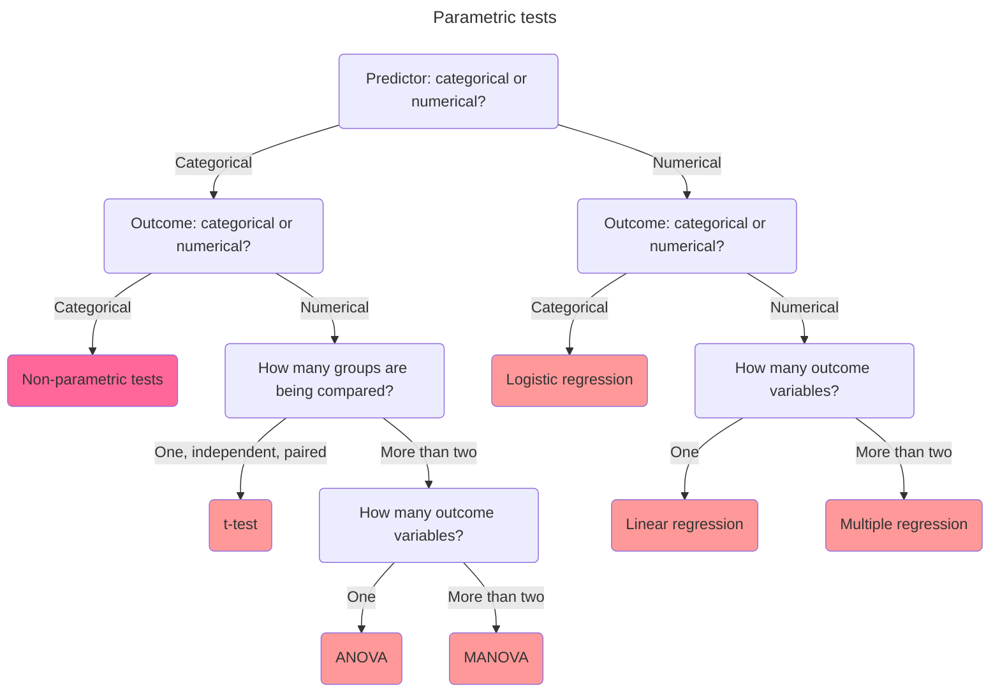
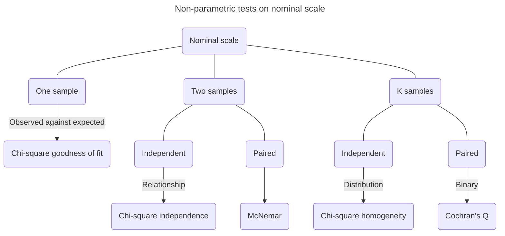
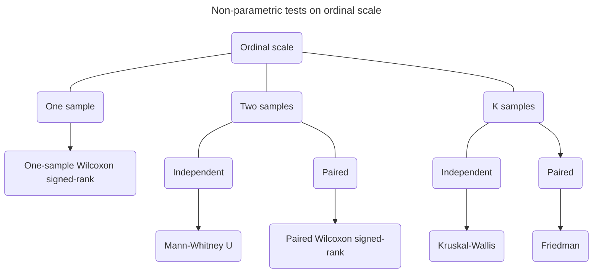

`This document covers key concepts in maths, statistics and practical practices used in analytics, with applications in Python. It is compiled from various resources for academic use.`[^1][^2]

[^1]: Nield, T. 2021. *Essential Math for Data Science: Take Control of Your Data with Fundamental Calculus, Linear Algebra, Probability and Statistics*. O'Reilly: Cambridge, England.

[^2]: Howell, E. https://medium.com/@egorhowell

# Basic maths and calculus

**Maths** is the study of **numbers**, **shapes**, **patterns**, and **relationships**. It provides tools and methods for solving problems, understanding the world around us, and making predictions in various fields.

**Calculus** deals with **continuous change**, focusing on **derivatives** that measure **rates of change** and **integrals** that measure the **accumulation of quantities**, using techniques like finding slopes of curves in differentiation and calculating areas under curves in integration.

**Variables** are named placeholders for numbers that aren't specified or known. In Python, we use theta $θ$ to denote angles and beta $β$ for a parameter in a linear regression.

```python
x = int(input('Please input a number'))
product = 3 * x
print(product)
```

**Parameters** are numerical values that summarise certain characteristics of a population. They are fixed and usually unknown values that define the underlying distribution of data. For example, in a normal distribution, the mean and standard deviation are parameters that describe the central tendency and spread of the data, respectively. Parameters are often estimated using sample data, and the estimates are referred to as statistics. This estimation process allows us to make inferences about the population based on the sample data.

**Functions** are expressions that show how variables relate to one another. Basically, you put in an input variable, the function works on them, and you get an output variable. Functions help us understand how variables are related such as predicting how many fires we might have at a certain temperature, which we typically plot on a **Cartesian plane**. Another convention is to explicitly designate the dependent variable $y$ as a function of $x$, denoted as $f(x)$. Therefore, instead of stating a function as $y=2x+1$, we can also represent it as $f(x)=2x+1$, a **continuous function** without breaks in its line.

```python
# Declare a linear function

def f(x):
    return 2 * x + 1

x_values = [0, 1, 2, 3]
for x in x_values:
    y = f(x)
    print(y)
```

```python
# Plot a linear function with SymPy

from sympy import *

x = symbols('x')
f = 2 * x + 1
plot(f)
```

```python
# Plot a quadratic function with SymPy

from sympy import * 

x = symbols('x')
f = x**2 + 1
plot(f)
```

When a function is continuous but curvy known as a **parabola**, rather than linear and straight, we call it a **curvilinear function**.

Functions can use more than one input variable such as $f(x,y)=2x+3y$. To represent this graphically, we plot it in **three dimensions**, forming a plane of values instead of a line. This approach helps us visualise how the function changes across different combinations of the two independent variables $x$ and $y$ with one dependent variable.

```python
# 3D function

from sympy import * 
from sympy.plotting import plot3d 

x, y = symbols('x, y')
f = 2 * x + 3 * y 
plot3d(f)
```

A **summation** is expressed as a sigma $Σ$ and adds elements together. For example, iterate the numbers 1 through 3, multiply each by 2 and sum them. Note that $i$ is a placeholder variable representing each consecutive index value we are iterating in the loop, which we multiply by 2 and then sum all together.

$$
\sum_{i=1}^3 2i=(2)1+(2)2+(2)3=12
$$

```python
summation = sum(2 * i for i in range(1, 4))
print(summation)

#Output
12
```

The `range()` function in Python is end exclusive, meaning if you invoke range(1, 4), it will iterate the numbers 1, 2, and 3, which excludes the 4 as an upper boundary.

It is also common to see `n` represent the number of items in a collection, where we iterate a collection of numbers of size `n`, multiply each one by 10, and sum them.

$$
\sum_{i=1}^n 10x_{i}
$$

```python
x = [1, 4, 6, 2] 
n = len(x) 
summation = sum(10 * x[i] for i in range(0, n))
print(summation)

# Output
130
```

A a summation operation in SymPy is performed using the `sum()` operator. We then use the `subs()` function to specify n as 5, which will then iterate and sum all $i$ elements from $1$ through $n$. Finally, use the `doit()` function to execute the expression.

```python
from sympy import *

i, n = symbols('i, n') 

# Iterate each element i from 1 to n, then multiply and sum
summation = Sum(2 * i,(i, 1 , n)) 

# Specify n as 5, then iterate the numbers 1 through 5
up_to_5 = summation.subs(n, 5)
print(up_to_5.doit())

# Output
30
```

## Exponent

**Exponents** involve multiplying a number by itself a certain number of times e.g. $2^3=2 \times 2 \times 2=8$, that is, $2$ as the base and $3$ as the exponent.

When we multiply exponents together with the same base, we simply add the exponents which is known as the **product rule** e.g. $x^2x^3=x^{2+3}=x^5$ and $\frac{x^2}{x^5}=x^{2-5}=x^{-3}$. The term **product** refers to the result of multiplying two or more numbers or expressions together.

```python
from sympy import *

x = symbols('x') 
expr = x**2 / x**5 
print(expr)

# Output
x**(-3)
```

**Chain of products** is a sequence where you multiply several factors together in a specific order. For instance, $a \times b \times c$ is a chain of products involving three factors.

**Chain of equations** is a sequence where you solve a series of equations step by step. For example, if you solve $x+2=5$ to find $x$, and then use $x$ in another equation 
$2x-1=5$, you create a chain of equations.

**Fractional exponents** are an alternative way to represent **roots**. For example, exponent $\frac{1}{2}$ in $4^{\frac{1}{2}}=\sqrt{4}=2$ represents the squared root operation and $\frac{1}{3}$ in $8^{\frac{1}{3}}=\sqrt[3]{8}=2$ a cubed root.

**Power rule** is an exponent of an exponent will multiply the other exponent together e.g. $(8^3)^2=8^{3*2}=8^6$ and $(8^{\frac{1}{3}})^2=2^2=4$.

Irrational numbers like $\pi$ has an infinite number of decimal places can serve as exponents if we take the first 11 digits. We can approximate it as a rational number e.g. $8^\pi \approx 8^{\frac{31415926535}{10000000000}}\approx 687.2913$.

## Logarithm

A **logarithm** is a math function that finds a power for a specific number and base. From measuring earthquakes to managing volume on your stereo, the logarithm is found everywhere. It is also a key part of logistic regression. For example, $2$ raised to the power of $3$ equals to $8$.

$$
\log{_a}b=x \Leftrightarrow a^x=b
$$

$$
\log_{\text{base}}\text{argument} = \text{exponent} \Leftrightarrow \text{base}^{\text{exponent}} = \text{argument}
$$

$$
\log{_2}8=3 \Leftrightarrow 2^3=8
$$

Note that an argument can be either an input or an output provided to a function.

```python
from math import log

# Find what power of 2 equals 8
x = log(8, 2)
print(x)

# Output
3.0
```

| Operator | Exponent property | Logarithm property |
|----------|-------------------|--------------------|
| Multiplication | $x^m \times x^n=x^{m+n}$ | $\log(a \times b)=\log(a)+\log(b)$ |
| Division | $\frac{x^m}{x^n}=x^{m-n}$ | $\log(\frac{a}{b})=\log(a)-\log(b)$ |
| Exponentiation | $(x^m)^n=x^{mn}$ | $\log(a^n)=n \times \log(a)$ |
| Zero exponent | $x^0=1$ | $\log(1)=0$ |
| Inverse | $x^{-1}=\frac{1}{x}$ | $\log(x^{-1})=\log(\frac{1}{x})=-\log(x)$

: Logarithmic properties

## Euler's number and natural logarithm


In data science, the default base for the logarithm, rather than `10` is **Euler's number** `e`, which is a mathematical constant approximately equal to `2.71828`. Its exponential function is a derivative to itself, which is convenient for exponential and logarithmic functions.

$$
e := \lim_{n \to \infty} \left(1 + \frac{1}{n} \right)^n
$$

For example, you lend £100 to someone with 20% interest annually for two years. Note that interest is typically compounded monthly.

$$
A=P \left(1+\frac{r}{n} \right)^{nt}
$$

$$
Balance=starting\ value \left( 1+\frac{\text{interest rate}}{\text{number of months}} \right)^{\text{number of months}\ \times\ \text{number of years}}
$$

$$
100 \left(1+\frac{0.2}{12} \right)^{12 \times 2}=148.69146179463576
$$

```python
from math import exp

p = 100
r = 0.2
n = 12
t = 2

a = p * (1 + (r / n))**(n * t)
print(a)

# Output
148.69146179463576
```

If daily for two years:

$$
100 \left(1+\frac{0.2}{365} \right)^{365 \times 2}=149.16612786515807
$$

We get smaller and smaller fractions of a cent the more frequently we compound. If we keep making these periods infinitely smaller to the point of compounding continuously, we need Euler's number
$e \approx 2.71828$.

$$
A=P(e^{rt})
$$

$$
100(e^{0.2 \times 2})=149.18246976412703
$$

```python
from math import exp

p = 100
r = 0.2
t = 2

a = p * exp (r * t)
print(a)

# Output
149.18246976412703
```

Technically, $e$ is the resulting value of the expression $(1+\frac{1}{n})^n$ as $n$ gets bigger and approaches infinity. As you make $n$ larger, there is a diminishing return, and it converges approximately on the value of $e$, which is $2.71828$.

$$
\left(1+\frac{1}{100} \right)^{100}=2.70481382942
$$

$$
\left(1+\frac{1}{10000} \right)^{10000}=2.71814592682
$$

$$
\left(1+\frac{1}{10000000} \right)^{10000000}=2.71828169413
$$

When $e$ is used as our base for a logarithm, we call it a **natural logarithm** e.g. $log{_e}10 \Leftrightarrow ln(10)$. Note that the natural logarithm is a default function in Python.

```python
from math import log

# Find what power of e equals 10
x = log(10)
print(x)

# Output
2.302585092994046
```

## Limit


A **limit** describes the behaviour of a function as its input **approaches** a value **but never reaches** it.

$$
f(x)=\frac{1}{x}
$$

The limit of the function $f(x)$ as the input variable $x$ approaches the value $c$, it equals to $L$.

$$
\displaystyle{\lim_{x \to c}}f(x)=L
$$

That is, as $x$ approaches infinity, the function $\frac{1}{x}$ approaches $0$ but never reaches it.

$$
\displaystyle{\lim_{x \to \infty}}\frac{1}{x}=0
$$

```python
from sympy import *

x = symbols('x')
f = 1 / x
result = limit(f, x, oo)
print(result)

# Output
0
```

The constant $e$ commonly appears in limits, especially when dealing with exponential functions. As $x$ approaches infinity, the expression $(1+\frac{1}{n})^n$ converges to $e$.

$$
\displaystyle{\lim_{x \to \infty}} \left(1+\frac{1}{n} \right)^n=e=2.71828182845905
$$

```python
from sympy import *

x = symbols('n')
f = (1 + ( 1 / n))**n
result = limit(f, n, oo)
print(result)

# Output
2.71828182845905
```

> [!NOTE]
> [SymPy](https://docs.sympy.org/latest/tutorials/intro-tutorial/intro.html 'What is symbolic computation?') is a robust computer algebra system for Python, which deals with the computation of mathematical objects symbolically rather than approximately. Mathematical expressions with unevaluated variables are left in symbolic form.

## Derivative


A **derivative** tells the **slope** of a function, and it is useful to measure the **rate of change** at any point in a function, which is often used in machine learning with **gradient descent** to find the minimum of a function by iteratively moving in the direction of steepest descent.

For example, how steep is the curve at $x=3$ in the function $f(x)=x^2$? We can measure steepness at any point in the curve with a visualised **tangent line** that just touches the curve at a given point.

$$
f'(x)=\frac{d}{dx}x^n=nx^{n-1}
$$

$$
f'(3)=2 \times 3^{2-1}=6
$$

```python
# Calculate the derivative of the function

from sympy import *

x = symbols('x')
f = x**2
dx_f = diff(f)
print(dx_f)

# Output
2*x
```

```python
# When x = 3

from sympy import *
x = symbols('x')
f = x**2
slope = diff(f)

def f(x):
    return x**2
    
def dx_f(x):
    return 2*x # The derivative we calculated above

slope = dx_f(3)
print(slope)

# Output
6
```

**Partial derivatives** are derivatives on functions that have multiple input variables, that is, slopes with respect to multiple variables in several directions. e.g. $f(x,y)=2x^3+3y^3$. The variables $x$ and $y$ each get their own derivatives $\frac{d}{dx}$ and $\frac{d}{dy}$.

$$
f'(x)=nx^{n-1}
$$

$$
\frac{d}{dx}2x^3+3y^3=3 \times 2x^{3-1}=6x^2
$$

$$
\frac{d}{dx}2x^3+3y^3=3 \times 3y^{3-1}=9y^2
$$

When $(x,y)$ is $(1,2)$, the slope to $x$ is $6(1)^2=6$ and $y$ is $9(2)^2=36$.

```python
from sympy import *
from sympy.plotting import plot3d

x,y = symbols('x y') 
f = 2*x**3 + 3*y**3

# Calculate the partial derivatives for x and y
dx_f = diff(f, x)
dy_f = diff(f, y)
print(dx_f) # prints 6*x**2 
print(dy_f) # prints 9*y**2
plot3d(f) # plot the function
```

The **chain rule** in calculus is used to differentiate composite functions expressed as $\frac{dz}{dx}=\frac{dx}{dy} \times \frac{dy}{dx}$ e.g. when we build a neural network.

$$
\begin{cases}
y=x^2+1\\
z=y^3-2
\end{cases}
$$

$$
\Rightarrow z=(x^2+1)^3-2=6x(x^2+1)^2
$$

```python
from sympy import * 

z = (x**2 + 1)**3 - 2 
dz_dx = diff(z, x)
print(dz_dx)

# Output
6*x*(x**2 + 1)**2
```

## Integral


The opposite of a derivative is an **integral**, which finds the area under the curve for a given range. For example, **Riemann sum** provides a certain method of approximation of an integral by a finite sum. Let's find the area under the line between $0$ and $1$ in the function $f(x)=2x$. The area is a triable, where you multiply its base by its height and then divide the result by $2$.

$$
A=\frac{1}{2}\ bh=\frac{1}{2}\ 1 \times 2=1
$$

Now, find the area under the line between $0$ and $1$ in the function $f(x)=x^2+1$. The curviness here does not give us a clean geometric formula to find the area, but we can pack 5 rectangles of equal length under the curve.

```python
def approximate_integral(a, b, n, f):
    delta_x = (b - a) / n
    total_sum = 0
    
    for i in range(1, n + 1):
        midpoint = 0.5 * (2 * a + delta_x * (2 * i - 1))
        total_sum += f(midpoint)
    return total_sum * delta_x
    
def my_function(x):
    return x**2 + 1

area = approximate_integral(a = 0, b = 1, n = 5, f = my_function)
print(area) 

# Output
1.33
```

```python
# Use SymPy to perform integration

from sympy import *

f = x**2 + 1

# Calculate the integral of the function with respect to x for the area between x = 0 and 1
area = integrate(f, (x, 0, 1))
print(area)

# Output
4/3
```

```python
# Use limit to calculate integral

x, i, n = symbols('x, i, n')
f = x**2 + 1
lower, upper = 0, 1

# Calculate width and each rectangle height at index i
delta_x = ((upper - lower) / n)
x_i = (lower + delta_x * i)
fx_i = f.subs(x, x_i)

# Iterate all n rectangles and sum their areas
n_rectangles = Sum(delta_x * fx_i, (i, 1, n)).doit()

# Calculate the area by approaching the number of rectangles n to infinity
area = limit(n_rectangles, n, oo)
print(area)

# Output
4/3
```

## Logic and set theory

**Logic** is the study of reasoning and argumentation, focusing on the principles of valid inference and the structure of arguments. It helps us understand how to make decisions, solve problems, and evaluate the truth of statements.

**Set theory** is a branch of mathematics that studies collections of objects, called sets, and their relationships. It provides a foundation for other mathematical disciplines like algebra, calculus, and probability theory.


# Linear algebra

Linear algebra deals with **vector spaces** and **linear transformations** between them, encapsulating concepts such as matrices, determinants, and eigenvalues. It provides a powerful framework for solving systems of linear equations, understanding geometric transformations, and analysing data in various fields like engineering, physics, and computer science.

A **vector** is a mathematical object that represents both **direction** and **magnitude**, often depicted as an arrow in space. It can be used to describe quantities such as **displacement**, **velocity**, and **force**. In computer science, it is an array of numbers **storing data**.

A **matrix** is a rectangular array of numbers, symbols, or expressions arranged in rows and columns.

For example, if you have data about a house that is 18,000 square feet and valued at $260,000, we can represent it as a vector where each number tells us how much we move in a particular direction.

$$
\vec{v}=\begin{bmatrix}
x\\
y
\end{bmatrix}=\begin{bmatrix}
18000\\
260000
\end{bmatrix}
$$


```python
import numpy as np

v = np.array([18000, 260000])
print(v)

# Output
[ 18000 260000]
```

Multiple-dimensional vector:

$$
\vec{v}=\begin{bmatrix}
x\\
y\\
z
\end{bmatrix}=\begin{bmatrix}
1\\
2\\
3
\end{bmatrix}
$$

```python
import numpy as np

v = np.array([1, 2, 3])
print(v)

# Output
[1 2 3]
```

**Vector addition** is commutative and its order of operation does not matter.


$$
\begin{cases}
\vec{v}=\begin{bmatrix}
3\\
2
\end{bmatrix}\\[1em]
\vec{w}=\begin{bmatrix}
2\\
-1
\end{bmatrix}
\end{cases}
$$

$$
\Rightarrow \vec{v}+\vec{w}=\begin{bmatrix}
3+2\\
2+(-1)
\end{bmatrix}=\begin{bmatrix}
5\\
1
\end{bmatrix}
$$

```python
from numpy import array

v = array([3, 2])
w = array([2, -1])

# sum the vectors 
v_plus_w = v + w 
print(v_plus_w)

# Output
[5, 1]
```

**Scaling** is growing or shrinking a vector's length, which does not change its direction but only its magnitude. For example, a vector is scaled by a factor of `2`, which is also called a scalar or coefficient. However, when you multiply a vector by a negative scalar, it flips the direction.


$$
\vec{v} \times 2=\overrightarrow{2v}=2\begin{bmatrix}
3\\
1
\end{bmatrix}=\begin{bmatrix}
3 \times 2\\
1 \times 2
\end{bmatrix}=\begin{bmatrix}
6\\
2
\end{bmatrix}
$$

```python
from numpy import array

v = array([3, 1])
scaled_v = 2 * v 
print(scaled_v)

# Output
[6 2]
```

All data operations, even basic tasks like finding averages, can be seen as vector operations. To find the average house value and square footage for a neighbourhood, we add up the total values and square footages. Then, we divide this combined total by the number of houses $n$ to get the average, which is the same as multiplying by $\frac{1}{n}$. This gives us a vector with the average house value and square footage.

**Linear span** of a set of vectors is the set of all possible linear combinations of those vectors. It essentially represents all the points that can be reached by scaling and adding the vectors in the set.

**Linear independence** refers to a set of vectors in a vector space where none of the vectors in the set can be expressed as a linear combination of the others. Each vector contributes unique information or direction to the space. On the other hand, **linear dependence** means one vector in a group of vectors can be written as a sum of the others multiplied by scalars, which may complicate problem-solving by causing variables to disappear in a set of equations.

A **linear transformation** is a function between two vector spaces that preserves vector addition and scalar multiplication. It maps lines to lines and the origin to the origin, typically by **scaling**, **rotating**, **shearing**, and **inverting**.


## Matrix multiplication

Matrix multiplication combines two matrices to produce another matrix. It involves **multiplying** the elements of **rows of the first matrix** by the corresponding elements of **columns in the second matrix** and **summing up these products**. The resulting matrix has dimensions determined by the number of rows of the first matrix and the number of columns of the second matrix.

$$
c_{ij}\sum_{k=1}^{n}a_{ik} \times ba_{jk}=a_{i1} \times a_{j1}\ldots+a_{in} \times a_{jn}
$$


If A is a `4` $\times$ $2$ matrix and B a $2$ $\times$ `3` matrix, the matrix product C is defined to be a `4` $\times$ `3` matrix.

$c11=a11 \times b11+a12 \times b21$\
$c12=a11 \times b12+a12 \times b22$\
$c13=a11 \times b13+a12 \times b23$

$c21=a21 \times b11+a22 \times b21$\
$c22=a21 \times b12+a22 \times b22$\
$c23=a21 \times b13+a22 \times b23$

$c31=a31 \times b11+a32 \times b21$\
$c32=a31 \times b12+a32 \times b22$\
$c33=a31 \times b13+a32 \times b23$

$c41=a41 \times b11+a42 \times b21$\
$c42=a41 \times b12+a42 \times b22$\
$c43=a41 \times b13+a42 \times b23$

```python
from numpy import array

basis = array([[3, 0], [0, 2]])
v = array([1, 1])

# create new vector by transforming v with dot product
new_v = basis.dot(v)
print(new_v)

# Output
[3, 2]
```

```python 
# Breaking out the vectors with dot approach
from numpy import array

i_hat = array([3, 0])
j_hat = array([0, 2])

# Transpose rows into columns
basis = array([i_hat, j_hat]).transpose()
v = array([1, 1])

# Create new vector by transforming v with dot product
new_v = basis.dot(v)
print(new_v)

# Output
[3, 2]
```

```python 
# Breaking out the vectors @ approach
from numpy import array

# Transformation 1

i_hat1 = array([0, 1])
j_hat1 = array([-1, 0])
transform1 = array([i_hat1, j_hat1]).transpose()

# Transformation 2
i_hat2 = array([1, 0])
j_hat2 = array([1, 1])
transform2 = array([i_hat2, j_hat2]).transpose()

# Note that the order of combining transformations is important from the inner-most to outer-most
combined = transform2 @ transform1

# Test
v = array([1, 2])
print(combined.dot(v))

# Output
[-1, 1]
```

## Determinant

A **determinant** is a number calculated from a square matrix that shows how much an area or volume changes when a shape is transformed. It helps understand transformations like scaling, rotating, and translating objects in 2D and 3D space. For example, determinants can help identify which faces of an object are visible and which are hidden.

Simple shears and rotations should not affect the determinant as the area will not change. When the orientation flips, then the determinant will be negative.

```python
from numpy.linalg import det
from numpy import array

i_hat = array([3, 0])
j_hat = array([0, 2])
basis = array([i_hat, j_hat]).transpose()
determinant = det(basis)

print(determinant)

# 6.0
```

If you have a determinant of 0 that means all of space has been squished into a lesser dimension. Testing for a 0 determinant is highly helpful to determine if a transformation has linear dependence. When you encounter this you will likely find a difficult or unsolvable problem on your hands.

```python
from sympy import *

basis = Matrix([ [2,1], [6,3] ])
determinant = det(basis)
print(determinant)

# Output
0
```

## Special types of matrices

The **square matrix** has an equal number of rows and columns, which is primarily used to represent linear transformations.

$$
\begin{bmatrix}
4 & 2 & 7\\
5 & 1 & 9\\
4 & 0 & 1
\end{bmatrix}
$$

The **identity matrix** has a diagonal of 1s while the other values are 0.

$$
\begin{bmatrix}
1 & 0 & 0\\
0 & 1 & 0\\
0 & 0 & 1
\end{bmatrix}
$$

An **inverse matrix** is when multiplied with the original matrix, results in the identity matrix. In other words, if $A$ is a square matrix and $A^{-1}$ is its inverse, then $A \times A^{-1}=A^{-1} \times A=I$, where $I$ is is the identity matrix.

$$
\begin{cases}
A=\begin{bmatrix}
4 & 2 & 7\\
5 & 1 & 9\\
4 & 0 & 1
\end{bmatrix}\\
A^{-1}=\begin{bmatrix}
-\frac{1}{2} & 0 & \frac{1}{3}\\
5\frac{1}{2} & -2 & \frac{4}{3}\\
-2 & 1 & \frac{1}{3}
\end{bmatrix}
\end{cases}
$$

$$
\Rightarrow \begin{bmatrix}
-\frac{1}{2} & 0 & \frac{1}{3}\\
5\frac{1}{2} & -2 & \frac{4}{3}\\
-2 & 1 & \frac{1}{3}
\end{bmatrix} \times \begin{bmatrix}
4 & 2 & 7\\
5 & 1 & 9\\
4 & 0 & 1
\end{bmatrix}=\begin{bmatrix}
1 & 0 & 0\\
0 & 1 & 0\\
0 & 0 & 1
\end{bmatrix}
$$

A **diagonal matrix** has zeros everywhere except on its main diagonal. The values on this main diagonal are not 1s.

$$
\begin{bmatrix}
4 & 0 & 0\\
0 & 2 & 0\\
0 & 0 & 5
\end{bmatrix}
$$

A **triangular matrix** has a diagonal of non-zero values in front of a triangle of values, while the rest of the values are 0s.

$$
\begin{bmatrix}
4 & 2 & 9\\
0 & 1 & 6\\
0 & 0 & 5
\end{bmatrix}
$$

A **sparse matrix** has most of its elements are 0s.

$$
\begin{bmatrix}
0 & 0 & 0\\
0 & 1 & 0\\
0 & 0 & 0
\end{bmatrix}
$$

## Systems of equations and inverse matrices

One of the basic use cases for linear algebra is solving systems of equations.

$$
\begin{cases}
4x+2y +4z =44\\
5x+3y+7z=56\\
9x+3y+6z=72
\end{cases}
$$

$$
\Rightarrow \begin{bmatrix}
4 & 2 & 4\\
5 & 3 & 7\\
9 & 3 & 6
\end{bmatrix} \times \begin{bmatrix}
x\\
y\\
z
\end{bmatrix}=\begin{bmatrix}
44\\
56\\
72
\end{bmatrix}
$$

```python
from numpy import array
from numpy.linalg import inv

A = array([ [4, 2, 4], [5, 3, 7], [9, 3, 6] ])
B = array([ 44, 56, 72 ])

values = inv(A).dot(B)
print(values)

# Output
[ 2. 34. -8.]
```

```python
# Alternative solution
import sympy as sp

# Define variables
x, y, z = sp.symbols('x, y, z')

# Define equations
eq1 = sp.Eq(4*x + 2*y + 4*z, 44)
eq2 = sp.Eq(5*x + 3*y + 7*z, 56)
eq3 = sp.Eq(9*x + 3*y + 6*z, 72)

# Solve the system of equations
solution = sp.solve((eq1, eq2, eq3), (x, y, z))

print("Solution: x =", solution[x], ", y =", solution[y], ", z =", solution[z])

# Output
Solution: x = 2 , y = 34 , z = -8
```

## Eigenvectors and eigenvalues 

**Eigenvectors** denoted by $v$ are non-zero vectors that retain their direction (or reverse it) when transformed by a matrix, though their length may change. They indicate the directions along which a linear transformation stretches, compresses, or flips the data. Essentially, eigenvectors reveal the principal directions of maximum variance in the data.

Eigenvalues denoted by $λ$ are scalars that indicate how much a linear transformation stretches or compresses space along specific directions. They measure the extent of stretching or compression applied to their corresponding eigenvectors during the transformation, reflecting the magnitude of variance in those directions.

Why they are important in data analysis:

- **Dimensionality reduction**: Used in techniques like Principal Component Analysis (PCA) to reduce the number of variables while preserving important data features.
- **Feature extraction**: Help identify the main patterns and directions of variance in the data.
- **Data compression**: Enable data simplification by focusing on the most significant components.
- **Noise reduction**: By ignoring components with small eigenvalues, we can filter out noise.
- **Understanding transformations**: Provide insights into how data is transformed, aiding in the interpretation of linear transformations.

The eigenvalue equation is $Av=λv$, where $A$ is the matrix, $v$ is the eigenvector, and $λ$ is the eigenvalue.

```python
from numpy import array, diag
from numpy.linalg import eig, inv

A = array([ [1, 2], [4, 5] ])
eigenvals, eigenvecs = eig(A)

print('Eigenvalues')
print(eigenvals)
print()
print('Eigenvectors')
print(eigenvecs)

# Output
Eigenvalues
[-0.46410162  6.46410162]

Eigenvectors
[[-0.80689822 -0.34372377]
 [ 0.59069049 -0.9390708 ]]
```

# Probability

**Probability** is about quantifying predictions of events yet to happen, whereas **likelihood** is measuring the frequency of events that already occurred. In statistics and machine learning, we often use likelihood as **the past** in the form of data to predict probability as **the future**. A probability of an event must be strictly between 0% and 100%. Logically, this means the probability of an event **not** happening is calculated by subtracting the probability of the event from $1$.

A **probability distribution** is a mathematical function that describes the likelihood of different outcomes in an experiment or process, assigning a probability to each possible outcome so that the total probability across all outcomes sums to 1. Suppose you have a bag with 3 red candies, 2 blue candies, and 5 green candies. The probability distribution shows the chances of picking each color as 30% for red, 20% for blue, and 50% for green.

## Basic probability

### Classical probability

**Classical probability** uses theory to apply a likelihood to possible events. On the other hand, **empirical probability** uses repeated trials to use actual observed frequencies to estimate likelihood. For example, what is the probability of randomly picking Monday in a week?

$$
\text{Classical probability}=\frac{\text{Number of events to occur}}{\text{Number of possible outcomes}}
$$

$$
\text{Empirical probability}=\frac{\text{Number of events occurred}}{\text{Number of observations}}
$$

$$
P(A)=\frac{N(A)}{N(B)}=\frac{1}{7} \approx 0.14285714285714285
$$

The opposite or complement of an event $A$ is the event not $A$, often denoted as ${\neg}A$, ${\sim}A$ or $A'$.

$$
P(A')=1-P(A)=1-\frac{1}{7}=\frac{6}{7} \approx 0.85714285714
$$

Alternatively, probability can be expressed as **odds**. For example, what are the odds in favour of randomly picking Monday in a week.

$$
t=\frac{p}{1-p}
$$

$$
\Rightarrow \frac{\dfrac{1}{7}}{1-\dfrac{1}{7}}=\frac{\dfrac{1}{7}}{\dfrac{6}{7}}=\frac{1}{6}
$$

The odds against the event with probability are six times as likely that a random day is not a Monday.

$$
t=\frac{1-p}{p}
$$

$$
\Rightarrow \frac{1-\dfrac{1}{7}}{\dfrac{1}{7}}=\frac{\dfrac{6}{7}}{\dfrac{1}{7}}=\frac{6}{1}
$$

Imagine a couple has two children. We know at least one of them is a girl. What is the chance that both children are girls?

1. **Possible Combinations**:
   - BB (both boys)
   - BG (boy and girl)
   - GB (girl and boy)
   - GG (both girls)

2. **Condition**: At least one child is a girl. So, we can ignore BB
   - BG
   - GB
   - GG

3. **Calculate Probability**:
   - Out of the 3 possible combinations (BG, GB, GG)

$$
\frac{\text{Number of favorable outcomes}}{\text{Total number of possible outcomes given the condition}}
$$

$$
\Rightarrow \frac{1}{3}
$$

Imagine you’re playing a game where every 15 minutes, you have a chance to spot a shooting star. You have a 20% chance to see a shooting star each time you check. What are the odds of seeing a shooting star in the next 15 minutes?

$$
1-(1-P)^n
$$

$$
\Rightarrow 1-(1-0.2)^4 =1-(0.8)^4=1-0.4096=0.5904
$$

- $(P)^n$ is the probability of the event happening $n$ times in a row.
    - E.g. probability of seeing a shooting star in each of four 15-minute intervals
- $(1-P)^n$ is the complement of the event happening $n$ times in a row.
    - E.g. probability of not seeing a shooting star in any of the four 15-minute intervals
- $1-(1-P)^n$ is the probability of the event happening at least once in $n$ trials.
    - E.g. probability of seeing a shooting star at least once in the four 15-minute intervals, meaning you could see it once, twice, three times, or all four times

### Joint probability

Find the probability of flipping a head on a coin and rolling a six on a dice that happen together.

$$
P(A \cap B)=P(A) \times P(B)
$$

$$
\Rightarrow \frac{1}{2} \times \frac{1}{6}=\frac{1}{12} \approx 0.08333333333
$$

We can use the multiplication as a shortcut to find the joint probability instead of generating all possible combinations and counting the ones of interest to us. This method is known as the **product rule**.

### Union probability

Find the probability of flipping a head on a coin or rolling a six on a dice that least one of the events happens and not mutually exclusive.

$$
P(A \cup B)=P(A)+P(B)−P(A \cap B)
$$

$$
\Rightarrow  \frac{1}{2}+\frac{1}{6}- \left( \frac{1}{2} \times \frac{1}{6} \right)=\frac{8}{12}-\frac{1}{12}=\frac{7}{12} \approx 0.58333333333
$$

### Conditional probability

A conditional probability is the likelihood of an event occurring given that another event has already happened, which allows you to evaluate how prior information affects probabilities.

Typically, the problem statement for conditional probability questions assumes that the initial event occurred or indicates that an observer witnesses it. The goal is to calculate the chances of the second event under the condition that the first event occurred.

$$
P(B|A)=\frac{P(A \cap B)}{P(A)}
$$

$$
\text{Probability of B given A}=\frac{\text{Probability of A intersects B}}{\text{Probability of A}}
$$

$$
P(\text{umbrella | rain})=\frac{P(\text{rain} \cap \text{umbrella})}{P(\text{rain})}
$$

$$
\Rightarrow \frac{0.5}{0.6} \approx 0.8333333333333334 \approx 83\%
$$

Imagine yourself calculating the probability of drawing a heart twice in a row. For the first draw, the chance of getting a heart is 25%, 13 out of 52 cards. Then, for the second draw, given you got a heart on the first draw, the chance becomes 23.5%, 12 out of 51 remaining cards.

$$
P(A \cap B)=P(A) \times P(B|A)
$$

$$
P(\text{1st heart and 2nd heart})=P(\text{1st heart} \times P(\text{2nd heart | 1st heart})
$$

$$
\Rightarrow \frac{13}{52} \times \frac{12}{51}= \frac{1}{17} \approx 0.058823529411764705 \approx 5.9\%
$$

### Bayes' theorem

Define the terms in Bayes' theorem:

- Posterior probability: P(belief|evidence)
- Likelihood: P(evidence|belief)
- Prior probability: P(belief)
- Marginal probability: P(evidence)

$$
P(A|B)=\frac{P(B|A) \times P(A)}{P(B)}
$$

$$
\text{Posterior probability}=\frac{\text{Likelihood} \times \text{Prior probability}}{\text{Marginal probability}}
$$

$$
P(\text{belief | evidence})=\frac{P(\text{evidence | belief}) \times P(\text{belief})}{P(\text{evidence})}
$$

$$
P(\text{rain | cloudy})=\frac{P(\text{cloudy | rain}) \times P(\text{rain})}{P(\text{cloudy})}
$$

$$
\Rightarrow \frac{0.95 \times 0.05}{0.65} \approx 0.07307692307692308 \approx 7\%
$$

Note that the order of events matters in Bayes' theorem. That is, the probability of it being cloudy given that it's raining but uses the probability of it raining given that it's cloudy in the equation, which leads to incorrect results. Theoretically, clouds may go away after it rains. Therefore, the following equation is considered incorrect. Unless, we'd like to claim otherwise.

$$
P(\text{cloudy | rain})=\frac{P(\text{rain | cloudy}) \times P(\text{cloudy})}{P(\text{rain})}
$$

```python
p_cloudy = 0.65 
p_rain = 0.05 
p_cloudy_given_rain = 0.95 
p_rain_given_cloudy = p_cloudy_given_rain * p_rain / p_cloudy
print(p_rain_given_cloudy)

# Output
0.07307692307692308
```

Imagine you have 1000 coins. Most of them are regular, but 1 coin is special and always shows heads. After flipping a coin 10 times and getting heads each time, what’s the chance that the next flip will also be heads?

To determine the probability of the next flip being heads, we can use Bayes' theorem. We need to calculate the probability of the coin being special given that we got 10 heads in a row.

Define the events:

- A: Selecting a special coin
- A': Selecting a regular coin
- B: Selecting 10 heads in a row
- B': Selecting another head after 10 heads in a row

Selecting 10 heads in a row:

- $P(A) = \frac{1}{1000} = 0.001$
- $P(A') = \frac{999}{1000} = 0.999$
- $P(B|A) = 1$
- $P(B|A') = \frac{1}{2}^{10} = \frac{1}{1024} = 0.000976$
- $P(B) = P(B|A) \times P(A) + P(B|A') \times P(A') = 1 \times 0.001 + 0.000976 \times 0.999 = 0.001976$

$$
P(A|B)=\frac{P(B|A) \times P(A)}{P(B)}
$$

$$
\Rightarrow \frac{1 \times 0.001}{0.001976} = 0.5061
$$

$$
P(A'|B)=\frac{P(B|A') \times P(A')}{P(B)}
$$

$$
\Rightarrow \frac{0.000976 \times 0.999}{0.001976} = 0.4939
$$

Selecting another head after 10 heads in a row:

$$
P(B'|B) = P(B'|A) \times P(A|B) + P(B'|A') \times P(A'|B)
$$

$$
\Rightarrow 1 \times 0.5061 + \frac{1}{2} \times 0.4939 = 0.7531
$$

### Poisson disc sampling

**Poisson disc sampling** is a method for generating points in a 2D plane such that no two points are closer than a specified minimum distance. This technique is useful for creating patterns in computer graphics, data visualisation, and other applications where a uniform distribution of points is desired.

## Discrete probability distribution

**Discrete probability distribution** provides a way to calculate and understand the probabilities of various outcomes for a discrete random variable, using the **probability mass function** (PMF) to describe individual probabilities and the **cumulative distribution function** (CDF) to describe cumulative probabilities.

### Binomial distribution

')

The binomial distribution models the number of successful outcomes in a fixed number of Bernoulli trials, which are random experiments with only two possible outcomes, success or failure. These outcomes are mutually exclusive and cannot occur at the same time. 

Find 11 probabilities for binomial distribution from 0 to 10 success.

```python
from scipy.stats import binom

n = 10
p = 0.9
for k in range(n + 1):
    probability = binom.pmf(k, n, p)
    print('{0} - {1}'.format(k, probability))

# Output
0 - 9.999999999999981e-11
1 - 8.999999999999986e-09
2 - 3.644999999999997e-07
3 - 8.747999999999995e-06
4 - 0.00013778099999999982
5 - 0.0014880347999999988
6 - 0.011160261000000001
7 - 0.05739562799999998
8 - 0.1937102445
9 - 0.387420489
10 - 0.3486784401000001
```

$$
9.999999999999981e{-}11=0.00000000009999999999999981=0.000000009999999999999981\%
$$

$$
0.3486784401000001 \approx 35\%
$$

**Bernoulli trial** (or binomial trial) is a random experiment with exactly two possible outcomes, **success** and **failure**, in which the probability of success is the same every time the experiment is conducted.

### Negative binomial distribution

The negative binomial distribution models the probability of observing a certain number of failures before observing a certain number of successes in a sequence of independent Bernoulli trials.

### Poisson distribution

The Poisson distribution models the probability that a certain number of events will occur during a specific time period.

For example, imagine you have an online website where you post content. Your website averages two views per hour. You want to determine the probability that your website will receive a certain number of views in a given hour.

### Geometric distribution

The geometric distribution is often referred to as the discrete version of the exponential distribution, which models the number of Bernoulli trials needed to get the first success.

What is the probability of rolling a 4 on a regular 6-sided die on the 5th roll?

Probability mass function:

$$
P(X=n)=(1-p)^{n-1} \times p
$$

$$
\Rightarrow P(5)=\left(1-\frac{1}{6}\right)^{5-1} \times \frac{1}{6}=0.08036
$$

Expected value (mean):

$$
E(X)=\frac{1}{p}
$$

$$
\Rightarrow E(X)=\frac{1}{\frac{1}{6}}=6
$$

```python
# Import packages
from scipy.stats import geom
import matplotlib.pyplot as plt

# Probability and Number of Trials
n = [1, 2, 3, 4, 5, 6, 7, 8, 9, 10]
p = 1 / 6

# Generate the PMF
dist = geom.pmf(X, p)

# Plot the distribution
plt.figure(figsize = (12, 7))
plt.scatter(n, dist, linewidth = 2, color = 'black')
plt.xticks(fontsize = 18)
plt.yticks(fontsize = 18)
plt.ylabel('Probability', fontsize = 20)
plt.xlabel('Number of Rolls', fontsize = 20)
plt.vlines(n, 0, dist, colors = 'black', linewidth = 2, alpha = 0.7)
plt.savefig('plot.png')
plt.show()
```

## Continuous probability distribution

**Continuous probability distribution** models the probability of a continuous random variable taking on a specific value or falling within a certain range. The **probability density function** (PDF) describes the likelihood of a continuous random variable falling within a specific range, while the **cumulative distribution function** (CDF) describes the probability of the random variable being less than or equal to a certain value.

### Normal distribution

**Normal distribution** aka **Gaussian distribution** is a **symmetrical bell-shaped** curve centred around the mean, with most of its **data clustered near the mean**. **Its spread is determined by the standard deviation.** As you move away from the mean, the tails on both sides of the curve **gradually decrease in height** but never touch zero. 

$$
f(x)={\frac{1}{\sigma{\sqrt{2\pi }}}}e^{-{\frac{1}{2}}\left({\frac{x-\mu}{\sigma}}\right)^{2}}
$$

### Uniform distribution

**Uniform distribution** is a continuous probability distribution where all outcomes are equally likely. It is often used to models a situation where all outcomes in a range are equally likely.

### Beta distribution


The **beta distribution** allows us to see the likelihood of different underlying probabilities for an event to occur given $\alpha$ **successes** and $\beta$ **failures**, which models variables that are bounded between 0 and 1 and are often used in Bayesian statistics.

Find the the likelihood of that probability being $90\%$ or less given $8$ successes and $2$ failures.

```python
from scipy.stats import beta 

a=8 
b=2 
p = beta.cdf(0.9, a, b)
print(p)

# Output
0.7748409780000002
```

### Gamma distribution

**Gamma distribution** is a two-parameter family of continuous probability distributions. The exponential distribution, Erlang distribution, and chi-squared distribution are special cases of the gamma distribution. It gives the probability of a certain number of events occurring in a fixed interval of time or space. For example, it can be used to model the time until a radioactive atom decays or the time until a customer arrives at a store.

### Exponential distribution

**Exponential distribution** is a continuous probability distribution commonly used to model the time between events in a Poisson process. It is particularly useful for describing the time until the first occurrence of an event or the time until an event happens given that it occurs at a constant average rate. For example, the time between phone calls at a call centre or the time between arrivals of buses at a bus stop can be modelled using the exponential distribution.

### Erlang distribution

**Erlang distribution** is a special case of the gamma distribution with integer shape parameters. It is named after the Danish mathematician Agner Krarup Erlang. The Erlang distribution is used in various fields, particularly in queuing theory, telecommunications, and reliability engineering, where it models the time until a certain number of events occur in a Poisson process.

### Chi-squared distribution

**Chi-squared distribution** is a continuous probability distribution that is widely used in statistics. It is often used in hypothesis testing, goodness of fit tests, and confidence interval estimation. For example, the chi-squared distribution is used in the chi-squared test to determine if there is a significant difference between the expected and observed frequencies of categorical data.

### Log-normal distribution

**Log-normal distribution** is a continuous probability distribution of a random variable whose logarithm is normally distributed. It is used to model variables that are positive and skewed to the right, such as the size of income, the price of stocks, and the length of time people spend on a website.

### Weibull distribution

**Weibull distribution** is a continuous probability distribution that is widely used in reliability engineering to model the time until failure of a component or system. It is named after the Swedish engineer Waloddi Weibull. The Weibull distribution can model a wide range of failure patterns, including early-life failures, constant failure rates, and wear-out failures.

### Gumbel distribution

**Gumbel distribution** is a continuous probability distribution that is used to model the distribution of the maximum or minimum of a number of samples of various distributions. It is often used in extreme value theory to model the distribution of extreme events, such as floods, earthquakes, and stock market crashes.

### Triangular distribution

**Triangular distribution** is a continuous probability distribution that is often used in decision analysis to model uncertain variables with a known minimum, maximum, and most likely value. It is shaped like a triangle, with the minimum, maximum, and most likely values forming the vertices of the triangle.

# Statistics

Variables are the characteristics of a dataset that can be measured or categorised. **Quantitative variables** are numerical and can be ordered or ranked, while **qualitative variables** are categorical and can be classified or grouped.

**Statistical interaction** occurs when the effect of one variable on an outcome is different depending on the level of another variable. In other words, the impact of one predictor variable on the dependent variable changes based on the value of another predictor variable. For example, the effect of a drug on a patient's health may depend on the patient's age.

**Independent variables** are the factors that researchers **manipulate** in an experiment. They are the variables that are changed deliberately to observe their effect on the dependent variable. **Dependent variables**, on the other hand, are the **outcomes** that researchers **measure**. They depend on the independent variable. Their changes are assumed to be caused by manipulations of the independent variable. **Controlled variables** are the factors that are kept **constant** during an experiment to ensure that they do not influence the results. By controlling these variables, researchers can isolate the effects of the independent variable on the dependent variable.

**Confounding variables** are the factors that can influence the results of an experiment, leading to **incorrect conclusions**. They are the variables that are not the focus of the study but can affect the relationship between the independent and dependent variables. For example, if a study finds a correlation between ice cream sales and drowning deaths, the confounding variable could be the temperature. Both ice cream sales and drowning deaths increase in hot weather, but they are not directly related to each other.

## Descriptive statistics

> Garbage in, garbage out!

Refer to [statistics with Python](https://docs.python.org/3/library/statistics.html 'Mathematical statistics functions') for more information on mathematical statistics functions.

Statistics encompasses a range of mathematical techniques aimed at **collecting**, **organising**, **summarising**, **analysing**  and **interpreting data**, to **discover findings** that are useful or **predict what causes those findings to happen**. Statistics is the heart of so many **data-driven** innovations.

**Data** is like snapshots of a story, similar to photographs. But it doesn't capture everything about reality or the countless factors behind the story. Data can also be biased, incomplete, or lacking important details. Ideally, we'd want endless data covering every aspect of reality, but that's not possible. Even the most powerful supercomputers can't gather all the world's data.

To achieve our goals, we must focus our objectives. While a few well-chosen photos can reveal if someone is good at golf, understanding their entire life story from photos alone is nearly impossible. Similarly, in data projects, we need to gather relevant and complete data by keeping our objectives clear and focused. Broad goals can lead to misleading results or incomplete data. This practice, known as **data mining**, though useful, requires careful execution.

**Descriptive statistics** summarises and describe the main features of a dataset. On the other hand, **inferential statistics** makes predictions or inferences about a population based on a sample of data.

**Population** represents the entirety of individuals under scrutiny in a given study. A **sample** is a subset of the population that is ideally random and unbiased, which we use to infer attributes about the population. We often have to study samples because polling the entire population is not always possible. When populations are **theoretical**, scientists resort to **simulations** to generate data.

It's crucial to have a **random** sample to avoid **bias**, which distorts our conclusions by favouring one group over others. Many **confounding variables** can affect the outcome of a study, making it difficult to determine the true relationship between the variables of interest. Refer to [glossary of biases](https://github.com/x-square/behavioural-science/blob/main/23-10-biases-glossary.md 'Glossary of biases') for more information on unfair preference towards one group.

**Measures of central tendency** are values that represent the center of a dataset, that is, mean, median, and mode.

$\mu$ [mu] refers to **population mean**, and $\bar{x}$ [x bar] represents **sample mean** .

$$
\bar{x} = \frac{1}{n} \left(\sum_{i=1}^{n}x_i \right)
$$

$$
\Rightarrow m=\frac{\text{sum of terms}}{\text{number of terms}}
$$

```python
# Mean number of pets each person owns
import numpy as np

sample = [1, 3, 2, 5, 7, 0, 2, 3]
mean_value = np.mean(sample)
print(mean_value)

# Output
2.875
```

**Weighted mean** is a type of average where each value is multiplied by a predetermined weight reflecting its relative importance when calculating the average.

$$
W=\frac{\sum_{i=1}^{n}w_{i}*x_{i}}{\sum_{i=1}^{n}w_{i}}=\frac{(x_{1}*w_{1})+\ldots+(x_{n}*w_{n})}{w_{1}+ \ldots w_{n}}
$$

```python
# Three exams of 0.2 weight each and final exam of 0.4 weight
scores = [90, 80, 63, 87]
weights = [0.2, 0.2, 0.2, 0.4]
weighted_mean = sum(s * w for s, w in zip(scores, weights)) / sum(weights)
print(weighted_mean)

# Output
81.4
```

**Median** can be a helpful alternative to the mean when data is **skewed by outliers** or values that are **extremely large and small** compared to the rest of the values.

If $n$ is odd:

$$
\text{Median}=\frac{n+1}{2}
$$

If $n$ is even:

$$
\text{Median}=\frac{\frac{n}{2}+ \left(\frac{n}{2}+1 \right)}{2}
$$

```python
# Middle-most value of pets each person owns
import numpy as np

sample = [0, 1, 5, 7, 9, 10, 14]
median_value = np.median(sample)
print(median_value)

# Output
7
```

**Mode** is the most frequently occurring set of values. It primarily becomes useful when your data is repetitive, and you want to find which values occur the most frequently e.g. **categorical data**. **Bimodal** describes a distribution with two distinct peaks, suggesting the data has two most frequent values.

```python
import statistics

sample = [1, 3, 2, 5, 7, 0, 2, 3]
mode_value = statistics.mode(sample)
print(mode_value)

# Output
3
```

**Measures of dispersion** let you describe the spread of your dataset or the amount of variation in your data values, that is, range, variance, and standard deviation.

**Variance** measures the average squared deviation of data points from the mean, indicating the **spread of the data**. When we **square** the differences before adding them together, it has a few benefits. Firstly, it **removes negative values** because squaring a negative number makes it positive. Secondly, it **emphasises larger differences**, making them more noticeable. Finally, from a mathematical perspective, working with squared values is simpler because it **simplifies mathematical operations**, especially when dealing with derivatives.

Population variance:

$$
\sigma^2=\frac{1}{n}\sum_{i=1}^{n}(x_{i}-\mu)^{2}=\frac{(x_{1}-\text{mean})^2+\ldots(x_{n}-\text{mean})^2}{n}
$$

```python
import numpy as np

data = [0, 1, 5, 7, 9, 10, 14]
pop_var_value = np.var(data)
print(pop_var_value)

# Output
21.387755102040813
```

Sample variance:

$$
s^2=\frac{1}{n-1}\sum_{i=1}^{n}(x_{i}-\bar{x})^{2}=\frac{(x_{1}-\text{mean})^2+\ldots(x_{n}-\text{mean})^2}{n-1}
$$

```python
import numpy as np

data = [0, 1, 5, 7, 9, 10, 14]
sample_var_value = np.var(data, ddof=1)
print(sample_var_value)

# Output
24.95238095238095
```

The number of variance is larger than any of our observations because we did a lot squaring and summing, putting it on an entirely different metric. The opposite of a square is a square root, so let's take the **square root** of the variance which gives us the **standard deviation**, which makes it a bit more intuitive and meaningful.

By counting values **short of 1** item in our divisor, we increase the variance and therefore capture **greater uncertainty** in our **sample's degrees of freedom**, which represent the number of values in a calculation that are **free to vary** without violating any constraints. For example, the formula to calculate standard deviation is `n - 1`, which is also true in a one-sample *t*-test. It is `(r - 1) x (c - 1)`[^3] in a chi-squared test of independence and `n - 2` in linear regression.

[^3]: `r` stands for row and `c` for column.

Population standard deviation:

$$
\sigma=\sqrt{\frac{1}{n}\sum_{i=1}^{n}(x_{i}-\mu)^{2}}=\sqrt{\frac{(x_{1}-\text{mean})^2+\ldots(x_{n}-\text{mean})^2}{n}}
$$

```python
import numpy as np

data = [0, 1, 5, 7, 9, 10, 14]
pop_std_value = np.std(data)
print(pop_std_value)

# Output
4.624689730353898
```

Sample standard deviation:

$$
s=\sqrt{\frac{1}{n-1}\sum_{i=1}^{n}(x_{i}-\bar{x})^{2}}=\sqrt{\frac{(x_{1}-\text{mean})^2+\ldots(x_{n}-\text{mean})^2}{n-1}}
$$

```python
import numpy as np

data = [0, 1, 5, 7, 9, 10, 14]
sample_std_value = np.std(data, ddof=1)
print(sample_std_value)

# Output
4.99523582550223
```

**Measures of position** let you determine the position of a value in relation to other values in a dataset, that is, percentiles, quartiles, and interquartile range.

A **percentile** is the value below which a percentage of data falls. Percentiles divide your data into `100` equal parts. Percentiles give the relative position or rank of a particular value in a dataset. 

**Quartiles** divide the dataset into four equal parts. The first quartile `Q1` represents the `25th` percentile, the second quartile `Q2` represents `50th` percentile, which is the same as the median, and the third quartile `Q3` represents the `75th` percentile.

The `middle 50%` of your data is called the **interquartile range** `IQR`. The interquartile range is the distance between the first quartile `Q1` and the third quartile `Q3`, that is, **IQR = Q3 - Q1**. This is the same as the distance between the 25th and 75th percentiles. 

We often summarise the major divisions in the dataset with the **five number summary**, which can be visualised with a **box plot**.

- Minimum
- First quartile
- Second quartile or median
- Third quartile
- Maximum 


Histograms often depict normal distributions. **Bins** on the **x-axis** represent **continuous intervals**, and each bar's **height** denotes the **frequency** within that interval. In general, the choice of bins can affect the interpretation of the data, including the **shape** and **level of continuity** of the distribution.

**Probability density function** (PDF) describes the likelihood of a continuous random variable falling within certain values. The vertical axis is not the probability but rather the likelihood for the data. To find the probability we need to look at a given range, and then find the area under the curve for that range.


**Probability mass function** (PMF) describes the probability distribution of a discrete random variable, indicating the likelihood of each possible outcome occurring, see [probability mass function binomial distribution](#binomial-distribution).

**Cumulative distribution function** (CDF) of a random variable $X$ tells us the chance that $X$ is less than or equal to a given value $x$.


Continuous random variable:

$$
F(x)=\int _{-\infty}^{x}f(t)\,dt
$$

Discrete random variable:

$$
F(x)=P(X\leq x)=\sum _{t\leq x}x\leq f(t)
$$

**Percent point function** (PPF) aka inverse cumulative distribution function or quantile function describes the relationship between the probability of an event and the value of a random variable.


**Z-score** aka **standard score** is a way to measure the position of a data point in relation to the mean of a dataset, expressed in terms of standard deviations from the mean.

$$
z=\frac{x-\mu}{\sigma}=\frac{value-mean}{standard\ deviation}
$$

Find if $x_a=150,000$ or $x_b=815,000$ is more expensive relative to the average house in its neighbourhood? Note that $\mu$ refers to the mean price of the house of the neighbourhood, and $\sigma$ stands for standard deviation.

$\mu _a=140,000$\
$\mu _b=800,000$\
$\sigma _a=3,000$\
$\sigma _b=10,000$

$$
\begin{cases}
z_a=\frac{15,000-14,000}{3000} \approx 3.3333333333333335\\
z_b=\frac{815,000-800,000}{10,000}=1.5
\end{cases}
$$

$$
\therefore z_a > z_b
$$

**Coefficient of variation** measures the relative variability of a dataset by expressing the standard deviation as a percentage of the mean, which allows for comparison of variability between datasets with different units or scales of measurement. It helps to assess the stability and consistency of data sets, with lower coefficient of variation values indicating less relative variability and higher values indicating greater variability.

$$
cv=\frac{\sigma}{\mu}
$$

In the example, although neighbourhood A is cheaper than B, it has more spread and therefore more price diversity than B. In other words, **B is more consistent than A**.

$$
\begin{cases}
z_a=\frac{3000-14,000}{3000}=0.0214\\
z_b=\frac{10,000-800,000}{10,000}=0.0125
\end{cases}
$$

## Inferential statistics

**Central limit theorem** states that the distribution of sample means approaches a normal distribution as the sample size increases, regardless of the shape of the population distribution. This theorem is fundamental in statistics as it allows us to make inferences about population parameters based on sample statistics, even when the population distribution is unknown or not normally distributed.

**Uniform distribution** is a probability distribution where all outcomes have equal probability of occurring. Every outcome has the same likelihood of happening, making it a simple and predictable distribution.

**Standard error** is a measure of the variability or spread of sample means around the population mean. It tells us how much the sample mean is likely to differ from the true population mean. Essentially, it quantifies the uncertainty in the sample mean estimation. The bigger the standard error, the less precise our estimate of the population mean is likely to be.

For example, we randomly select a sample of 50 students and find that the mean exam score in this sample is 75 out of 100, with a standard deviation of 5. This means that if we were to take multiple random samples of 50 students from the school and calculate the mean exam score for each sample, the standard error tells us that on average, the sample means would deviate from the true population mean by about 0.71 points.

$$
\text{SE}=\frac{\sigma}{\sqrt{n}}
$$

$$
\Rightarrow \frac{5}{\sqrt{50}}\approx 0.70710678118
$$

**Point estimate** is a single value that serves as an estimate of a population parameter. For example, the sample mean is a point estimate of the population mean, while the sample proportion is a point estimate of the population proportion.

**Confidence interval** is a range of values that is likely to contain the true value of a population parameter. It is calculated from sample data and provides a range of values that is likely to contain the true value of the population parameter. The confidence level is the probability that the confidence interval contains the true value of the population parameter. For example, a 95% confidence interval means that if you were to take 100 samples and calculate the confidence interval for each sample, then 95 of the intervals would contain the true value of the population parameter.

Based on the analysis of 50 golden retrievers, with an average weight of 64.41 kg and a sample standard deviation of 2.05 kg, we can state with 95% confidence that the true average weight of all golden retrievers falls within the range of 63.645 kg to 65.171 kg.

Here's a simplified breakdown of the process:

- We begin by selecting a confidence level, such as aiming for 95% confidence that our sample mean reflects the population mean.
- Next, we determine the critical z-score corresponding to the 95% confidence level, which is approximately $\pm 1.96$.
- We then calculate the margin of error, which turns out to be approximately $\pm 0.57$.
- Therefore, with 95% confidence, we conclude that the mean weight lies within 64.41 $\pm$ 0.57, equating to a range of 63.84 kg to 64.98 kg.

$$
\text{Confidence interval} = \text{Sample mean} \pm \text{Margin of error}
$$

$$
\Rightarrow \text{Sample mean} \pm (\text{Z score} \times \text{Standard error})
$$

$$
\Rightarrow \bar{x} \pm z \frac{s}{\sqrt{n}}
$$

```python
# Confidence interval for n > 30
import numpy as np
import scipy.stats as stats

# Define sample size, mean, standard deviation, and confidence level
n = 50
mean = 64.41
std = 2.05
confidence_level = 0.95

# Calculate z-score based on confidence level
z_score = stats.norm.ppf(1 - (1 - confidence_level) / 2)

# Calculate margin of error
margin_of_error = z_score * std / np.sqrt(n)

# Calculate confidence interval
lower_bound = mean - margin_of_error
upper_bound = mean + margin_of_error

# Print the calculations
print(f"z-score for 95% confidence level: {z_score:.2f}")
print(f"Margin of error: {margin_of_error:.2f}")
print(f"Confidence interval: {mean} ± {margin_of_error:.2f}")
print(f"    Lower bound: {lower_bound:.2f}")
print(f"    Upper bound: {upper_bound:.2f}")

# Output
z-score for 95% confidence level: 1.96
Margin of error: 0.57
Confidence interval: 64.41 ± 0.57
    Lower bound: 63.84
    Upper bound: 64.98
```

```python
# Get critical value range for 95% confidence with a z-statistic
from scipy.stats import norm

lower = norm.ppf(.025)
upper = norm.ppf(.975)
print(lower, upper)

# Output
-1.9599639845400545 1.959963984540054
```

For smaller samples:

$$
\text{CI} = \bar{x} \pm t \frac{s}{\sqrt{n}}
$$

```python
# Confidence interval for n < 30
import numpy as np
import scipy.stats as stats

# Define sample size, mean, standard deviation, and confidence level
n = 25
mean = 64.41
std = 2.05
confidence_level = 0.95

# Calculate degrees of freedom
df = n - 1

# Calculate t-score based on confidence level and degrees of freedom
t_score = stats.t.ppf(1 - (1 - confidence_level) / 2, df)

# Calculate margin of error
margin_of_error = t_score * std / np.sqrt(n)

# Calculate confidence interval
lower_bound = mean - margin_of_error
upper_bound = mean + margin_of_error

# Print the calculations
print(f"t-score for 95% confidence level: {t_score:.2f}")
print(f"Margin of error: {margin_of_error:.2f}")
print(f"Confidence interval: {mean} ± {margin_of_error:.2f}")
print(f"    Lower bound: {lower_bound:.2f}")
print(f"    Upper bound: {upper_bound:.2f}")

# Output
t-score for 95% confidence level: 2.06
Margin of error: 0.85
Confidence interval: 64.41 ± 0.85
    Lower bound: 63.56
    Upper bound: 65.26
```

```python
# Get critical value range for 95% confidence with a t-statistic
from scipy.stats import t

n = 25
lower = t.ppf(.025, df=n-1)
upper = t.ppf(.975, df=n-1)
print(lower, upper)

# Output
-2.063898561628021 2.0638985616280205
```

**P-value** is the probability of observing a test statistic as extreme as the one computed from the sample data, assuming that the null hypothesis is true. It is a measure of the strength of the evidence against the null hypothesis. A small p-value, e.g. $<.05$, indicates that the observed data is unlikely to have occurred if the null hypothesis were true, providing evidence to reject the null hypothesis in favour of the alternative hypothesis.

In hypothesis testing, the **null hypothesis** `H0` is a statement that there is no significant difference or effect, often serving as the default assumption to be tested against. The **alternative hypothesis** `H1`, on the other hand, suggests there is a significant difference or effect present in the population.

**Type I error** or **false positive** occurs when you mistakenly reject a true null hypothesis. It's like crying wolf when there is none. On the other hand, **Type II error** or **false negative** happens when you fail to reject a false null hypothesis. It's akin to missing a real wolf because you didn't notice it.

Type I errors can result in **unnecessary actions** e.g. over a million patients are prescribed the medication despite risks of severe side effects and inadequate research on the outcomes. While still problematic, Type II errors may lead to **missed opportunities** e.g. the drug intervention is considered ineffective when it can actually improve symptoms of the disease.

| **Decision about H0** | **H0 is true** | **H0 is false** |
|-----------------------|----------------|-----------------|
| **Fail to reject** | True negative <br> Correct inference <br> Probability = 1 − α | False negative <br> Type II error <br> Probability = β  |
| **Reject** | False positive <br> Type I error <br> Probability = α | True positive <br> correct inference <br> Probability = 1 - β |

: Type I and type II errors


In a **one-tailed** test, you're only interested in one direction of difference or effect. For example, you might be testing whether a new drug improves performance because you are only interested in whether it's better, not worse. This type of test is more powerful in detecting effects in a specific direction but can miss effects in the opposite direction.

Typically, we frame null and alternative hypotheses in a one-tailed test using **inequalities**. When expecting the sample mean[^4] of the **experiment group** $\bar{x}_e$ to show improvement or a positive effect compared to the **control group** $\bar{x}_c$, we express this as experiment $>$ control. Otherwise, we can do the other way round to see if the experiment is worse than control as experiment $<$ control.

[^4]: Sample mean is commonly used because it is accessible and cost-effective. We use the population mean when we have data for the entire population rather than just a sample of it.

$$
\begin{cases}
H0: \bar{x}_e > \bar{x}_c\\
H1: \bar{x}_e < \bar{x}_c
\end{cases}
$$

```python
# Cold has 18 day mean recovery and 1.5 std dev
from scipy.stats import norm

mean = 18
std_dev = 1.5

# What x-value has 5% of area behind it?
x = norm.ppf(0.05, mean, std_dev)
print(x)

# Output
15.53271955957279
```

```python
from scipy.stats import norm

mean = 18
std_dev = 1.5

# The threshold for the p-value of 0.05 is 15 days
p_value_1 = norm.cdf(16, mean, std_dev)
print(p_value_1)

p_value_2 = norm.cdf(15, mean, std_dev)
print(p_value_2)

# Output
0.09121121972586788
0.022750131948179195
```

In contrast, a **two-tailed** test looks for differences or effects in both directions. It's useful when you're interested in any difference, regardless of whether it's positive or negative. For example, you might be testing whether a new teaching method changes student scores, without any assumption of whether it'll be better or worse. Two-tailed tests are more conservative and capture effects in both directions, but they may require larger sample sizes to detect effects compared to one-tailed tests.

To do a two-tailed test, we frame null and alternative hypotheses in an **equal** and **not equal** structure.

$$
\begin{cases}
H0: \bar{x}_e = \bar{x}_c\\
H1: \bar{x}_e \neq \bar{x}_c
\end{cases}
$$

```python
# Cold has 18 day mean recovery and 1.5 std dev
from scipy.stats import norm

mean = 18
std_dev = 1.5

# What x-value has 2.5% of area behind it?
x1 = norm.ppf(.025, mean, std_dev)
print(x1)

# What x-value has 97.5% of area behind it
x2 = norm.ppf(.975, mean, std_dev)
print(x2)

# Output
15.060054023189918
20.93994597681008
```

```python
from scipy.stats import norm

mean = 18
std_dev = 1.5

# The threshold for the p-value of 0.05 is 15 days on the lower bound or 21 on the upper bound
p1 = norm.cdf(16, mean, std_dev)
p2 = 1 - norm.cdf(20, mean, std_dev)
p_value1 = p1 + p2
print(p_value1)

p3 = norm.cdf(15, mean, std_dev)
p4 = 1 - norm.cdf(21, mean, std_dev)
p_value2 = p3 + p4
print(p_value2)

# Output
0.18242243945173575
0.0455002638963584
```

There is a problem getting more awareness in the scientific research community called **p-hacking**, where scientists shop for statistically significant p-values of 0.05 or less.

**Texas sharpshooter fallacy** is a cognitive bias where someone cherry-picks data or focuses on specific patterns within a dataset while ignoring the broader context or random variations. The name comes from the analogy of a marksman who shoots at a barn and then paints a target around the area where the most bullet holes cluster, making it appear as though they had aimed precisely at that spot.

Data mining often falls prey to big data fallacy, where it finds patterns in random events. With vast data and quick algorithms, it's easy to spot things that seem meaningful but are actually just **coincidental**. We learnt to form hypotheses before collecting data, but data mining does the opposite. Ironically, starting with a hypothesis often leads to more **objectivity**.

**Sample size calculator** is a used to determine the number of observations or data points needed in a sample to make reliable inferences about a population.

When population is unknown:

$$
n=\frac{z^2 \times p \times (1-p)}{e^2}
$$

$$
\Rightarrow \text{sample size}=\frac{\text{Confidence level}^2 \times \text{Proportion} \times (1-\text{Proportion})}{\text{Margin of error}^2}
$$

```python
# Unlimited population size
import math

def calculate_sample_size(confidence_level, margin_of_error):
    z_score = get_z_score(confidence_level)
    p = 0.5  # Use 0.5 for maximum variability as a worst-case scenario
    q = 1 - p
    e = margin_of_error
    
    sample_size = ((z_score**2) * p * q) / (e**2)
    
    return math.ceil(sample_size)

def get_z_score(confidence_level):
    # Z-scores for common confidence levels
    z_scores = {
        0.70: 1.04,
        0.75: 1.15.
        0.80: 1.28,
        0.85: 1.44,
        0.90: 1.65,
        0.95: 1.96,
        0.99: 2.58
    }
    return z_scores.get(confidence_level, None)

# Example usage:
confidence_level = 0.95
margin_of_error = 0.03

sample_size = calculate_sample_size(confidence_level, margin_of_error)
print('Sample size needed:', sample_size)

# Output
Sample size needed: 1850
```

When population is known:

$$
n = \frac{{(\mu -1) \times e^2+z^2 \times p \times (1-p)}}{{\mu \times z^2 \times p \times (1-p)}}
$$

```python
# The sample size doesn't change much for populations larger than 20,000
import math

def calculate_sample_size(confidence_level, margin_of_error, population_size):
    z_score = get_z_score(confidence_level)
    p = 0.5  # Use 0.5 for maximum variability as a worst-case scenario
    q = 1 - p
    e = margin_of_error
    n = population_size
    
    sample_size = ((z_score**2) * p * q) / (e**2)
    adjusted_sample_size = sample_size / (1 + ((sample_size - 1) / n))
    
    return math.ceil(adjusted_sample_size)

def get_z_score(confidence_level):
    # Z-scores for common confidence levels
    z_scores = {
        0.70: 1.04,
        0.75: 1.15.
        0.80: 1.28,
        0.85: 1.44,
        0.90: 1.65,
        0.95: 1.96,
        0.99: 2.58
    }
    return z_scores.get(confidence_level, None)

# Example usage:
confidence_level = 0.95
margin_of_error = 0.03
population_size = 10000

sample_size = calculate_sample_size(confidence_level, margin_of_error, population_size)
print('Sample size needed:', sample_size)

# Output
Sample size needed: 1516
```

**Law of large numbers** says that as we collect more data, the average of our results gets closer to the true average of the whole population. This means that with a large enough sample size, our average will be very close to the expected value.

## Errors and residuals

**Errors** are the differences between **observed values** and the **expected values** in a statistical analysis. They can be used to assess the accuracy of a model and identify patterns in the data that the model fails to capture.

**Residuals** are the differences between **observed values** and **predicted values** in a regression analysis. They represent the error in the model and can be used to assess the model's performance and identify patterns in the data that the model fails to capture.

**Loss** in a model is a measure of the discrepancy between predicted values and actual values, namely residuals. **Loss function** is a mathematical function that quantifies this discrepancy, again residuals. It is to guide the training process by minimising this loss, thereby improving the model's predictions and performance. Types of loss functions are as follows:

### Mean absolute error

Mean absolute error (MAE) measures the average magnitude of errors in a set of predictions, without considering their direction. It calculates the average of the absolute differences between predicted and actual values, giving a straightforward indication of prediction accuracy.

### Mean squared error

Mean squared error (MSE) evaluates the average of the squared differences between predicted and actual values. By squaring the errors, it penalises larger discrepancies more than smaller ones, making it sensitive to outliers.

### Root mean squared error

Root mean squared error (RMSE) is the square root of the MSE and provides a measure of the average magnitude of errors in the same units as the original data. It offers a more interpretable sense of prediction accuracy compared to MSE.

### R-squared

R-squared (R²) represents the proportion of variance in the dependent variable that is predictable from the independent variables. It ranges from 0 to 1, where a higher R-squared value indicates a better fit of the model to the data.

## Statistical tests

**Hypothesis testing** is a statistical method used to make inferences about a population based on sample data. It involves formulating a null hypothesis, which states that there is no significant difference or effect, and an alternative hypothesis, which suggests that there is a significant difference or effect. The goal of hypothesis testing is to determine whether the observed data provides enough evidence to reject the null hypothesis in favour of the alternative hypothesis. Hypothesis testing is commonly used in scientific research, quality control, and decision-making to test theories, validate assumptions, and make informed decisions.

**A/B testing** is a method used to compare two versions of a product or service to determine which one performs better. It involves randomly assigning users to two groups, the control group and the experiment group, and exposing each group to a different version of the product or service. By measuring the performance of each group and comparing the results, you can determine which version is more effective. A/B testing is commonly used in marketing, web design, and product development to optimise user experience, increase conversion rates, and improve overall performance.

### Choosing a right parametric test



### Choosing a right non-parametric test





### Alternative non-parametric tests when parametric assumptions are not met

| **Parametric tests** | **Non-parametric alternatives** | **When to use the non-parametric tests** |
| - | - | - |
| **t-test** | **Sign** (one), **Mann–Whitney U** (independent), or **Wilcoxon signed-rank** (paired) | When comparing two groups and data are not normally distributed or are ordinal |
| **ANOVA** | **Kruskal–Wallis** | When comparing more than two independent groups and the data are not normal |
| **MANOVA** | **PERMANOVA** | When analysing multiple dependent variables but assumptions such as multivariate normality and homogeneity of covariances are violated |
| **Logistic regression** | **Rank-based logistic regression** or **classification trees** | When assumptions about linearity in the logit or large samples are violated |
| **Linear regression** | **Spearman's rank correlation**, **Theil–Sen estimator**, or **LOESS** | When the relationship isn't linear or residuals aren't normally distributed |
| **Multiple regression** | **Rank-based multiple regression** or **non-parametric bootstrap regression** | When assumptions of normality, linearity, or homoscedasticity are not met |

### Accuracy and precision


**Accuracy** is the closeness of a measured value to a standard or known value. It tells you how close your measurements are to the true value. **Precision** is the closeness of two or more measurements to each other. It tells you how consistent your measurements are. In other words, accuracy is about **correctness**, while precision is about **consistency**.

**Underfitting** occurs when a model is too simple to capture the underlying patterns in the data, leading to poor performance on both the training and test data. It's like guessing the answers to a test without studying the material. On the other hand, **overfitting** occurs when a model learns the noise in the training data rather than the underlying patterns, leading to poor generalisation to new data. It's like memorising the answers to a test rather than understanding the concepts.

**Bias** is the error introduced by approximating a real-world problem, which can lead to underfitting. **Variance** is the error introduced by the model's sensitivity to fluctuations in the training data, which can lead to overfitting. **Bias-variance trade-off** is the balance between bias and variance in a model, where reducing bias increases variance and vice versa. The goal is to find the optimal trade-off that minimises the total error on new data.

### Regularisation

**Regularisation** is a technique used to prevent overfitting by adding a penalty term to the loss function that discourages complex models. It helps to reduce the model's sensitivity to noise in the training data and improve generalisation to new data.

**L1 regularisation** or **Lasso** adds the absolute values of the weights to the loss function, encouraging sparsity and feature selection.

**L2 regularisation** or **Ridge** adds the squared values of the weights to the loss function, encouraging small weights and reducing the impact of outliers.

**Elastic net regularisation** combines L1 and L2 regularisations to leverage the benefits of both methods, providing a balance between sparsity and small weights.

**Dropout** is a regularisation technique used in neural networks to randomly drop units during training to prevent overfitting. It helps to reduce the model's reliance on specific features and improve generalisation to new data.

To prevent underfitting in machine learning, make sure your model is complex enough to recognise the patterns in your data. Underfitting occurs when a model is too simple and cannot learn effectively, leading to poor results. To combat this, you can **increase the model's complexity**, **add more features**, **use a more advanced model**, or **extend the training period**. By enhancing the model's complexity and learning capacity, you can improve its performance and mitigate underfitting.

### Resampling

**Resampling** involves creating new datasets from the original data by methods like bootstrapping or cross-validation. It helps in evaluating model performance and improving accuracy by repeatedly drawing new samples and seeing how your answers change.

- **Permutation test** is a resampling technique that involves shuffling the labels of the data to create new samples and assess the significance of a statistic. It's useful when you want to test the null hypothesis that there is no difference between groups.
- **Bootstrapping** is a resampling technique that involves creating new samples by drawing with replacement from the original data. It's useful when you want to estimate the uncertainty of a statistic or evaluate the stability of a model.
- **Cross-validation** is a resampling technique that involves splitting the data into multiple subsets, training the model on one subset, and testing it on another. It's useful when you want to evaluate the model's performance and generalisation to new data.

### Confusion matrix


**Confusion matrix** is a table that visualises the performance of a classification model. It shows the number of **true positives**, **true negatives**, **false positives**, and **false negatives**. These values are used to calculate metrics as follows:

- **Accuracy** verifies you how often your model is correct overall, namely the proportion of correct predictions among all predictions made.
    - $\frac{\text{TP+TN}}{\text{TP+TN+FP+FN}} \Rightarrow \frac{45+30}{45+30+5+20}=\frac{75}{100}=0.75$
    - 75% of emails are correctly identified as spam or non-spam by the classifier.
- **Precision** tells you how many of the predicted positive instances are actually positive, namely the proportion of true positive predictions among all positive predictions made.
    - $\frac{\text{TP}}{\text{TP+FP}} \Rightarrow \frac{45}{45+5}=\frac{45}{50}=0.9$
    - 90% of spam emails are correctly identified as spam from all emails identified as spam.
- **Negative predictive value** tells how many of the predicted negative instances are actually negative, namely the proportion of true negative predictions among all negative predictions made.
    - $\frac{\text{TN}}{\text{TN+FN}} \Rightarrow \frac{30}{30+20}=\frac{30}{50}=0.6$
    - 60% of non-spam emails are correctly identified as non-spam from all emails identified as non-spam.
- **Sensitivity or recall** tells you how well your model identifies positive instances, namely the proportion of true positive predictions among all actual positive instances.
    - $\frac{\text{TP}}{\text{TP+FN}} \Rightarrow \frac{45}{45+20}=\frac{45}{65}=0.69$
    - 69% of spam emails are correctly identified as spam from all spam emails.
- **Specificity** tells you how well your model identifies negative instances, namely the proportion of true negative predictions among all actual negative instances.
    - $\frac{\text{TN}}{\text{TN+FP}} \Rightarrow \frac{30}{30+5}=\frac{30}{35}=0.86$
    - 86% of non-spam emails are correctly identified as non-spam from all non-spam emails.
- **F1-score** is the harmonic mean of precision and recall, providing a balance between the two metrics, which is useful when you want to consider both false positives and false negatives. It is a better measure when the class distribution is imbalanced.
    - $2 \times \frac{\text{Precision}\ \times\ \text{Recall}}{\text{Precision + recall}} \Rightarrow 2 \times \frac{0.9 \times 0.69}{0.9 + 0.69}=2 \times \frac{0.621}{1.59}=2 \times 0.39=0.78$
    - 0.78 is the f1-score for the model. It is the weighted average of precision and recall, where an f1-score reaches its best value at 1 and worst at 0.

# Statistical and machine learning

Statistical and machine learning are two closely related fields that use data to make predictions and decisions. While both fields aim to extract knowledge from data, they differ in their approaches and methodologies. **Statistical methods** focus on **understanding the underlying patterns and relationships** in data, while **machine learning algorithms** aim to **build predictive models that can make accurate predictions** on new data. Statistical methods are often used to test hypotheses and make inferences about populations, while machine learning algorithms are used to build models that can learn from data and make predictions without being explicitly programmed. Both fields have their strengths and weaknesses, and they are often used together to solve complex problems and make informed decisions.

**Covariance** measures how two variables change together. It is calculated by taking the average of the product of the differences between each variable and its mean. A positive covariance indicates that the variables are positively related, while a negative covariance indicates a negative relationship. For example, if you have two variables, such as the number of hours studied and the exam score, you can calculate the covariance to see how they are related. If the covariance is positive, it means that as the number of hours studied increases, the exam score also increases. If the covariance is negative, it means that as the number of hours studied increases, the exam score decreases. However, the covariance does not provide a standardised measure of the relationship between the variables, making it difficult to compare across datasets. This is where the correlation coefficient comes in.

**Correlation coefficient** is a standardised measure of the relationship between two variables, ranging from -1 to 1. A correlation coefficient of 1 indicates a perfect positive relationship, while a correlation coefficient of -1 indicates a perfect negative relationship. A correlation coefficient of 0 indicates no relationship between the variables. The correlation coefficient is calculated by dividing the covariance by the product of the standard deviations of the two variables. This standardisation allows you to compare the relationship between variables across datasets. For example, if you have two variables, such as the number of hours studied and the exam score, you can calculate the correlation coefficient to see how they are related. If the correlation coefficient is close to 1, it means that as the number of hours studied increases, the exam score also increases. If the correlation coefficient is close to -1, it means that as the number of hours studied increases, the exam score decreases. If the correlation coefficient is close to 0, it means that there is no relationship between the variables.

In information retrieval, frequency–inverse document frequency (**tf–idf**) is a numerical statistic that is intended to reflect how important a word is to a document in a collection or corpus. It is often used as a weighting factor in searches of information retrieval, text mining, and user modelling. The tf–idf value increases proportionally to the number of times a word appears in the document and is offset by the number of documents in the corpus that contain the word, which helps to adjust for the fact that some words appear more frequently in general.

## Supervised learning

**Supervised learning** is a type of machine learning where the model is trained on labelled data, meaning that the input data is paired with the correct output. The model learns to map the input data to the output labels, allowing it to make predictions on new, unseen data. Supervised learning is used in a wide range of applications, including image recognition, speech recognition, and natural language processing.

**Classifiers** are machine learning models that predict the class or category of an input based on its features. They are used in classification tasks, where the goal is to assign a label to an input based on its characteristics. Common classifiers include logistic regression, support vector machines, decision trees, and random forests.

**Regressors** are machine learning models that predict a continuous value or quantity based on input features. They are used in regression tasks, where the goal is to estimate a target variable based on other variables. Common regressors include linear regression, polynomial regression, support vector regression, and neural networks.

### Logistic regression

Logistic regression is for classification tasks, where the outcome variable is categorical with two possible classes. It predicts the probability of an observation belonging to one of the classes based on input features. Unlike linear regression, which predicts continuous outcomes, logistic regression models the relationship between the dependent variable and independent variables using the logistic function, also known as the sigmoid function. This function maps any real-valued number into a range between 0 and 1, representing probabilities. The model calculates the odds of the event occurring and then converts these odds into a probability score. It's widely used in various fields such as medicine, finance, and marketing for predicting outcomes like disease diagnosis, loan default, or customer churn.

The logistic function, commonly known as a sigmoid curve, is adept at producing outputs ranging between 0 and 1, thereby rendering it well-suited for representing probabilities.

$$
P(y=1|x)=\frac{1}{1+e^{-(\beta_0 + \beta_1x)}}
$$

$$
\Rightarrow P(\text{Buy = 1 | Income})=\frac{1}{1+e^{-(\beta_0 + \beta_1 \times \text{Income})}}
$$

This formula helps us find the chance of $y$ being 1 when we know $x$ . The numbers $\beta_0$ and $\beta_1$ adjust this probability, with $\beta_0$ setting the starting point as intercept and $\beta_1$ showing how $x$ affects the rate of change as slope. The number $e$ about 2.718 models growth or decay. Note that the negative sign in the formula ensures the S-curve direction of the logistic function, keeping the result between 0 and 1.

**Softmax function**: $f(x) = \frac{e^{x_i}}{\sum_{j=1}^{k} e^{x_j}}$

Softmax function is a way to turn raw scores from a model into probabilities for multiple classes. It converts these scores into a range between 0 and 1 for each class, and the class with the highest probability is chosen as the prediction. Suppose a model outputs scores of 2.0, 1.0, and 0.5 for the classes cat, dog, and bird. The Softmax function will convert these scores into probabilities of about 0.63 for cat, 0.23 for dog, and 0.14 for bird, so the model will predict cat as the most likely class.

**Sigmoid function**: $f(x) = \frac{1}{1+e^{-x}}$

Sigmoid function is a special case of the Softmax function for binary classification tasks. It converts raw scores into probabilities between 0 and 1, making it suitable for binary outcomes. If a model outputs a score of 2.0 for a positive class and 1.0 for a negative class, the Sigmoid function will convert these scores into probabilities of about 0.88 for the positive class and 0.27 for the negative class, so the model will predict the positive class as the most likely outcome.

### Multinomial logistic regression

Multinomial logistic regression is an extension of logistic regression that can handle multiple classes. It models the relationship between multiple input features and multiple output classes using the softmax function, which converts raw scores into probabilities for each class. Multinomial logistic regression is widely used in various domains, including image recognition, text classification, and sentiment analysis, for tasks such as multi-class classification and ranking.

### Linear regression

One useful method in data analysis is drawing a line through data points to see how variables are related. **Regression** tries to fit a function to data to predict future results. **Linear regression** specifically fits a straight line to data, showing a linear relationship between variables and predicting future outcomes.

$$
y=mx+b
$$

$$
\Rightarrow \text{House price}=m \times \text{Size}+b
$$

For each unit increase in $x$, $y$ changes by $m$ units, where $m$ is the slope. The intercept $b$ provides the baseline value of $y$ when $x$ is zero.

Closed form equation:

$$
m = \frac{n \sum xy - \sum x \sum y}{{n \sum x^2 - (\sum x)^2}}
$$

$$
b = \frac{\sum y}{{n}} - m \frac{\sum x}{{n}}
$$

Pearson correlation coefficient:

$$
r = {\frac {n\sum xy - (\sum x) (\sum y)}{{\sqrt{n \sum x^2 - \left(\sum x\right)^{2}}}~{\sqrt {n\sum y^2 - \left(\sum y \right)^{2}}}}}
$$

Sum of squared error:

$$
\text{SSE} = \sum (y-\^{y})^2
$$

Sum of squared error of the estimate:

$$
S_e = \frac{\sum (y-\^{y})^2}{n-2}
$$

Coefficient of determination:

$$
r^2 = 1- \frac{\sum (y_i-ŷ_i)^2}{\sum (y_i-\bar{y}_i)^2}
$$

### Multiple linear regression

**Multiple linear regression** is an extension of linear regression that can model the relationship between multiple input features and a continuous output variable. It fits a linear equation to the data by estimating the coefficients of the input features to predict the output variable. Multiple linear regression is widely used in various domains, including finance, healthcare, and marketing, for tasks such as sales forecasting, risk assessment, and customer segmentation.

### Decision tree

Decision tree for both classification and regression a popular machine learning algorithm that uses a tree-like structure to model decisions and their possible consequences. Each internal node represents a decision based on an input feature, and each leaf node represents the outcome or prediction. Decision trees are easy to interpret and visualise, making them useful for understanding the decision-making process and identifying important features. They are widely used in various domains, including finance, healthcare, and marketing, for tasks such as classification, regression, and feature selection.

**Entropy** is a measure of uncertainty or disorder in a dataset. It tells us how mixed up the data is. In a decision tree, we use entropy to determine how pure or impure a dataset is.

$$
H(S) = - \sum_{i=1}^n p_i \log_2(p_i) 
$$


where  $p_i$  is the proportion of examples in class  $i$  in dataset $S$.

**Information gain** measures how much a feature (attribute) helps to reduce the uncertainty in a dataset. When we split the dataset using a feature, information gain tells us how much more organised the resulting subsets are compared to the original dataset.

$$ 
\text{Information gain}(S, A) = H(S) - \sum_{v \in \text{Values}(A)} \frac{|S_v|}{|S|} H(S_v)
$$

where:

- $H(S)$ is the entropy of the original dataset $S$.
- $S_v$ is the subset of $S$ where feature $A$ has value $v$.
- $\frac{|S_v|}{|S|}$ is the proportion of subset $S_v$ relative to the whole dataset  $S$.
- $H(S_v)$ is the entropy of the subset $S_v$.

A higher information gain means that the feature is better at organising the data.

The **ID3** algorithm (Iterative Dichotomiser 3) is a method used to create decision trees. It uses information gain to decide which features to split the data on at each step. Here’s how it works:

- **Calculate the entropy** of the current dataset.
- For each feature, **calculate the information gain** when splitting the data based on that feature.
- **Choose the feature** with the highest information gain as the splitting feature.
- **Split the dataset** into subsets based on the chosen feature.
- For each subset, **repeat** the process until all examples in a subset are of the same class (entropy is 0) or there are no more features to split on.

### Random forest

**Random forest** for both classification and regression is an ensemble learning algorithm that combines multiple decision trees to improve prediction accuracy and reduce overfitting. It works by training a group of decision trees on different subsets of the data and aggregating their predictions to make the final prediction. Random forest uses a technique called bagging (bootstrap aggregating) to create diverse and independent trees, which helps to reduce variance and improve generalisation to new data. It is widely used in various domains, including finance, healthcare, and e-commerce, for tasks such as classification, regression, and feature selection.

### Gradient boosting

**Gradient boosting** for both classification and regression builds a strong model by training weak learners sequentially, where each model aims to reduce the residual errors from the previous models. It uses gradient descent to minimise a loss function, making iterative improvements to the model. Unlike AdaBoost, which reweights individual instances, Gradient Boosting focuses on optimising the overall model performance by correcting errors across the entire dataset. The final model combines predictions from all trained models, typically by summing them up, to enhance accuracy. The primary difference lies in their approaches: AdaBoost emphasises correcting individual misclassifications by adjusting weights, while Gradient Boosting focuses on minimising errors through gradient-based optimisation.

### AdaBoost: Adaptive boosting

**AdaBoost** for both classification and regression s an ensemble learning method that enhances model performance by sequentially combining weak classifiers. It starts with a base model and iteratively adjusts the weights of incorrectly classified instances to focus more on challenging examples in subsequent models. AdaBoost aggregates the predictions of all models using weighted voting, where the weight of each model reflects its accuracy. This process allows AdaBoost to correct errors from earlier models and improve overall predictive performance, particularly in complex datasets. Its key feature is the reweighting of misclassified instances, which helps to concentrate on difficult cases and adjust the focus of each new model.

### XGBoost: Extreme gradient boosting

**XGBoost** for both classification and regression is an optimised implementation of the gradient boosting algorithm that is designed for speed and performance. It uses a technique called regularisation to prevent overfitting and improve generalisation to new data. XGBoost is widely used in various domains, including finance, healthcare, and e-commerce, for tasks such as classification, regression, and ranking.

### LightGBM: Light gradient boosting machine

**LightGBM** for both classification and regression is a gradient boosting framework that uses a tree-based learning algorithm to improve prediction accuracy and efficiency. It is designed to be faster and more memory-efficient than other gradient boosting implementations by using a histogram-based algorithm to split data and reduce the number of splits. LightGBM is widely used in various domains, including finance, healthcare, and e-commerce, for tasks such as classification, regression, and ranking.

### Support vector machines

**Support vector machines** (SVM) are a powerful machine learning algorithm used for both classification and regression tasks. They work by finding the optimal hyperplane that separates the data into different classes, maximising the margin between the classes. SVMs are effective in high-dimensional spaces and can handle non-linear relationships by using kernel functions to map the data into a higher-dimensional space. They are widely used in various domains, including image recognition, text classification, and bioinformatics, for tasks such as classification, regression, and outlier detection.

In SVM, **kernels** are functions that transform data into a higher-dimensional space where it might be easier to find a separating hyperplane. They enable SVM to handle non-linearly separable data by implicitly mapping it to a higher-dimensional space without explicitly computing the transformation. Common types of kernels include:

- **Linear kernel**: No transformation, used for linearly separable data
- **Polynomial kernel**: Maps data into a higher-dimensional space using polynomial functions
- **Radial basis function kernel** or **Gaussian kernel**: Maps data into an infinite-dimensional space using an exponential function of the distance between data points
- **Sigmoid kernel**: Uses a sigmoid function to transform data, similar to a neural network activation function

### k-nearest neighbors

**k-nearest neighbors** or **k-NN** is a simple and intuitive machine learning algorithm used for both classification and regression tasks. It works by finding the k-nearest data points to a given input and using their labels or values to make predictions. k-NN is a non-parametric algorithm that does not make any assumptions about the underlying data distribution, making it versatile and easy to implement. It is widely used in various domains, including image recognition, recommendation systems, and anomaly detection, for tasks such as classification, regression, and clustering.

### Ensemble learning algorithms

Ensemble learning algorithms combine multiple machine learning models to improve prediction accuracy and robustness. They work by training a group of models on different subsets of the data and combining their predictions to make the final prediction. Ensemble learning techniques are widely used in various domains, including finance, healthcare, and e-commerce, for tasks such as classification, regression, and ranking. Common ensemble learning techniques include:


 **Bagging** or **bootstrap aggregating** involves training multiple models independently on different subsets of the training data, which are created by randomly sampling with replacement. The predictions from these models are then aggregated, typically by averaging for regression or voting for classification. This technique reduces variance and helps prevent overfitting. Common models used with bagging include decision trees, random forests, and neural networks.


**Boosting** builds a sequence of models where each model is trained to correct the errors of the previous ones. Each subsequent model focuses on the misclassified instances from earlier models, and the final prediction is a weighted combination of all models. This approach helps to reduce both variance and bias. Popular models used with boosting include AdaBoost, Gradient Boosting, and XGBoost.


**Stacking** or **stacked generalisation** combines multiple models by training a meta-model on their predictions. The base models make individual predictions, and the meta-model learns to combine these predictions to make the final prediction. Stacking helps to improve prediction accuracy by leveraging the strengths of different models and reducing the impact of individual model weaknesses. Common models used with stacking include decision trees, support vector machines, and neural networks.

**Naive Bayes classifier** is a probabilistic machine learning algorithm based on Bayes' theorem that is widely used for classification tasks. It works by assuming that the features are conditionally independent given the class label, simplifying the calculation of the posterior probability. Naive Bayes is simple, fast, and efficient, making it suitable for large datasets with high dimensionality. It is widely used in various domains, including text classification, spam filtering, and sentiment analysis, for tasks such as classification and ranking.

### Hyperparameter optimisation

Hyperparameter Optimisation involves selecting the most effective hyperparameters to enhance a machine learning model's performance. These parameters, set before training, are crucial for improving the model's accuracy and efficiency. The process explores various configurations to find the optimal settings that boost predictive capabilities, with effectiveness typically assessed through cross-validation. Methods for this optimisation include:

- **Grid search** evaluates all possible combinations of predefined hyperparameter values.
- **Random search** samples random combinations of hyperparameters within specified ranges.
- **Bayesian optimisation:** uses probabilistic models to explore the hyperparameter space more efficiently and adjust based on previous results.
- **Gradient-based optimisation** utilises gradient information to fine-tune hyperparameters, often for complex models like neural networks.

## Unsupervised learning

**Unsupervised learning** is a type of machine learning where the model is trained on unlabelled data, meaning that the input data is not paired with the correct output. The model learns to find patterns and relationships in the data without explicit guidance, allowing it to discover hidden structures and insights. Unsupervised learning is used in applications such as clustering, anomaly detection, and dimensionality reduction.

### k-means clustering

**k-means clustering** is a popular unsupervised learning algorithm used to group data points into k clusters based on their similarity. It works by iteratively assigning data points to the nearest cluster centroid and updating the centroids to minimise the sum of squared distances between data points and centroids. k-means clustering is widely used in various domains, including customer segmentation, image compression, and anomaly detection, for tasks such as clustering and pattern recognition.

### Dimensionality reduction

**Dimensionality reduction** is a technique used to reduce the number of input features in a dataset while preserving the most important information. It helps to simplify the data and improve the performance of machine learning models by reducing noize and redundancy. Dimensionality reduction is used in various domains, including image processing, text mining, and bioinformatics, for tasks such as feature selection and visualisation.

### Factor analysis

**Factor analysis** is a statistical method used to identify underlying factors or latent variables that explain the observed correlations among variables. It works by reducing the dimensionality of the data and identifying the common factors that influence the observed variables. Factor analysis is widely used in various domains, including psychology, sociology, and marketing, for tasks such as data reduction and variable selection.

### Recommender systems

**Recommender systems** are a type of machine learning model that predicts user preferences and makes personalised recommendations based on historical data. They are widely used in e-commerce, social media, and entertainment platforms to suggest products, content, and services to users. Recommender systems can be based on collaborative filtering, content-based filtering, or hybrid approaches, depending on the data available and the desired outcomes.

**Collaborative filtering** is a type of recommender system that makes predictions based on the preferences of similar users or items. It works by finding users or items that are similar to the target user or item and using their preferences to make recommendations. Collaborative filtering can be user-based or item-based, depending on whether the focus is on users or items.

**Content-based filtering** is a type of recommender system that makes predictions based on the features of the items and the user's preferences. It works by creating a profile of the user's preferences and matching it with the features of the items to make recommendations. Content-based filtering is based on the idea that similar items will be liked by similar users.

**Hybrid recommender systems** combine collaborative filtering and content-based filtering to make more accurate and diverse recommendations. They leverage the strengths of both approaches to improve prediction accuracy and coverage. Hybrid recommender systems are widely used in various domains, including e-commerce, social media, and entertainment platforms, for tasks such as recommendation and personalisation.

## Reinforcement learning

**Reinforcement learning** is a type of machine learning where the model learns to make decisions by interacting with an environment and receiving feedback in the form of rewards or penalties. The model learns to take actions that maximise the cumulative reward over time, allowing it to learn complex behaviours and strategies. Reinforcement learning is used in applications such as game playing, robotics, and autonomous systems.

### Q-learning

**Q-learning** is a model-free reinforcement learning algorithm that learns to make decisions by estimating the value of taking an action in a given state. It works by updating the Q-values of state-action pairs based on the rewards received and the expected future rewards. Q-learning is widely used in various domains, including game playing, robotics, and finance, for tasks such as decision-making and control.

# Deep learning

Deep learning is a subset of machine learning that uses artificial neural networks to model and solve complex problems. It is inspired by the structure and function of the human brain, with interconnected nodes, called neurons, organised into layers. Deep learning models consist of multiple hidden layers, allowing them to learn complex patterns and relationships in data. They are capable of automatically extracting features from raw data, making them well-suited for tasks such as image recognition, natural language processing, and speech recognition. Deep learning has achieved remarkable success in various domains, including computer vision, speech recognition, and natural language processing, due to its ability to handle large datasets and learn intricate patterns.

## Neural networks

Neural networks are a type of machine learning model inspired by the structure and function of the human brain. They consist of interconnected nodes, called neurons, organised into layers. These layers typically include an input layer, one or more hidden layers, and an output layer. Each neuron receives input, processes it through an activation function, and passes the result to the neurons in the next layer.

During training, the network adjusts the weights associated with each connection between neurons to minimise the difference between the predicted output and the actual output. This process, known as backpropagation, uses algorithms like gradient descent to update the weights iteratively.

Neural networks are capable of learning complex patterns and relationships in data, making them useful for tasks such as image recognition, natural language processing, and predictive modelling. They have become increasingly popular due to their ability to tackle a wide range of problems and their effectiveness in handling large datasets.

### Shallow neural networks

Shallow neural networks consist of an input layer, a single hidden layer, and an output layer. They are straightforward models that are less computationally demanding compared to deeper networks.

Example of email spam detection:

- **Input layer** features like number of words, presence of keywords, and email length.
- **Hidden layer** processes these features to identify patterns indicating spam.
- **Output layer** classifies the email as spam or not spam.

In this setup, the hidden layer helps recognise patterns that help distinguish spam from non-spam emails.

`Any questions, please reach out!`

Chiawei Wang, PhD\
Data & Product Analyst\
<chiawei.w@outlook.com>
